# Develop in Swift Fundamentals

## Unit 1 Getting Started With App Development

### Lesson 1.1 Start Defining Your App

- Guide
  - App Design Workbook
    - Begin by opening the App Design Workbook and familiarizing yourself with the layout.
    - Read the Welcome pages to learn about how to use the workbook, Keynote, and the other resources you will need.
    - You’ll use the workbook to document your app design process and ideas throughout the course, so save it in an easy-to-find place on your device.
    - Also, remember that this course focuses on UIKit, so the SwiftUI coding exercises in the App Design Workbook are optional.
    - Use the App Design Workbook to complete the following exercises.
  - Discover
    - Think about your favorite app.
    - What’s its purpose? What problem(s) does it solve?
    - Assuming you’re thinking about a well-designed app, it’s probably fairly easy to answer these questions.
    - Many great apps focus on one particular type of user and one or two issues — and therefore have a very specific set of goals.
    - Use the Discover section of the App Design Workbook to begin identifying a challenge and the people it affects.
    - By the end of this part of the workbook, you’ll have a thorough understanding of a challenge and an insight into the people who would benefit from a solution.
  - Analyze
    - Now it’s time to dig a little deeper.
    - The more you understand the issue and audience, the more targeted the app will be — and the more likely it is that it will solve a problem that a group of users experiences.
    - Complete the Analyze section of the App Design Workbook. By the end of this stage, you’ll have a clearer picture of the form your app might take.
    - You’ll look at the root causes of your users’ challenges, and you’ll use them to drive feature ideas that take advantage of key iOS capabilities while contrasting your ideas with existing apps.
  - Coming Up
    - As you build your coding knowledge in the rest of this unit, you’ll regularly return to your app idea and think about how you might use what you are learning to make the app you care about come to life. Keep your App Design Workbook handy so that you can refer back to it and add notes to keep your app design ideas and plans moving forward.

### Lesson 1.2 Introduction to Swift and Playgrounds

- A Little History
  - At the Apple Worldwide Developers Conference 2014, Apple introduced Swift as a modern language for writing apps for iOS and macOS. Apple now has new platforms, including watchOS and tvOS, that also use Swift as the primary programming language.
  - Since the 1990s, most developers have written applications for Apple platforms in Objective-C, a language built on top of the C programming language. Objective-C is more than 30 years old, and C is more than 40 years old. Both languages have served the software developer community well. They won’t be going away in the foreseeable future.
  - However, Objective-C can be challenging to learn. Because technology has been advancing so fast in recent years, Apple saw the opportunity to create a more modern language that was easier to learn and easier to read, write, and maintain.
  - As you learn Swift, you may see the influence of its C and Objective-C heritage.
- A Modern Language
  - What’s a modern language? It’s one that’s safe, fast, and expressive. As Apple was designing Swift, those three primary goals were at the core of every decision. As you learn programming concepts in Swift, you’ll come to appreciate how each decision points to safety, speed, and clarity.
  - Some of the features that make Swift a modern language include:
    - Clean syntax, which makes code readable and easier to work with
    - Optionals, a new way of expressing when a value may not exist
    - Type inference, which speeds up development and allows the compiler to help identify common issues
    - Type safety, which enforces code that’s less likely to crash your program
    - Automatic Reference Counting (ARC) for memory management, which automatically handles some of the deeper technical challenges of native programming
    - Tuples and multiple return values, which allow smaller units of code to do more
    - Generics, which help developers write code that can be used in multiple scenarios
    - Fast and concise iteration over collections, making Swift a fast language
    - Structs that support methods, extensions, and protocols, which allow Swift to optimize for memory use and speed while providing flexibility for developers
    - Map, filter, reduce, and other functional programming patterns, which simplify code and streamline common actions that previously required multiple lines of code
    - Powerful error handling, which helps the developer write fewer bugs and better handle scenarios that could cause apps to crash or perform unexpectedly
  - At the moment, you’re probably not familiar with most of the concepts on the list. That’s OK. For now, just realize that they make Swift a great language to use for building applications. As you progress through this course, you’ll learn what each of these features means and how it’s relevant to writing safe, fast, and expressive code.
- A Safe Language
  - A number of features already mentioned make Swift a safe language by helping you write code that is less likely to crash your app. Computer programs are very literal, and so code written to handle one thing may not be capable of handling another. Type safety forces you to be explicit about the “type” of each object that you create, manipulate, and assign, and only lets you write code that the given object can handle. This prevents you from writing code that may crash if it is not designed to work with the “types” of objects you are referencing. Type inference similarly allows the compiler to infer the type of an object, thereby saving you time and again ensuring that the compiler can enforce proper rules regarding what operations and functions can be performed with each type. Optionals are somewhat unique to Swift, and allow you to better express when a value may not exist. This helps you ensure that your code can handle both scenarios where values exist and scenarios where they do not. Swift also provides for sophisticated error handling, which as the name implies, allows you to write code that can handle errors gracefully and simply.
- Open Source
  - In December 2015, Apple released the Swift language and supporting resources on GitHub as an open source project. Open source can mean a lot of things. The most important point to understand is that an open source language is developed in the open, with community input and support. Everyone is welcome to contribute or simply to follow along.
    -Open development means that Swift is evolving and improving. Over time, syntax may change and support will be added for more platforms, including delivering more Swift technology to Linux. Now that you’re learning Swift, you can be confident that your knowledge will become more and more valuable as the language continues to improve and as adoption grows across Apple platforms and beyond.
  - For more information about how to follow along or participate in building the Swift language, visit the project home page at Swift.org.
- Hello World

  - Terminal

    - macOS comes with a console app called Terminal, and Swift comes with a tool called a REPL, which stands for Read, Eval, Print Loop. The REPL allows you to enter simple commands, evaluate them, and print the result.

    - ```terminal
        swift repl
        print("Hello, world")
        :quit
      ```

  - Playground
    - One of the most important things announced with Swift was playgrounds, a special Xcode document type that runs Swift code in a simple format with easily visible results.
    - Working in playgrounds is preferable to working in a REPL for many reasons. For starters, they make writing Swift code fun and simple. Using a more familiar interface, you can type in a line of code and the results appear immediately in the sidebar. If your code runs over a period of time, you can watch the progress in the timeline.
    - Playgrounds can also be extremely useful for Swift developers. They make it easy to manage more code in one place and to see multiple results in the results sidebar. Developers often use playgrounds for prototyping their Swift code, then move it into an Xcode project after testing.

### Lesson 1.3 Constants, Variables, and Data Types

- Constants and variables associate a name (like age or name) with a value of a particular type (like the number 29 or the string “John”). You can then use the name to refer to that value many times in your program. Once it’s set, the value of a constant is immutable, which means that it cannot be changed. In contrast, the value of a variable is mutable, which means that it can be changed at any time.
  By defining a constant or variable, you’re asking the compiler to allocate storage for the value in memory on the device that will run the program. You’re also asking it to associate the constant or variable name with the assigned value so you can access the value later.

- **Constants**
  - When you want to name a value that won’t change during the lifetime of the program, you’ll use a constant.
  - You define constants in Swift using the `let` keyword, `let name = "John"`.
- **Variables**
  - When you want to name a value that may change during the lifetime of the app, you’ll use a variable.
  - You define variables using the `var` keyword., `var age = 29`.
- You can assign constants and variables from other constants and variables. This functionality is useful when you want to copy a value to one or more other variables.
- **Constant or Variable?**
  - You just learned to use a constant when the value won’t change and a variable when the value might change.
  - But there’s a nuance here that’s worth learning. Even though certain values might be variable, you can represent them with a constant because they won’t change during the lifetime of a single execution of the code.
  - Imagine you’re calculating information about the distance traveled on a trip. The program can be reused to track many trips over time, but it tracks one trip at a time. How would you represent the following data in your code?
    - Starting location
      - This is a GPS coordinate of where you started your trip. Once you begin tracking a trip in your program, the location won’t change. You’ll represent this value with a constant.
    - Destination
      - This GPS coordinate is where you want to arrive. Your app can be used for many destinations, so you may think this would be represented with a variable. But once your program begins tracking a trip, the destination won’t change. You’ll represent this value with a constant.
    - Current location
      - The GPS coordinate of your current location will change whenever you move. So you’ll represent this value with a variable.
    - Distance traveled
      - How far have you traveled from your starting point? This value changes as you move. You’ll represent it with another variable.
    - Remaining distance
      - How far must you travel to arrive at your destination? The remaining distance changes as you move. You’ll represent this value with a variable.
  - Constants and variables perform very similar jobs. You may think it would be easier to use variables for everything and ignore constants altogether. Technically your code could work this way.
  - So why should you use constants at all?
    - First, if you set a value to a constant, the compiler understands that it should never be changed.
      - This means you won’t be able to build or run your program if you try to change the constant’s value.
      - In this way, the compiler enforces safety.
    - Second, there are special optimizations that the compiler can make for constant values.
      - When you use constants for values that won’t change, the compiler can make low-level assumptions about how to store the value. These adjustments allow your program to execute faster.
    - Third, it’s the idiomatic, or accepted, way to do things in Swift.
- As you learn more about building software, you’ll come to appreciate best practices for consistently writing clean, readable code. This is especially important when working on a team with other developers. You’ll also discover that following best practices will make it easier for you to remember what your code does, especially when you want to make changes later on.
- If you want to be a great developer, you’ll need to follow shared patterns and conventions.
- **Naming Constants And Variables**
  - There are rules for naming constants or variables. The compiler enforces the rules, so you won’t be able to build and run your program if you break them.
    - Names can’t contain mathematical symbols.
    - Names can’t contain spaces.
    - Names can’t begin with a number.
  - Other than these three rules, you can name a constant or variable whatever you like.
  - In addition to the rules, there are some best practices for naming constants and variables:
    - Constant and variable names should be clear and descriptive, making it easy to understand the code when you come back to it later.
      - For example, `firstName` is better than `n` and `restaurantsNearCurrentCity` is better than `nearby`.
    - To be clear and descriptive, you’ll often want to use multiple words in a name. When you put two or more words together, the convention is to use **camel case**.
      - Lowercase the first letter in the name, and then capitalize the first letter of each new word.
      - You’ve probably noticed examples of this: defaultScore is the camel case treatment for combining default and score. Camel case is easier to read than all the words compressed together.
        - For example, `defaultScore` is clearer than `defaultscore` and `restaurauntsNearCurrentCity` is clearer than `restaurantsnearcurrentcity`.
      - Camel case also allows assistive devices to better delineate word boundaries.
- **Comments**

  - As code becomes more complex, it can be useful to leave little notes for yourself, as well as other developers who might read your code. These comments are created by placing two forward slashes in front of the text. When your code is compiled, the comments will be ignored, so write as many as you find helpful.

    - ```swift
        // Setting pi to a rough estimate
        let π = 3.14
      ```

  - If you need multiple lines for your comment, you can also place as much text as you’d like between /_ and _/ and it will be ignored by the Swift compiler.

    - ```swift
        /* The digits of pi are infinite,
        so instead I chose a close approximation.*/
        let π = 3.14
      ```

  - Comments are most frequently used to explain difficult sections of code, provide copyright information at the top of a file, and to provide dating information (when the file was created and/or modified).

- **Types**

  - Each constant or variable in Swift has a `type` that describes its kind of value.
  - Swift includes many predefined types you can use to more easily write clean code. Whether your program needs to include numbers, strings, or Boolean (true or false) values, you can use types to represent a specific kind of information.
  - Here are a few of the most common types in Swift.
    | Name | Type | Purpose | Example |
    |:---|:---|:---|:---|
    | Integer | Int | Represents whole numbers or integers | 4 |
    | Double | Double | Represents numbers requiring decimal points, or real numbers | 13.45 |
    | Boolean | Bool | Represents `true` or `false` values | true |
    | String | String | Represents text | "Once upon a time..." |
  - Swift also supports collection types, which group multiple values into a single constant or variable. One collection type is named an Array, which stores an ordered list of values. Another collection type is named a Dictionary, which has keys that help you look up specific values. You’ll learn more about collections in a future lesson.
  - The Swift standard library includes all the types above, so you can always use them.
  - “In addition, you can define your own types in Swift by creating a type definition. Consider a simple Person type:

    - ```swift
        struct Person {
          let firstName: String
          let lastName: String
         
          func sayHello() {
            print(”Hello there! My name is \(firstName) \(lastName).”)
          }
        }
      ```

  - You can think about a type definition as a blueprint. A blueprint designates how to construct a building but isn’t a building itself. However, you can create many buildings from a single blueprint.
  - A type definition declares the information it stores (properties) and its capabilities or actions (methods).
    - In this case, a `Person` stores `String` information in two properties, `firstName` and `lastName`, and has one action, the method `sayHello()`.
  - The example above describes how the type Person should look and perform. When you create a type and assign it to a variable or constant, you’re creating a version or instance of the type. Thus, an instance is a value. Consider the following code:

    - ```swift
        let aPerson = Person(firstName: “Jacob”, lastName: “Edwards”)
        let anotherPerson = Person(firstName: “Candace”, lastName:
        “Salinas”)
         
        aPerson.sayHello()
        anotherPerson.sayHello()

        Console Output:
        Hello there! My name is Jacob Edwards.
        Hello there! My name is Candace Salinas.
      ```

    - This code creates two instances of the Person type.
      - One instance represents a Person named Jacob Edwards, and the other instance represents a person named Candace Salinas.

- **Type Safety**

  - Swift is considered a type-safe language. Type-safe languages encourage or require you to be clear about the types of values your code can work with. For example, if part of your code expects an Int, you can’t pass it a Double or a String.
  - When compiling your code, Swift performs type checking on all your constants and variables and flags any mismatched types as errors. If you mismatch types, you can’t run your program.

    - ```swift
        let playerName = “Julian”
        var playerScore = 1000
        var gameOver = false
         
        playerScore = playerName
        // Will be flagged for mismatched types, will not compile.
      ```

  - Because type safety enforces the type a constant or variable can hold, assigning a String to a variable that only holds an Int doesn’t make sense. You’ll learn how Swift figured out the types shortly.
  - Type safety also applies to variables, constants, and literal values that represent data that may seem compatible. For example, Swift recognizes Int and Double as completely different types, even though they both represent numbers.

    - ```swift
        var wholeNumber = 30
        var numberWithDecimals = 17.5
         
        wholeNumber = numberWithDecimals
        // Will be flagged for mismatched types, will not compile.
      ```

  - In the case above, both variables are numeric types, but wholeNumber will be an Int and numberWithDecimals will be a Double. In Swift, you can't assign a value of one type to a variable of another type.
  - When working with numbers, you may find that you need to assign a very large value to a variable or constant. This can be difficult to read, since it is hard to see how many zeros there are in 1000000000. Fortunately, Swift allows you to put underscores in your numbers as a way of formatting for easier reading.

    - ```swift
        var largeUglyNumber = 1000000000
        var largePrettyNumber = 1_000_000_000
      ```

- **Type Inference**

  - You may have noticed that you don’t have to specify the type of value when you declare a constant or variable. This is called type inference. Swift uses type inference to make assumptions about the type based on the value assigned to the constant or variable.

    - ```swift
        let cityName = “San Francisco”
        // “San Francisco” is obviously a `String`, so the compiler
        automatically assigns the type of cityName to a `String`.
         
        let pi = 3.1415927
        // 3.1415927 is a number with decimal points, so the compiler
        automatically assigns the type of pi to a `Double`.
      ```

  - Once you assign a value to a constant or variable, the type is set and can’t be changed. This is true even for variables. The value of a variable may change, but not its type.
  - You might find cases where it’s useful, or even required, to explicitly specify the type of a constant or variable. This is referred to as a type annotation. To specify a type, add a colon (:), a space, and the type name following the constant or variable name.

    - ```swift
        let cityName: String = “San Francisco”
        let pi: Double = 3.1415927
      ```

  - You can use a type annotation with different number types. The Swift compiler will adjust the value to match the type.

    - ```swift
        let number: Double = 3
        print(number)

        Console Output:
        3.0
      ```

  - There are three common cases for using type annotation:

    1. When you create a constant or variable but haven’t yet assigned it a value.

       - ```swift
          let firstName: String
          //...
          firstName = “Layne”
         ```

    2. When you create a constant or variable that could be inferred as more than one type.

       - ```swift
          let middleInitial: Character = “J”
          // “J” would be inferred as a `String`, but we want a `Character`

          var remainingDistance: Double = 30
          // `30` would be inferred as an `Int`, but the variable should support decimal numbers for accuracy as the number decreases.
         ```

    3. When you write your own type definition.

       - ```swift
          struct Car {
          var make: String
          var model: String
          var year: Int
          }
         ```

- **Required Values**

  - Whenever you define a constant or variable, you must either specify a type using a type annotation or assign it a value that the compiler can use to infer the type.

    - ```swift
        var x
        // This would result in an error.”
      ```

  - Even when you use a type annotation, your code can’t work with a constant or variable if you haven’t yet assigned it a value.

    - ```swift
        var x: Int
        print(x)
        // This would result in an error.
      ```

  - Once the value is assigned, the constant or variable becomes available.

    - ```swift
        var x: Int
        x = 10
        print(x)
      ```

### Lesson 1.4 Operators

- **Assign A Value**

  - Use the `=` operator to assign a value. The name on the left is assigned the value on the right.
  - The `=` operator is also used to modify or reassign a value.
  - The following code declares a `shoeSize` variable and assigns `8` as its value. The value is then modified to 9:

    - ```swift
        var shoeSize = 8
        shoeSize = 9 // Reassigns shoeSize to 9
      ```

- **Basic Arithmetic**
  - You can use the `+`, `-`, `*`, and `/` operators to perform basic math functionality.
  - When you use the division operator (`/`) on `Int` values, the result will be an `Int` value rounded down to the nearest whole number, because the `Int` type supports whole numbers.
  - If you explicitly declare constants or variables as `Double` values, the results will include decimal values.
  - Make sure to use `Double` values whenever your code requires decimal-point accuracy.
- **Compound Assignment**
  - It's a better way to modify a value. You can use a compound assignment operator, which adds the `=` operator after an arithmetic operator: `+=`, `-=`, `*=`, and `/=`.
  - Compound assignment operators help you write cleaner, more concise code.
- **Remainder Operator**
  - Use the remainder operator (`%`) to quickly calculate the remainder from the division of two `Int` values.
- **Order of Operations**
  - Mathematic operations always follow a specific order.
  - Multiplication and division have priority over addition and subtraction, and parentheses have priority over all four.
  - The remainder operator has the same precedence as multiplication and division.
- **Numeric Type Conversion**

  - As you've learned, you can't mix and match number types when performing mathematical operations.
  - You can create a new type by prefixing the type you want to convert it.

    - ```swift
        let x = 3
        let y = 0.14
        let pi = Double(x) + y
      ```

    - `Double(x)` creates a new `Double` value from the `Int` value `x`, enabling the compiler to add it to `y` and assign the result to `pi`.

### Lesson 1.5 Control Flow

- You will write code that makes decisions about what lines of code should be executed depending on results of previously executed code. This is call control flow.
- In this lesson, you'll learn how to use logical operators to check conditions and to sue control flow statements (`if`, `if-else`, and `switch`) to choose what code will be executed as a result.
- **Logical and Comparison Operators**
  - Each if statement uses a logical or comparison operator to decide if something is true or false. The result determines whether to run the block of code or to skip it.
  - Here’s a list of the most common logical and comparison operators:
    | Operator | Type | Description |
    |:--:|:---|:---|
    | == | Comparison | Two items must be equal. |
    | != | Comparison | The values must not be equal to each other. |
    | > | Comparison | Value on the left must be greater than the value on the right. |
    | >= | Comparison | Value on the left must be greater than or equal to the value on the right. |
    | < | Comparison | Value on the left must be less than the value on the right. |
    | <= | Comparison | Value on the left must be less than or equal to the value on the right. |
    | && | Logical | AND - The conditional statement on the left and right must be `true`. |
    | || | Logical | OR - The conditional statement on the left or right must be `true`. |
    | ! | Logical | NOT - Returns the logical opposite of the conditional statement immediately following the operator. |
  - You can mix and match operators to create a Boolean value, or `Bool`.
  - Boolean values are either `true` or `false` and you can combine them with an `if` statement to determine if code should be run or skipped.
- **If Statements**
  - The most straightforward conditional statement is the if statement.
  - An if statement says that “If this condition is true, then run this block of code.” If the condition isn't true, the program skips the block of code.
  - In most cases, you’ll use an if statement to check simple conditions with only a few possible outcomes.
- **If-Else Statements**
  - By adding an else clause to an `if` statement, you can specify a block of code to execute if the condition is not `true`.
  - Bu using `else if`, you can declare more blocks of code to run based on any number of conditions.
- **Boolean Values**
  - You can assign the results of a logical comparison to a `Bool` constant or variable to check or access the value later.
    - `Bool` values can only be `true` or `false.
  - It's also possible to invert a `Bool` value using the logical NOT operator, which is represented with `!`.
  - In the same way, you can use the logical AND operator, represented by `&&`, to check if two or more conditions are `true`.
  - You have yet another option: the logical OR operator, represented by `||`, to check if either one of two conditions is `true`.
- **Switch Statement**
  - You’ve seen `if` statements and `if-else` statements that you can use to run certain blocks of code depending on certain conditions.
    - But a long chain of `if`, `else if`, `else if ... else` statements can become messy and difficult to read after a small number of options.
  - Swift has another tool for control flow known as a `switch` statement that’s optimal for working with many potential conditions.
  - A basic `switch` statement takes a value with multiple options and allows you to run separate code based on each option, or `case`.
    - You can also provide a `default` case to specify a block of code that will run in all the cases you haven’t specifically defined.
  - Any given `case` statement can also evaluate multiple conditions at once: `case "a", "e", "i":`.
  - When working with numbers, you can use interval matching to check for inclusion in a range: `case 0...9:`.
  - The `switch` operator is the right tool for control flow when you want to run different code based on many different conditions.
- **Ternary Conditional Operator**
  - An interesting (and very common) use case for an `if` statement is to set a variable or return a value.
    - If a certain condition is `true`, you want to set a variable to one value.
    - If the condition is `false`, you want to set the variable to a different value.
  - Because this situation is so common in programming, many languages include a special operator, known as a ternary conditional operator (`?:`), for writing more concise code.
    - Swift programmers generally leave out the word “conditional” and refer to this as simply the “ternary operator.”
  - The ternary operator has three parts:
    - A question with a `true` or `false` answer.
    - A value if the answer to the question is `true`.
    - A value if the answer to the question is `false`.
      - `condition ? true : false`

### Lesson 1.6 Xcode

- To begin your exploration of the Xcode IDE, you'll need to create a new project. Open Xcode and select "Create a new Xcode project."
- On the next screen, you'll see that Xcode provides many starting templates for creating new applications, sectioned according to the platforms that Xcode supports: iOS, watchOS, tvOS, and macOS.
  - Select the iOS App template. Click Next.
- Enter Product Name, Set Interface to "Storyboard", set Language to "Swift", Leave Use Core Date and Include Tests unselected. Click Next.
- Select a location for saving your project and click Create.Until you work with a version control system, such as Git, you can leave the box that asks if you’d like to create a git repository unselected.
- Now that you’ve created the project, you’ll arrive at the main interface of Xcode. You’ll notice that it takes up a lot of space. You might want to resize the window to fill the majority of your desktop—or take Xcode full-screen by clicking the green circle in the upper left of the window or using the Command-Control-F keyboard shortcut.
- **Xcode Interface**

  - The Xcode workspace is divided into five main sections. Click each call out to see more information.
  - 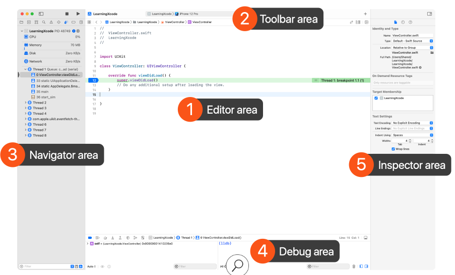

  1. Editor Area

     - 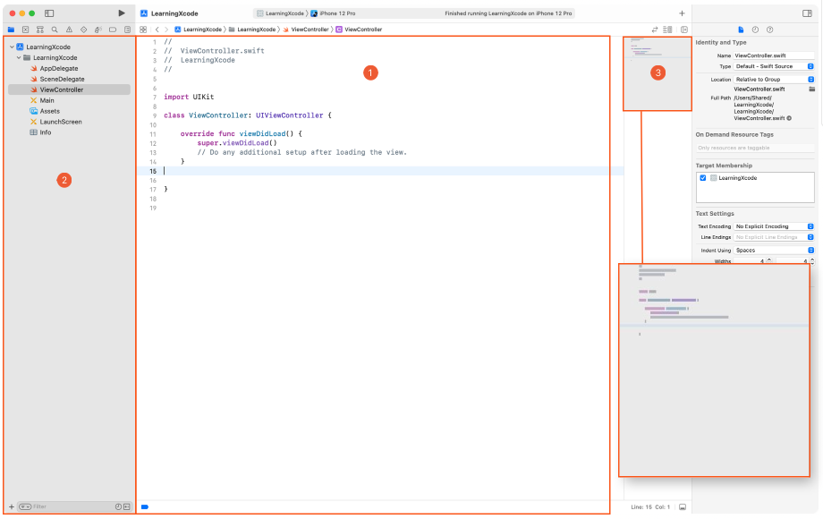

       1. The first is the editor area, where you spend most of your time writing Swift code and building UIs using Interface Builder.
       2. The file you select in the Project navigator column on the left determines what's displayed in the editor area.
       3. When you edit code, an overview of the entire file optionally appears on the right. This overview is the minimap (choose Editor > Minimap from the menu bar). This overview is the min map. You can interact with the minimap to navigate your source code quickly.

     - Jump Bar

       - Above the editor area is the jump bar, which contains the following controls from left to right
       - 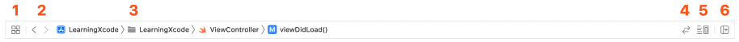

         1. Related Items - Allows you to navigate to various related items for the file you're currently editing.
         2. Go Back/Forward - Navigation buttons to move back and forth through your navigation history within the editor. This includes navigation actions such as jumping between definitions within a file and moving between different files.
         3. Path - A breadcrumb style control showing you the current editing context relative to tis parent groups and folders in the project. Click on any item in this control to navigate to other items at the same level. Note that the farthest right item navigates the structure within the file. (It might say "No Selection.")
         4. Code Review - Displays side-by-side views of the current version and other versions if you're using a source control system, such as Git, to manage your Xcode files.
         5. Adjust Editor Options - Allows you to change the options of the current editor as well as create an Assistant Editor that appears alongside your current editor with related files. Most useful when referencing other source files and when creating connections between source code and Interface Builder.
         6. Add Editor - Allows you to add an additional editor to the window - much like the assistant editor. By default this will add an editor to the right. By holding the Option key you can add an editor below. Once multiple editors are present two new buttons appear at the very left of the jump bar. One that closes the editor and another that focuses the editor - causing it to hide all others. Using multiple editors is an advanced feature that can greatly improve productivity when referencing and editing multiple files.

  2. Toolbar Area

     - Next is the toolbar, which spans the top of the Xcode workspace.
     - Moving from left to right are the following buttons:
       - 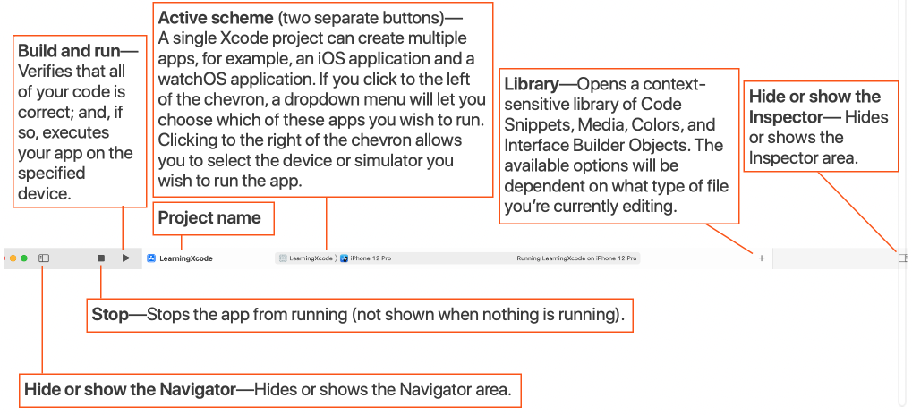

  3. Navigator Area

     - The third section is the Navigator area, a narrow column on the left. At the top of the column is the project jump bar, which allows you to select which navigator is displayed.
     - 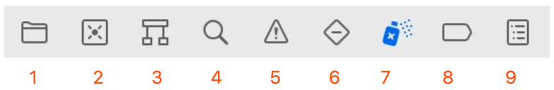

       1. Project navigator - Lists all files associated with your project.
       2. Source Control navigator - Displays information about your project's Git repository if one is set up.
       3. Symbol navigator - Lists all the symbols, or data types, you've defined in your project. Since a single file can contain multiple symbol definitions, use this navigator when you're unsure which file a symbol defines.
       4. Find navigator - Allows you to perform a search for specified text throughout your project, with the option to also replace the text.
       5. Issue navigator - Displays all the warnings or build errors that were encountered the last time your app was built.
       6. Test navigator - Lists all the tests that you've written for your application and allows you to run each test individually.
       7. Debug navigator - Displays the order in which the code was executed when you're actively debugging an app.
       8. Breakpoint navigator - Lists all the breakpoints you've added to your project and makes it easy to enable or disable them individually.
       9. Report navigator = Provides a detailed log of each build of your project.

  4. Debug Area

     - At the bottom of the Xcode window is the fourth main section: the debug area.
     - To the left of this area is the variables view, which lists the value of each variable while you're actively debugging an app. To the right is the console pane, which displays any `print` statements you or the system has output. Each of these views can be shown or hidden using the button in the bottom right.
     - 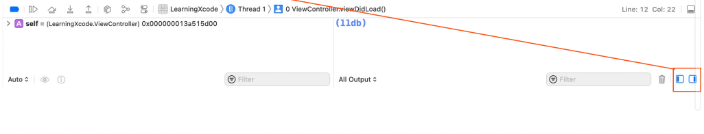

  5. Inspector Area
     - Finally, the Inspector area is a context-sensitive pane that displays details about any file selected in the Project navigator, such as the file's location on disk or the apps in which the file is included. When you're using Interface Builder, you'll find that this area is particularly useful for adjusting the attributes of your UI elements, including position, size, and color.

- **Xcode File Types**

  - Xcode knows how to work with a variety of files that span across multiple programming languages.
    - For now, you'll learn about files related to projects written in the Swift language.
    - The files in your project have filename extensions that you might see in the Finder, such as .swift and .xcodeproj, which Xcode doesn't show by default.
    - Instead, it uses icons to indicate the file type.
  - At the very top of the Project navigator, you'll see a file with a tiny blue Xcode icon.
    - 
    - Click the file to open it in the editor area.
    - This is the project file, which includes all the settings for your project and its targets.
    - Each target is a product that Xcode can build from the project.
    - For now, the targets you'll build will be executable apps.
    - Later, you may use targets to build frameworks, different versions of a particular app, or versions for different platforms like watchOS or tvOS.
  - The particular project you’re working with has only one target: an iOS app.

    - Within the project file, you can change all the details of a particular target.
    - For example, under Deployment Info, you can specify which version of iOS your code must support, change which devices your app is intended to run on, or show/hide the status bar. (1)
    - 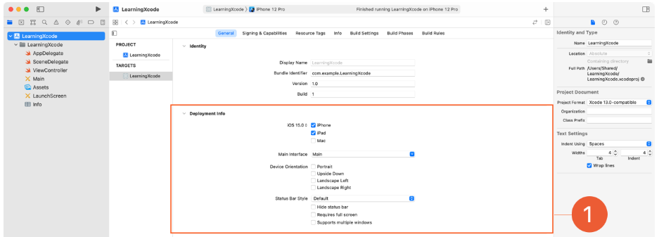

  - By selecting Signing & Capabilities at the top of the pane, you can configure code signing, which is a requirement for deploying to devices or the App Store. (1)
    - From this screen, you can also enable different features within the selected target.
    - For example, if your application needs to accept push notifications, you can add the Push Notifications capability and Xcode configures everything necessary for your app to receive notifications from the Apple Push Notifications service.
    - You can add capability configurations by clicking the + Capability button. (2)
  - Some capabilities have configuration options that you can disclose by clicking the triangle next to them.
  - 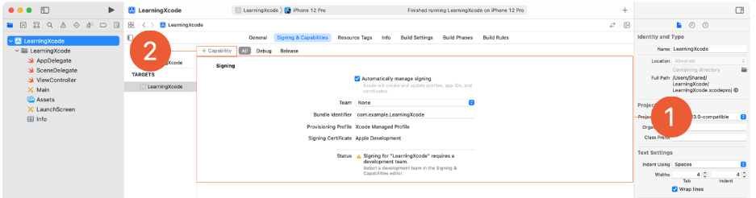

  - 

    - Files with this icon contain Swift code, as you'd expect.
    - Whenever you build your app, Xcode gathers up all included Swift files and runs them through the Swift compiler, which converts the code into a format your selected device understands.

  - 

    - This icon represents a storyboard.
    - All storyboard files are unique to Interface Builder.
    - They contain information about the design of each scene within your application, as well as how one screen transitions to another.

  - 

    - This icon represents an asset catalog.
    - In an asset catalog, you can manage many different kinds of assets.
    - This includes your app's icon, images, color definitions, and other forms of data to be bundled with your app.
    - An asset catalog also allows you to specify variants of your assets based on device settings and capabilities such as light and dark appearance, accessibility settings for high and low contrast, and hardware differences from screen resolutions to memory capacity and graphics chip support.

  - 

    - This icon represents a file containing a list of properties and settings for your app.
    - Xcode provides a special interface for editing this file so that you rarely need to interact with it directly.
    - These settings are organized on various screens that you can find when you select the project file you learned about earlier.

- **Keyboard Shortcuts**

  - As you become more proficient with Xcode, you’ll discover that it’s much faster to execute tasks using keyboard shortcuts. Make sure to learn the most common shortcuts right away:
    - Command-B: Build the project
    - Command-R: Build and run the project
    - Command-.: Stop building or running
    - Command-/: Toggle comments on selected rows of code
    - Command-[: Shift the selected code left
    - Command-]: Shift the selected code right
    - Control-I: Reindent the selected code
    - Command-0: Show and hide the Navigator area
    - Command-⬆️: Move to the top of a file
    - Option-Command-0: Show and hide the Inspector area
  - To learn more keyboard shortcuts, look on the right side of any menu, or choose Xcode > Preferences from the menu bar and select Key Bindings at the top of the window.

- **Xcode Preferences**
  - Xcode is a powerful tool with many options. As you work with Xcode you'll learn more about what it can do and how you can customize it to work how you want it to.
  - Check out the Xcode Preferences by choosing Xcode > Settings from the menu bar. You can use the Preferences to add developer accounts, customize navigation or fonts, or choose certain behaviors when text editing and more.
  - Open Xcode Preferences and navigate to the Fonts & Colors pane.
    - You can choose a new theme, or set of colors and fonts, by selecting different options in the list on the left. Some themes have a suffix of "(Light)" or "(Dark)." These variants are used respectively based on the system's current light or dark appearance.
    - Xcode also allows you to override its appearance behavior independent of the system setting from the General pane.
  - To read more about Xcode and its various tools, read the Xcode Help documentation by choosing Help > Xcode Help from the menu bar.

### Lesson 1.7 Building, Running, and Debugging an App

- **Building and Running**
  - When creating a project, make sure the interface option is set to Storyboard.
    - You'll be presented with the Xcode workspace. Locate the Scheme menu on the Xcode toolbar, then choose the device you want to simulate from the list.
    - Click the Run button ▶️, or use the keyboard shortcut (`Command-R`) to begin launching the app in Simulator.
  - After Simulator has launched, you should see a device image with a white background. ​To rotate the image from portrait to landscape orientation, use the keyboard shortcuts `Command-Left Arrow` and `Command-Right Arrow`.
  - The simulator image may appear quite large, depending on the screen resolution of your Mac and the device you chose to simulate.
  - From inside the Simulator application, you can use keyboard shortcuts, from `Command-1` to `Command-3`, to scale the device image up or down.
    - If you're using an older Mac, you may want to select an older lower-resolution device, such as an iPhone SE, to reduce the total impact of the Simulator on your system.
  - To quit Simulator, use the keyboard shortcut `Command-Q`. Or just go back to Xcode.
  - Simulator doesn't work for all portions of an app. Certain interactions depend on the actual physical device to run.
    - For example, if you try to use Simulator to test an interaction with the Camera app, the program will crash. If your code depends on other hardware components that don't exist on a Mac — maybe an accelerometer, a gyroscope, or a proximity sensor — you'll want to test with an actual device.
  - Simulator also has some software limitations.
    - For example, push notifications can be delivered only to physical devices, and the MessageUI framework — which helps compose email and text messages — is incompatible with Simulator. If you're running into a lot of issues in Simulator, try testing the code on your iPhone or iPad. Your issues may be resolved.
  - Simulator runs on a Mac, many of which are built on the Intel "x86-64" architecture, but iOS devices are built on the ARM (Advanced RISC Machine) architecture.
    - This means there can be underlying (and sometimes subtle) differences in how your app works.
  - Overall, Simulator works well when you're developing and debugging apps, but you should always test your code on actual hardware.
- **Using A Personal Device**
  - The beauty of mobile apps is that you can take them anywhere. You may find that you want to share your programming progress with friends and coworkers. But before you can begin running your code on a physical device, you must have an account on the Apple Developer website. Accounts are free, so don’t worry.
  - Using a web browser, go to developer.apple.com and click Account. You can sign up using your existing Apple ID. If you don’t have an Apple ID, go ahead and create one — it’s also free.
    - Once you’ve entered your Apple ID, your developer account is good and you can head on back to Xcode.
      - With a free account, you can run your iOS apps on only one physical device. To distribute your apps to multiple devices or publish them to the App Store, you need to enroll in the Apple Developer Program.
  - Now, you need to tell Xcode about your new developer account. Open Xcode Settings using the keyboard shortcut `Command-Comma` (or choose Xcode > Settings from the Mac menu bar), and then select the Accounts button near the upper-left corner. Click the “+” button in the lower-left corner and choose Add Apple ID from the menu.
    - After entering your credentials, you're ready to run and debug apps on a physical iOS device.
  - Connect your iOS device to your Mac using the appropriate USB cable. Xcode will automatically download the necessary information from the device and will display its name in the Scheme menu. Choose the name of your physical device — which will typically be at the top of the list, before the device simulators.
  - Build and run the app again. You may receive a prompt asking you to trust the developer certificate. Follow the instructions within the alert to allow the device to run your apps.
  - Build and run once more, and you should see the same simple white screen on your iOS device.
    - To stop the app from running, click the Stop button near the left end of the Xcode toolbar (or use the Command-Period keyboard shortcut).
  - Building and Running Wirelessly
    - Xcode also gives you the option of deploying an app to your device over your network.
    - To do this, connect your iOS device to your Mac using the appropriate USB cable, and open the Devices and Simulators window by selecting Devices and Simulators from the Window dropdown.
    - Ensure that your device is selected in the list farthest to the left in the Devices and Simulators window. Check the Connect via network box.
  - If your device is on the same network as your Mac, you’ll see a globe appear next to your device’s name within a few moments. This indicates that your device is wirelessly connected.
  - You can now disconnect the USB cable connecting your device to your Mac, and build and run your app wirelessly.
  - In most cases, the above steps are sufficient for wireless pairing.
    - However, if this doesn’t work for you, you might be on a corporate or institutional network where the system administrator has put in place certain network restrictions.
    - In this case, open the Devices and Simulators window,
    - hold Control and click your device,
    - then click Connect via IP Address in the menu presented.
    - You then need to find your device's IP Address from your device's Settings, enter it in the prompt, and click Connect.
    - This should successfully pair your device. If you run into problems with wireless debugging, you can always pair over a USB cable.
- **Debugging An Application**

  - Even the best developers struggle to write perfect code. Debugging is the process of identifying and removing problems that may arise in your app. Xcode provides tools to help you through this process.
  - When you run an app as described above, either on Simulator or on your device, Xcode will connect the app to its debugger.
  - This allows you to watch the execution of your code in real time, stop code execution using breakpoints, print information from your code to the console, and much more.
  - As you proceed through this course, you’ll encounter three types of issues: warnings, compiler errors, and bugs.
  - **Warnings**
    - Warnings are the simplest kinds of issues to fix. They’re generated whenever your code is built, but they don’t prevent your program from successfully compiling and running. Some of the conditions that can throw a warning include:
      - Writing code that never gets executed
      - Creating a variable that never changes
      - Using code that’s out of date (also known as deprecated code)
    - Take a look at a warning. Back in Xcode, select ViewController in the Project navigator and, in the editor area, add the following line of code just below `super.viewDidLoad()`: `let x = 4`
    - This code assigned a value of `4` to a constant named `x`.
    - Build your application using `Command-B`. You should see a yellow caution sign with an explanation on the line you just added.
      - `Initialization of immutable value 'x' was never used; consider replacing with assignment to '_' or removing it`
      - Xcode will do its best to explain the warning in a straightforward way.
      - The compiler is telling you that it created `x` but, because it's not used in a meaningful way, you can remove it. Delete the line and rebuild to remove the warning.
  - **Compiler Errors**
    - An error is indicative of a more serious issue — for example, invalid code (such as a typo), improperly declaring a variable, or improperly calling a function.
    - Unlike a warning, an error prevents the code from ever being executed.
    - Simulator won’t even launch if your code has an error.
    - Here’s a look at two different errors in the making.
      - In ViewController, remove the open and closing parenthesis on the end of `super.viewDidLoad()`, leaving `super.viewDidLoad`. Beneath this line of code, write `navigationController.title = “Debugging”`.
    - After you build the app, you'll see two red error symbols with explanations on the lines you just updated.
      - 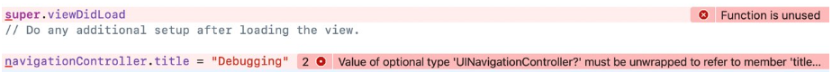
      - 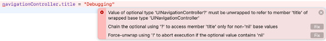
      - The first error has an icon with an "X" in the center. Xcode provides a message that can help you identify the issue. The compiler expected to see an open and closing parenthesis as the proper syntax for calling a function. Add both characters at the end of `super.viewDidLoad` to remove the error.
      - The other error of the errors has a dot in the center.
        - Click this error and Xcode displays a suggestion to fix the code.
        - Click the Fix button to have Xcode implement this suggestion.
        - In this instance, Xcode provides a valid fix. However, you can’t rely on the compiler to properly fix all errors — you need to be able to address errors on your own.
  - **Bugs**

    - The third type of issue is known as a bug — and it’s the hardest issue to track down.
    - A bug is an error that occurs while running the program, resulting in a crash or incorrect output.
    - Finding bugs can involve some time and some real detective work.
    - In ViewController, add the following lines of code below `super.viewDidLoad()`:

      - ```swift
          var names = [”Tammy”, “Cole”]
          names.removeFirst()
          names.removeFirst()
          names.removeFirst()
        ```

    - You may not be familiar with Swift at this point, and that’s OK. These lines are simple to understand. names is a list containing two pieces of text, “Tammy” and “Cole.”
    - Each subsequent line removes the first item from the list. Since there are three calls to remove the first item, but only two items in the list, what do you expect will happen?
      - Build your application. Since the syntax is valid, you’ll receive the “Build Succeeded” message. Now try running the app. After a few moments, the program will crash, and the following message will appear in red on the last line of code above: `Thread 1: Fatal error: Can't remove first element from an empty collection`
      - The program crashed when it tried to remove the remaining first element and couldn't find one. You've already guessed that. But imagine you're unsure how to fix the problem. Xcode can help you to step through the program one line at a time.
    - Before you start looking for the bug, you'll need to add a breakpoint to your code.
      - A breakpoint pauses the execution of a program at a specified point. Create a breakpoint by clicking in the gutter area to the left of the line where you want execution to pause. In this case, add the breakpoint to the `var names = [”Tammy”, “Cole”]` line.
    - Build and run your app. You'll see the program pause at the breakpoint(1). That's good.
      - In the debug area(2), show the variables view to inspect the current values (the button is on the lower right(3)).
      - Because the breakpointed line hasn't yet been executed, names contains no values.
    - From here, you can use the step control buttons at the top of the debug area to slowly continue code execution:
      - Continue — Resumes code execution until the next breakpoint is reached. If you select this button now, the code will crash, since there are no other breakpoints before the third names.removeFirst().
      - Step over — Executes the selected line and pauses execution on the next line.
      - Step into — If clicked on a line with a function call, advances to the first line of the function, then pauses execution again.
      - Step out — Executes all remaining lines in the function call and pauses execution on the line after the function.
    - 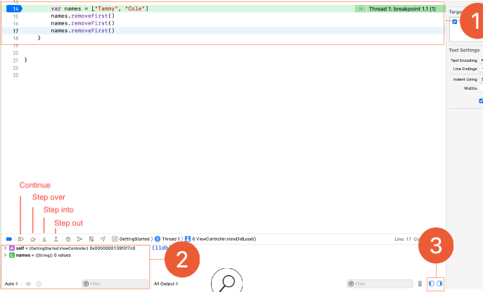
    - Click the "Step over" button to advance execution by one line. In the variables view, you can see that names has been assigned the proper values. So far, so good.
    - Click the “Step over” button to execute the first call to `names.removeFirst()`. names no longer includes “Tammy” in its list, so that worked fine.
    - Click “Step over” again to execute the second call to `names.removeFirst()`, leaving names an empty list with zero values. Still OK.
    - By now, it should be clear that the third call to `names.removeFirst()` is responsible for the bug.
    - Remove the third call to `names.removeFirst()` and run the program again to verify that the error has been fixed.
    - Debugging is a crucial skill for developers to build. When debugging, take the following approach:
      1. Try to understand the problem
      2. Brainstorm a potential solution
      3. Try the solution
      4. Verify it worked, repeat as necessary
    - Take each bug one step at a time. It can be frustrating to run into bugs when building apps, but it feels great when you’re able to fix them.

  - **Lab - Debug Your First App**
    - The objective of this lab is to find and resolve compiler errors, runtime errors, and compiler warnings.
    - Step 1
      - Find and Fix Compiler Errors
        - Open the Xcode project, “FirstTimeDebugging.”
        - Try to run the app. Note that it won’t run due to a few compiler errors. As you’ve learned in this lesson, compiler errors are indicated by red symbols in line with the mistake — or where the compiler guesses the mistake might be. All compiler errors are also listed in the Issue navigator.
        - Fix the compiler errors so that you can run the app. Here are two of the more common mistakes that may have caused this app’s compiler errors:
          - Missing or extra parentheses or braces (whether opening or closing).
          - Referencing a function or property but with incorrect spelling (The compiler is very literal and expects you to reference a function or property exactly by the name you gave it.)
            - ​Hint: Sometimes a single mistake can cause the compiler to flag multiple errors. Fix one mistake and you might eliminate all the error symbols.
    - Step 2
      - Find and Fix Runtime Errors
        - Were you able to remove all the red error symbols from the project? If so, try to run the app again.
        - This time, notice that the app stops execution right after opening in Simulator and that there’s a red line across one of the lines of code on the screen. The fact that the line is red indicates something went wrong. Look at the text in the console area to learn what the issue might be. Try to solve this runtime error. If it’s helpful, you might want to add breakpoints at and before the affected code, then run the app again.
    - Step 3
      - Find and Fix Compiler Warnings
      - Now that the app runs, focus your attention on a few more problems. Open the project’s Issue navigator. You’ll note several warnings, indicated by yellow triangles. Address all of these warnings.

### Lesson 1.8 Documentation

- Every developer has a preferred method of accessing documentation. Some prefer to view it in a web browser, while others like to use the documentation browser provided by Xcode. By learning multiple ways to interact with documentation, you can decide which method works best for you. The faster you can find answers to your questions, the faster you can get back to writing code.
- **Documentation Browser**
  - In the previous lesson, you added lines of code inside the viewDidLoad() function. Do you have any idea what that function does or when the function is called in your program? Xcode provides a fast answer using the Quick Help feature. Option-click the viewDidLoad() method name, and Xcode displays a popover with a brief description of the function.
  - Within the Quick Help popover, click Open in Developer Documentation to conveniently access the Xcode Developer Documentation for the function. The documentation includes a more thorough explanation of the function, the OS versions that support it, the framework it belongs to (in this case UIKit), and references to related functions.
  - In the navigation on the left, you can jump quickly to different sections of the Developer Documentation. (You can also access Developer Documentation from the Window menu or by using the shortcut, Command-Shift-0.)
  - At the top of the documentation window, you’ll see a search field, which allows you to look up documentation about any function, class, or framework. This feature makes it quick to search through thousands of pages of documentation, so answers are readily available—which is why many developers choose to leave the documentation window open while they’re coding.
  - Try navigating through the Xcode documentation. Start typing UIViewController. As you type, Xcode will suggest matching options with autocompletion. As soon as you see UIViewController in the menu, select it to display the documentation for UIViewController.
  - In the right-hand column, under On This Page, click the Topics link to jump down the page. The Topics section displays a list of symbols grouped by topic. A symbol is a function or variable associated with a particular class. In the documentation, these symbols are sorted into logical categories rather than in alphabetical order, so you can more easily locate items that interest you.
  - When you're building a new feature, these logical categories are a great way to find out if the object can do what you need.
  - Look through the topics for UIViewController and try to find the symbol for the view property. Click this symbol.
  - Here you’ll see information for your selected property. Most instance property documentation will follow a similar pattern:
    - A short description - A quick summary of what the property is
    - Declaration - The name used to access the property and the property’s associated type
    - Discussion - An in-depth description, discussing the finer (albeit, important) elements to consider when using the property
    - See Also - Other symbols that are related to the property that may be of interest
  - In the upper-left corner, you’ll see two buttons with chevrons < >. Use these to navigation backward < and forward > through your viewing history. Click the back button to return to the documentation for UIViewController. Find the symbol for the function `viewWillAppear(_:)`.
  - Most method documentation will follow a very similar pattern to instance property documentation with one possible addition:
    - Parameters — If the function has parameters (inputs), they are listed with the name used to access the parameter and a short description of the parameter
  - You’ll work more with the documentation browser as you work through this course.
- **Sample Code and Topics**
  - There's more to Developer Documentation than just descriptions of types and methods. As you work your way through coding concepts, it can be useful to read more about a certain topic or try out some sample code. The top level of documentation for the UIKit framework, for example, includes numerous overview topics and articles to help you get started. And the views and controls subtopic includes a UIKit Catalog sample code project.
  - You'll need to learn how to read and understand documentation to be a successful developer. Because documentation is very technical, it can be hard to digest when reading it the first time. It takes practice.
  - Throughout this course you will be given links to reference guides and API documentation in the “Related Resources” section. Read through them. You may not always understand every sentence or concept from reading, but you will be building a very useful skill that will help you be a successful developer.

### Lesson 1.9 Interface Builder Basics

- The best way to learn the basics of Interface Builder is to dive into Xcode and explore some of its features.
- Start by creating a new Xcode project using the iOS App template.
  - When creating the project, make sure the interface option is set to Storyboard. Name the project "IBBasics."
- **Storyboards**
  - Interface Builder opens whenever you select an XIB file (.xib) or a storyboard file (.storyboard) from the Project navigator.
  - An XIB file contains the user interface for <u>a single visual element</u>, such as a full-screen view, a table view cell, or a custom UI control. XIBs were used more heavily before the introduction of storyboards and you may hear seasoned macOS or iOS developers refer to XIB files as “Nib” files. They're still a useful format in certain situations, but this lesson focuses on storyboards.
  - In contrast with an XIB, a storyboard file includes many pieces of the interface, defining the layout of one or many screens as well as the progression from one screen to another. As a developer, you'll find that the ability to see multiple screens at once will help you understand the flow within your app.
  - 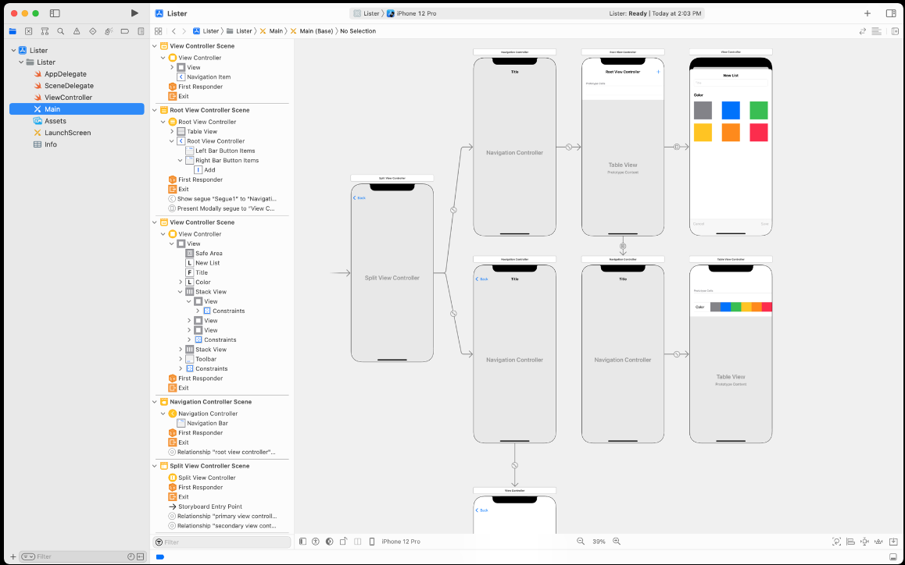
  - By default, a new iOS app project comes with one storyboard named Main.storyboard. Because Xcode doesn't show file extensions by default, it appears as Main in the Project navigator. Click it now to open the storyboard in Interface Builder. In the center of the screen, you'll see a single scene with a plain white view on an otherwise blank canvas. This scene is called the initial view controller, and it is the first screen that will appear when you open the app. As you add more scenes to the storyboard, you can drag them anywhere on the canvas. To see more view controllers at once, use two fingers on a Multi-Touch trackpad to pinch and zoom the canvas out or to zoom in on a particular view. If you don't have a trackpad, you can use the zoom buttons near the bottom of the canvas to achieve the same result.
  - Build and run the project. Simulator displays the same white screen you saw in the storyboard. How did the app know to display this screen? To investigate, select the top-most file (IBBasics) in the Project navigator, and find the Deployment Info section under the General heading. The entry in Main Interface defines which storyboard file is loaded first when the app launches.(It's disappeared on Xcode v14.) Because you created the project using the iOS App template, this entry was preconfigured to use the Main storyboard.
  - You can change the initial view controller by moving the entry point (the right-facing arrow) to the left of the desired view controller(1). Currently in this project, the Main storyboard has only one view controller, so you won't be able to change it.
    - 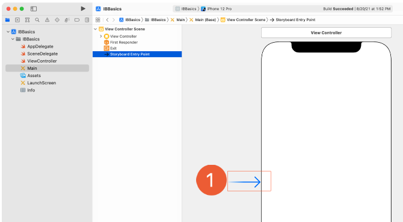
- **Interface Builder Layout**
  - To the left of the main canvas is the Document Outline view. To reveal it, click the Show Document Outline button in the bottom left corner of the canvas(1). The Document Outline displays a list of each view controller in the scene, along with a hierarchical list of the elements within each view controller. Click the gray triangles to the left of each item to inspect the contents. As you might notice, clicking the view in the outline will highlight the corresponding element on the canvas(2).
    - 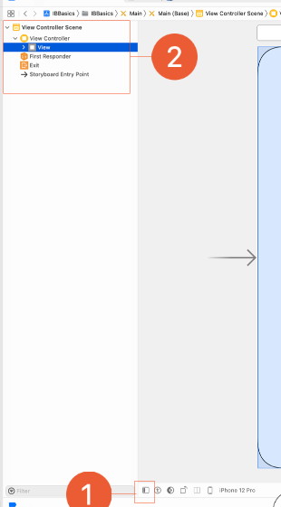
  - Select the Library button + in the Xcode toolbar to display the Object library. The Object library contains buttons, text fields, labels, and other view controllers that you can add to your scene.
  - Scroll through the Object library to find and select “Button,” then drag the item from the library onto the view. As you drag the button toward the upper-left corner of the view, try to use the layout guides.
    - Layout guides appear as a dotted blue line when you are placing or resizing a view object in Interface Builder.
    - Layout guides help you center your content, use appropriate margins and spacing between objects, and avoid putting content in the status bar at the top of the screen.
  - Go ahead and release the mouse or trackpad to insert the button into the view. Notice that the button object now shows up in the Document Outline as well.
  - On the right side of the screen, you see the Inspector area. If you don’t see it, click the "Hide or Show the Inspectors" button at the top left of the toolbar or use the keyboard shortcut, Option-Command-0.
  - In addition to the File, History, and Quick Help inspectors (which are always available), the top of the Inspector area displays four context-sensitive inspectors when you're in Interface Builder. To explore these different inspectors and how they can help you customize the objects in your view, select the button you just added—either in the Document Outline or in the scene itself.
- **Outlets And Actions**
  - You'll often need a way to reference your visual elements in code so that they can be adjusted at runtime, or when the app is already running. This reference from Interface Builder to code is called an outlet. When you have an object that you want the user to interact with, you create an action—a reference to a piece of code that will execute when the interaction takes place.
  - Select the view controller in the outline view, then select the Identity inspector. The template you chose when creating the project has set the Custom Class to ViewController. Open the assistant editor by clicking the Adjust Editor Options button and choosing Assistant Editor.
  - The source code of ViewController is displayed alongside the storyboard (because it corresponds to the Custom Class field in the Identity inspector).
  - But the ViewController class still doesn’t have access to the button you added. To make the object accessible in code, you’ll need to create an outlet.
  - Creating an Outlet
    - Control-click (or right-click) the button in the storyboard, and start dragging toward the assistant editor pane that contains the ViewController class definition. As you drag the pointer into the code, you see a blue line.
    - When you release the pointer, the "Outlets and Actions" dialog appears. Make sure that Connection is set to Outlet and Storage is set to Strong. In the Name field, specify a variable name for the button: "myButton." Click the Connect button to finalize the creation of the outlet, generating a line of code that defines the outlet.
    - Now that you have access to the button in code, add the following line inside the viewDidLoad() function: `myButton.tintColor = .red`
    - This line changes the color of the button’s title from blue to red. Build and run your application to see the change take effect.
    - That’s great, but you’ll probably notice that nothing happens when you try clicking the button. To add functionality, you’ll need to create an action that’s tied to the button.
  - Creating an Action
    - Once again, Control-click (or right-click) the button in the storyboard, and drag the cursor into the ViewController class definition.
    - When the “Outlets and Actions” dialog appears, set Connection to Action. In this situation, your entry in the Name field doesn’t define a variable; it defines the action the button tap is tied to. Name the action “buttonPressed.” Click the Connect button to finalize the creation of the action.
    - You now have a function to execute whenever the button is tapped. To test it, add the following line inside the buttonPressed function: `print(”The button was pressed”)`
    - This code prints a message to the Xcode console whenever the function is executed. Build and run your app, then click the button to see the message print in the console at the bottom right of the screen.
    - Back in the outline view, select the button again, then select the Connections inspector. Now that you’ve wired up an outlet and an action to the button, you’ll see them both in the Connections pane.
- **A Note About Interface Builder**

  - Every attribute in Interface Builder represents a property that can also be configured programmatically, or in code. Interface Builder is simply a graphical interface for configuring and setting properties on UIKit classes that are displayed in your app.
  - Add a label to your scene, then look at the Attributes inspector for the label.
  - Now look up the symbols, or properties and functions, for UILabel in the Documentation Browser. You’ll find that each setting in Interface Builder has a companion property.
  - | Interface Builder Attribute | Property Name                        |
    | --------------------------- | ------------------------------------ |
    | Text                        | text                                 |
    | Color                       | textColor                            |
    | Dynamic Type                | adjustsFontForContentSizeCategory    |
    | Font                        | font                                 |
    | Alignment                   | textAlignment                        |
    | Lines                       | numberOfLines                        |
    | Enabled                     | enabled                              |
    | Highlighted                 | isHighlighted                        |
    | Baseline                    | baselineAdjustment                   |
    | Line Break                  | lineBreakMode                        |
    | Autoshrink                  | adjustsFontSizeToFitWidth            |
    | Tighten Letter Spacing      | allowsDefaultTighteningForTruncation |
    | Highlighted                 | highlightedTextColor                 |
    | Shadow                      | shadowColor                          |
    | Shadow Offset               | shadowOffset                         |
  - Many objects that you can configure in Interface Builder have properties that can only be set programmatically. For example, `UIScrollView` has a `contentSize` property that does not have a matching option in the Attributes inspector.
  - When you need to adjust one of these settings, you can do so programmatically by setting up an @IBOutlet for the scroll view and updating the properties using dot-notation. `scrollView.contentSize = CGSize(width: 100, height: 100)`
  - In fact, everything that you can do in Interface Builder can also be done programmatically, including setting up all child views and adding them to the screen.

    - ```swift
        let label = UILabel(frame: CGRect(x: 16, y: 16, width: 200, height: 44))
        view.addSubview(label) // Adds label as a child view to `view`
      ```

  - This type of setup is most commonly done in the viewDidLoad() method of a view controller, which gives you access to the view controller’s main view property before it’s displayed on the screen.
  - While you can do everything programmatically, you can see that Interface Builder can save you a lot of time when setting up complex views. As your projects grow, storyboards help you more easily maintain your interface setup. Additionally, Interface Builder has support for building complex views that support multiple device sizes, all in one place.
  - You will learn much more about Interface Builder and storyboards as you work through the rest of the course.

### Guided Project: Light

- You'll have created an app, called Light, that changes the screen from black to white, and back again, whenever the user taps a button.
- To successfully build the light, you'll need to use Xcode documentation, set breakpoints, and create outlets and actions.

#### 1. Create A Button and An Action

- Create a new Xcode project using the iOS App template, set the interface option to Storyboard, and name the project "Light."
- Select the Main storyboard in the Project navigator to open your storyboard in Interface Builder.
- Select View Controller in the Document Outline, then click the Identity inspector button at the top of the Inspector area to confirm that this particular view controller is of type ViewController.
- If you're using Simulator, use the Devices button at the bottom of the canvas (the current selection is shown next to the button) to adjust the size of the canvas. Set the canvas size to the iPhone 13 Pro configuration, and select the iPhone 12 Pro or iPhone 13 Pro simulator from the menu toward the left end of the Xcode toolbar.
- If you’re using your own device for this project, the size of the view controller may not be identical to the size of your screen. Use the “View as” button at the bottom of the canvas to adjust the size of the canvas to match your device, but leave it in portrait orientation.
- Select the view controller’s view, then select the Attributes inspector, which will allow you to customize the attributes of any interface element. The background color for this view has already been set to white. That’s the desired state of your app on launch, so you don’t need to change anything right now.
- Next, add a button that’ll be used to change the view's background color, simulating a light turning on and off. Press the + button at the top right of the toolbar to open the Library. As you learned in an earlier lesson, this library includes a list of common objects you can add to a storyboard. Scroll through the list, or use the search filter at the top of the library area.
- Find the “Button” object in the library and drag it over on top of the view. When you release the cursor, the Document Outline should indicate that the button has been added as a subview.
- Move the button to the upper-left corner of the view. Margin-alignment guides will help snap the object into the correct position.
- Give your button an action to perform when it's clicked or tapped. Add an assistant editor using the Adjust Editor Options button and choose Assistant Editor to split the Xcode workspace into two parts: Interface Builder and its corresponding code.
- Now Control-drag (or right-click) the button into an available area within the ViewController class definition. As you drag, a blue line extends from the button and a blue horizontal bar will display below your cursor, indicating a valid place to create a connection.
- When you release the mouse cursor, you will be prompted to create an outlet or define an action. Change Connection to Action, then set Name to “buttonPressed.” When you click the Connect button, Xcode will create a new method that will be called whenever the button is tapped. You may notice the @IBAction keyword right before the buttonPressed(\_:) method. @IBAction signals to Xcode that a relationship can be created between a visual element in a storyboard and the function.
- Build and run the app. When you press the button, nothing happens, because there’s no code within the buttonPressed(\_:) method to execute. To verify that the method is being called, you can place a breakpoint within the method definition. Now press the button and the breakpoint will be triggered.
- Now that you’ve verified that the action is working correctly, you can add some code to change the background color. Remove the breakpoint before proceeding.

#### 2. Change The Background

- If the light is on (that is, if the background color is white) then the light should be switched off. Otherwise, if the light is off (the background is black), then the light should be switched on. The statement "the light is on" is either a true or false statement, so it would make sense to use a Boolean to determine how to change the background color.
- Near the top of the ViewController class definition, create a variable called lightOn and set the initial value to true, since the screen starts off with a white background. `var lightOn = true`
- Each time the button is tapped, the value should change from true to false, or from false to true. Swift booleans have a method, toggle(), that does precisely this. Since the buttonPressed(\_:) method is called whenever the tap is executed, make the change there.

  - ```swift
      @IBAction func buttonPressed(_ sender: Any) {
          lightOn.toggle()
      }
    ```

- After the value has been changed, you can use the new value to determine how to change the background color. If the light is supposed to be off, change it to black. Or if it’s supposed to be on, change it to white. You can write this logic using a simple if-statement.

  - ```swift
      @IBAction func buttonPressed(_ sender: Any) {
          lightOn.toggle()
          if lightOn {
            view.backgroundColor = .white
          } else {
            view.backgroundColor = .black
          }
      }
    ```

- Build and run your application, and the background should successfully change on each press.
- As your application’s size continues to grow, make sure that your code stays organized. Rather than put the if-statement directly inside the buttonPressed(\_:) method, you can move it to a new method that handles updating the entire user interface.
- Select the entire if-statement, and then choose Editor > Refactor >​ Extract to Method.
- Xcode moves the code out of place into a new method and enters a special editing mode that allows you to set the new method's name and update where it’s called at the same time. Type updateUI and press the Return key to set the name.
- Xcode moved the selected code into a new method named updateUI(), and then added a call to updateUI() where the code once lived.
- The result should look like the following:

  - ```swift
      fileprivate func updateUI() {
        if lightOn {
          view.backgroundColor = .white
        } else {
          view.backgroundColor = .black
        }
      }
       
      @IBAction func buttonPressed(_ sender: Any) {
          lightOn.toggle()
          updateUI()
      }
    ```

- Notice the `fileprivate` keyword that Xcode used in front of the method name. Swift uses this special access modifier to specify where the method can be called from. If you use the Xcode refactor feature and need to call your method outside of the file it’s defined in, remove the fileprivate keyword in front of it.
- This is a small change for a small app. You will see this pattern persist throughout this book, and you will find it much easier to debug interface issues if the code that updates the view is all contained in a single method.

#### 3. Update The Button Text

- You’ve now successfully set the button to change the background color of the view, but the title of the button text remains the same no matter the state of the light. At the moment, there’s no way to reference your newly created button in code. You must first create an outlet to the button. Control-drag the button in Interface Builder to an empty space at the top of the view controller’s definition in the editor area. In the popover, verify that Outlet is selected under Connection, and enter “lightButton” in the Name field.
- As you learned in an earlier lesson, you’re able to see these details of the outlet, from left to right:
  - Circle — The filled circle indicates that the outlet is connected. The circle would be empty if the property isn’t connected to anything.
  - @IBOutlet — This keyword signals to Xcode that the property on this line is an outlet.
  - var lightButton — This declares a property called “lightButton.”
  - UIButton! — The type of the property is UIButton!. The exclamation point warns you that the program will crash if you try to access this property and the outlet isn’t connected. You’ll learn more about the exclamation point when you learn about optionals in a later unit.
- Having created the outlet, you can now make changes to the button programmatically. Start by finding the right place for updating the button’s title and the right action for it to perform.
- 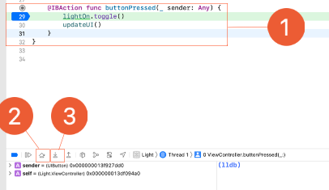
- Add a breakpoint to the first line of the `buttonPressed(_:)` method, then build and run your app. As you might expect, when you press the button to change the color, the corresponding action, `buttonPressed(_:)`, will be executed. But since you added a breakpoint, the code will pause before executing the line with the breakpoint.(1)
- Click the “Step over” button (2) to run the first line. Now your app is paused just before running the updateUI() method. Click the “Step into” button (3). Now the app is paused just before executing the first line of updateUI.
- Take a moment to try and read the body of the updateUI() method. Since Swift is a very readable programming language, you can probably interpret the lines to say: “If the light is on, the view’s background color should be white, or else the view’s background color should be black.”
- Now consider how the button’s title should be decided. If the light is on, the button’s title should read “Off,” or else the button’s title should read “On.” It makes sense that the button’s title should be updated in a similar way to the view’s background color.
- You’ve now found a reasonable place to update the text—in the updateUI() method. But what’s the actual function for doing so? As you learned earlier, Xcode documentation is always available to support you. So whenever you’re unsure of something, it’s a good habit to look to the documentation for answers.
- To learn how to set the title of lightButton, start by reading the documentation on its type, UIButton. You can access the documentation directly using Window > Developer Documentation from the Xcode menu. This opens a separate window with the documentation viewer.
- Start entering UIButton in the documentation search field. Autocompletion quickly suggests options. As soon as you see UIButton in the menu, go ahead and select it.
- Scroll down to the Symbols section to find a list called “Configuring the Button.” ​There you’ll find a function to set the title: `func setTitle(String?, for: UIControl.State)`.
- Click the function name to see its declaration and a list of its parameters. The first parameter is the desired text, and the second parameter is a UIControl.State. UIControl.State represents the different potential states of a button, for example: if it is sitting idle, if the user has begun tapping it, or if the button is disabled. Click UIControl.State in the Declaration section.
- In this new list of symbols, the Constants section contains a normal constant, which corresponds to the state of the button when it’s enabled and sitting idle on the screen. This is the correct state for setting the button’s title.
- With your new knowledge of the updateUI() method, you can remove the breakpoints you added earlier and adjust the method to look like the following:

  - ```swift
      func updateUI() {
        if lightOn {
          view.backgroundColor = .white
          lightButton.setTitle(”Off”, for: .normal)
        } else {
          view.backgroundColor = .black
          lightButton.setTitle(”On”, for: .normal)
        }
      }
    ```

- Build and run your app. Clicking or tapping the button should now change both the background color and the button text. But there’s a bug: Before the button is clicked, the text still reads “Button,” not “On” or “Off.” How can you update the code to resolve this issue?
- Your project already has code that will make sure the button’s text matches the on or off state of the light: updateUI(). You just need to call it when the view first loads — so that the button is updated when the view appears, instead of when the user first taps the button. You can run setup code in the viewDidLoad() function, which is already defined in your view controller subclass and is called when the view controller is ready to appear on the screen.
- Call updateUI() within this method, as shown in the following example:

  - ```swift
      override func viewDidLoad() {
          super.viewDidLoad()
          updateUI()
      }
    ```

- Build and run your app again. On launch, the text of the button should now read "Off."

#### 4. Improve The User Experience

- Now take a moment to think about its design and how the user experiences the app. What could be improved?
- Looking at the button, you might realize that the text feels extraneous. It’s pretty clear whether the light is currently on or off — the background color indicates that. Does the user need to see the text at all?
- Does it matter where on the screen the button is located? And isn’t it a little odd that most of the screen isn’t tappable?
- It may be better to remove the text from the button and to make the button fill the entire screen. That way, the user can tap anywhere on the screen to turn the light on and off. An important part of building any app is considering the little details and trying to build an intuitive, simple, powerful user interface. In this case, it makes sense for the user to be able to tap anywhere on the screen to toggle the background color.
- To begin, you’ll need to resize the button to fill the screen. Select the button in Interface Builder, then drag its top-left and bottom-right corners, extending the button to cover the entire white view.
- Remove the title text for the button. The tappable area of the button will still perform as expected, but it will now appear as though only the white view exists on the canvas.
- With the text gone, you can remove the lines of code in updateUI() that make changes to the button’s title.
- In this updated design, the button’s properties don’t need to change while someone is using the app. That means the outlet — which you created at the beginning of the project — is no longer needed. As a developer, you want to keep your code as clean as possible, so it’s a good idea to clear out the @IBOutlet.
- First, sever the connection between the button and its outlet. To do so, select the button in Interface Builder, then show the Connections inspector. Here you can see all the events and outlets connected to a particular object. In this case, you can see that the button is tied to the buttonPressed: action and to the lightButton outlet. ​Click the X next to the outlet to remove it.
- Since there are no longer any objects connected to lightButton, the little circle next to @IBOutlet is no longer filled in. It’s now safe to delete the declaration of lightButton.
- Build and run your app one last time to test your new design improvements. You should now be able to tap or click anywhere on the screen to change its background color.
- Because both lines in the if-else statement do the same thing (set the backgroundColor), the updateUI() method might look cleaner if you use a ternary operator instead of an if-else statement.

  - ```swift
      func updateUI() {
        view.backgroundColor = lightOn ? .white : .black
      }
    ```

- Build and run your application once more to verify that the ternary operator works as intended.

- **Wrap-Up**
  - You've successfully created an app that changes the screen from black to white, and back, at the tap of a button—something like a flashlight. You've simplified the design of the app as well, making conscious decisions to improve the user experience by removing the button title and filling the screen with a tappable area. Even though you have limited knowledge of Swift, you were able to step through lines of code and refer to the documentation to complete this project.

## Unit 2 Introduction To UIKit

- You'll learn about structures, collections, loops, and different ways to work with the information that makes up an app. You'll also build a Keynote prototype of your own app idea and think about how the skills you're learning can be used to eventually build a functioning app. At the end of the unit, you'll build an ambitious project.
- What You'll Design
  - The App Design Workbook will guide you through designing a working prototype of your app in Keynote.
- What You’ll Build
  - Apple Pie is a simple word-guessing game where the user must guess a word, letter by letter, before all the apples fall off the apple tree. If there are apples remaining, the user wins—and can eat delicious Apple Pie.

### Lesson 2.1 Start Your App Prototype

- Before diving into coding, most app developers save time and energy by first creating a working prototype to iterate on their ideas and get feedback before finalizing the structure of their app. Developers build prototypes in all sorts of ways, from simple notebook sketches to partially completed apps in Xcode.
- In this unit, you’ll build a prototype in Keynote—a happy medium. It’ll be easier to create than using Xcode, but have more fidelity to the look and feel of an app than paper. In this lesson, you’ll start by mapping screens to form an app architecture.
- Prototyping
  - A prototype is a fake version of your app that you can show other people to get feedback. It should give users a sense of how your app works, even though it may not do much. If you start from your app's goals and features, creating a prototype can be fun, and it can delight your users even if you don't write a single line of code.
- Map
  - In the last unit, you outlined a concrete plan for what features and functionality your app should have, including choosing an MVP feature that can help a user solve the primary problem. Starting with this feature set, you are ready to create a prototype to show potential users. The first step in this process is to turn your list of features into workflows showing how a user will navigate within the app. This is where your app starts to take shape.
  - Complete the Map section of the App Design Workbook. In these activities, you’ll create an outline of the information and functions on each screen — and how they relate to each other. You’ll derive your app’s architecture from the its key functions, making decisions based on how you expect users to work with it. By the end of this section you’ll have a Keynote file with linked screen outlines, which is the beginning of your prototype.

### Lesson 2.2 Strings

- Swift’s strings are represented by the String type, and the most common way to define one is by using a string literal.
- A string literal is a raw representation of a String value. You write a string literal by surrounding a set of characters with double quotation marks “.
- String literals are commonly used to set an initial value for a constant or variable: `let greeting = “Hello”`, `var otherGreeting = “Salutations”`
  - If you assign a string to a constant (using let), the string is immutable and can't be modified.
  - If the string is assigned to a variable (using var), the string is mutable and can change.
- If your string literal needs to be multiple lines, simply surround your set of characters with three double quotation marks “””. In its multiline form, the string literal includes all of the lines between its opening and closing quotes. The string begins on the first line after the opening quotes and ends on the line before the closing quotes.

  - ```swift
      let joke = “””
        Q: Why did the chicken cross the road?
        A: To get to the other side!
        “””
      print(joke)
      Console Output:
      Q: Why did the chicken cross the road?
      A: To get to the other side!
    ```

- Any space preceding each line in your multiline string literal will be ignored if it aligns with the closing """ quotation marks. Multiline string literals may contain double quotes (").

  - ```swift
      let greeting = """
        It is traditional in programming to print "Hello, world!"
        """
    ```

- To include double quotes in single-line string literals, you'll need to use the backslash (\), known in Swift as the escape character. That's because you're “escaping” the normal interpretation of characters in the string, `let greeting = “It is traditional in programming to print \”Hello, world!\””`
- You can use the escape character with other letters and symbols to produce specific results:
  - Double quote: \”
  - Single quote: \’
  - Backslash: \\
  - Tab: \t
  - Newline (go to the next line—like pressing Return): \n
- You’ll often find that you want to start with an empty string, then add to it over time. This means you’ll need to make it a variable. Use the following syntax to initialize the string without any text: `var myString = “”`
- If you need to check if a Swift String is empty, you can use the Boolean property, `isEmpty`:

  - ```swift
      var myString = “”
       
      if myString.isEmpty {
        print(”The string is empty”)
      }
    ```

- As you might expect, individual characters are of type Character. But since strings are much more common in programming than individual characters, Swift will always infer the type of a collection of characters — or even a single character — as String, unless you specify otherwise with a type annotation:

  - ```swift
      let a = “a” //’a’ is a String
      let b: Character = “b” //’b’ is a Character
    ```

#### Concatenation And Interpolation

- Sometimes you need to combine strings. The + operator isn’t just for numbers; it can add strings together too. You can use + to create a new String value from multiple String values. This is called concatenation.
- If the existing String is a variable, you can use the += operator to add to it or modify it.

  - ```swift
      let string1 = “Hello”
      let string2 = “, world!”
      let myString = string1 + string2 // “Hello, world!”

      var myString = “Hello”
      myString = myString + “, world!” // “Hello, world!”
      myString += “ Hello!” // “Hello, world! Hello!”
    ```

- As strings grow in complexity, the use of the + operator can make your code tricky to handle. In the code above, for example, you might forget to add a space before “Hello!”
- Swift provides a syntax, known as string interpolation, that makes the inclusion of constants, variables, literals, and expressions easier. String interpolation allows you to easily combine many values into a single String constant or variable.
- You can insert the raw value of a constant or variable into a String by preceding the name with a backslash \ and wrapping the name in parentheses (). In the example below, the printed String will contain the raw values of the name and age constants.
- You can place entire expressions within the parentheses. These expressions will always be evaluated first, before being printed or stored.

  - ```swift
      let name = “Rick”
      let age = 30
      print(”\(name) is \(age) years old”) // Rick is 30 years old

      let a = 4
      let b = 5
      print(”If a is \(a) and b is \(b), then a + b equals \(a+b)”)
      Console Output:
      If a is 4 and b is 5, then a + b equals 9
    ```

- Using string interpolation, the raw values of the a and b constants are inserted into the printed String value.
- It was hinted at above, but since the result of string interpolation is a String, you can also use it anywhere you'd use a String or string literal:

  - ```swift
      let listName = "Shopping"
      var items = 14
      myLabel.text = "There are \(items) items on your \(listName) list"
      // The label displays "There are 14 items on your Shopping list"
       
      func setLabel(_ label: UILabel, to text: String) {
        label.text = text
      }
       
      setLabel(myLabel, to: "There are \(items) items on your \(listName) list")
      // The label displays "There are 14 items on your Shopping list"
    ```

#### String Equality And Comparison

- Developers often need to compare String values to see if they’re equal to each other.
- Just as you do with numbers, you can check for equality between two strings using the == operator. As you might expect, == checks for identical characters in the same order. Since uppercase characters aren’t identical to their lowercase counterparts, the strings have the same value if the case of each character also matches. This is known as case sensitivity.
- But maybe you want to ignore the capitalization of a string when checking for string equality. You can use the `lowercased()` method to normalize the two, comparing an all-lowercase version of the string with an all-lowercase version of the calling string.
- You could have also used lowercased()'s counterpart, `uppercased()`, which creates an all-uppercase version of the string.
- If you want to match the beginning or the end of the string, you can use the `hasPrefix(_:)` or `the hasSuffix(_:)` method. Just like ==, these matches are case-sensitive.

  - ```swift
      let name = “Johnny Appleseed”
      if name.lowercased() == “joHnnY aPPleseeD”.lowercased() {
        print(”The two names are equal.”)
      }
      Console Output:
      The two names are equal.

      let greeting = “Hello, world!”
      print(greeting.hasPrefix(”Hello”))
      print(greeting.hasSuffix(”world!”))
      print(greeting.hasSuffix(”World!”))
      Console Output:
      true
      true
      false
    ```

- Maybe you want to check if one string is somewhere within another string. You can use the `contains(_:)` method to return a Boolean value that indicates whether or not the substring was found.

  - ```swift
      let greeting = “Hi Rick, my name is Amy.”
      if greeting.contains(”my name is”) {
        print(”Making an introduction”)
      }
    ```

- Since a string is a collection of characters, its length is equal to the total number of characters. The size of any collection can be determined using its `count` property. You can use this property to compare strings or to evaluate whether strings meet a certain requirement.

  - ```swift
      let name = “Ryan Mears”
      let count = name.count // 10
       
      let newPassword = “1234”
       
      if newPassword.count < 8 {
          print(”This password is too short. Passwords should have at
          least eight characters.”)
      }
      Console Output:
      This password is too short. Passwords should have at least
      eight characters.
    ```

- In the last unit, you learned that you can use switch statements to perform specific blocks of code based on a particular case. You can also use the switch statement to pattern-match multiple values of strings or characters and to respond accordingly.

  - ```swift
      let someCharacter: Character = “e”
      switch someCharacter {
        case “a”, “e”, “i”, “o”, “u”:
          print(”\(someCharacter) is a vowel.”)
        default:
          print(”\(someCharacter) is not a vowel.”)
      }
      Console Output:
      e is a vowel.
    ```

#### More Advanced String Topics

- Similar to the lowercased(), hasPrefix(_:), hasSuffix(_:), and contains(\_:) methods mentioned previously, strings come with a variety of properties and methods that can be useful for tracking locations of characters within strings, creating new strings from “substrings,” inserting characters or strings into existing strings, and much more. Much of this functionality is shared among all Swift collections. For now you don’t need to worry about these more advanced string topics, but keep in mind that you can always turn to documentation to learn more should you wish to do more advanced string manipulation with Swift. For reference, here are a few useful String properties and methods that you could look up:

  - startIndex
  - endIndex
  - index(before:)
  - index(after:)
  - index(\_:offsetBy:)
  - insert(\_:at:)
  - insert(contentsOf:at:)
  - remove(at:)
  - removeSubrange(\_:)
  - replaceSubrange(\_:with:)

- For a full list of methods and more information you can review the [String documentation](https://developer.apple.com/documentation/swift/string).

#### Unicode

- Every Swift String adheres to an international computing standard called Unicode. Unicode compliance allows Swift to go beyond the short list of letters and symbols in the English language. Instead, Unicode encompasses over 128,000 different characters used across multiple languages. This includes accents on characters (é), emoji (🐮), symbols (∞), Kanji (七), and other specialized characters. In addition, Unicode supports text that reads right to left, as well as left to right.
  Swift ensures that you can work with Unicode characters conveniently, so that “e,” “é,” and “🐮” are treated as single characters with a length of 1.
- In reality, a character is a Unicode “extended grapheme cluster” which is a fancy way of saying that some characters are actually comprised of multiple (often invisible) characters although they appear to the user as a single character. For example, “ü” comprises two characters and “👩🏽‍🎓” comprises four characters! Swift makes working with these much easier.

### Lesson 2.3 Functions

- When someone gives you the task “get dressed,” it seems like such a simple instruction. But the details of what you'll wear, how you'll put the clothes on, and where you'll get the clothes from are all wrapped up within the “get dressed” phrase. The idea of taking something that is complex and defining a simpler way to refer to it is an abstraction, and a function is one of the fundamental ways to create an abstraction in code.
- A function is made up of a name, a set of inputs, and a set of outputs. Both inputs and outputs are optional. You call or invoke a function to cause your program to do something such as print text to the console.
- In Swift, a function can take zero, one, or many parameters, and likewise return zero, one, or many values. When a function does return values, you can choose to ignore them.
- Similar to the declaration of a constant with let or a variable with var, the func keyword tells the Swift compiler that you're declaring a function. Immediately following func, you add the name of the function followed by parentheses (), which may or may not include a list of parameters within them. If the function has a return value, you'll write an arrow (->), followed by the type of data the function will return, such as Int, String, Person, and so on.
- **Defining A Function**

  - `func functionName (parameters) -> ReturnType { // body of the function }`
  - Here’s an example of a function that will display the first ten digits of pi (π). Since printing pi requires no additional input, there are no parameters. And since printing pi doesn’t need to return anything relevant to the function caller, no return value is specified.
  - Once a function has been properly declared, you can call it, or execute it, from anywhere just by writing its name.

    - ```swift
        func displayPi() {
            print(”3.1415926535”)
        }

        displayPi()
        Console Output:
        3.1415926535
      ```

- **Parameters**

  - To specify a function with a parameter, insert a name for the value, a colon (:), and the value’s type—all inside the parentheses. For example, say you wanted to write a function called triple that takes in an Int, triples the value, and then prints it.
  - The parameter value is a constant you can use within the function. When you call a function, you pass values for its parameters as arguments. In the code below, the argument for value in the call to the function triple(value:) is 10.

    - ```swift
        func triple(value: Int) {
          let result = value * 3
          print(”If you multiply \(value) by 3, you’ll get \(result).”)
        }

        triple(value: 10)
        Console Output:
        If you multiply 10 by 3, you’ll get 30.
      ```

  - To give a function multiple parameters, separate each parameter with a comma (,). Here’s an example of a function that takes in two Int parameters, multiplies them together, and then prints the result. The function is then called with one argument per parameter

    - ```swift
        func multiply(firstNumber: Int, secondNumber: Int) {
          let result = firstNumber * secondNumber
          print(”The result is \(result).”)
        }
         
        multiply(firstNumber: 10, secondNumber: 5)
        Console Output:
        The result is 50.
      ```

- **Argument Labels**

  - So far, the labels for the arguments passed to a function are the same as the names for the parameters it uses internally. In the next example, firstName is used both within the function and when the function is called:

    - ```swift
        func sayHello(firstName: String) {
          print(”Hello, \(firstName)!”)
        }
         
        sayHello(firstName: “Aidyn”)
      ```

  - But imagine that you want your function to read a little more cleanly: `sayHello(to: “Miles”, and: “Riley”)`
  - The argument labels to and and make the function read very clearly: "Say hello to Miles and Riley." However, check out the implementation of this function:

    - ```swift
        func sayHello(to: String, and: String) {
          print(”Hello \(to) and \(and)”)
        }
      ```

  - Within the body of the function, to and and are poor names for parameters. To make the name of the parameter within the function different from the label used to call the function, specify a separate argument label before the parameter name. In the code below, to is the argument label for the parameter person, while and is the argument label for the parameter anotherPerson:

    - ```swift
        func sayHello(to person: String, and anotherPerson: String) {
          print(”Hello \(person) and \(anotherPerson)”)
        }
         
        sayHello(to: “Miles”, and: “Riley”)
      ```

  - If the function is clearer without an argument label, you can go ahead and omit it. For example, take the print function: `print(”Hello, world!”)`
  - The name of the function already makes it very clear what should be passed in as a parameter. It would feel extraneous if you had to call the function in the following way: `print(message: “Hello, world!”)`
  - To omit the argument label, use `_`. In the next example, the label for the firstNumber parameter is omitted, while the to label adds meaning and makes the function call more readable:

    - ```swift
        func add(_ firstNumber: Int, to secondNumber: Int) -> Int {
            return firstNumber + secondNumber
        }

        let total = add(14, to: 6)
      ```

- **Default Parameter Values**

  - Parameters allow a function to remain flexible, but often there’s a value you want to use most of the time. For example, you might drink water with nearly all of your meals, but every now and then you have a glass of orange juice instead.
  - As part of the function definition, you can provide a default value for any parameter. This way, you can call the function with or without the parameter. If the parameter is unspecified, the function simply uses the default value.

    - ```swift
        func display(teamName: String, score: Int = 0) {
          print(”\(teamName): \(score)”)
        }
         
        display(teamName: “Wombats”, score: 100) // ”Wombats: 100”
        display(teamName: “Wombats”) // ”Wombats: 0”
      ```

  - A certain level of thought needs to go into defining a function with default parameter values and argument labels. The compiler can do only so much when inferring what you're calling. If you mix default values and parameters without argument labels, you need to validate that every variation of the function call can be inferred.

    - For example, the compiler can't infer which variant of your function to call when defined like the following:

      - ```swift
          func displayTeam(_ teamName: String, _ teamCaptain: String = "TBA", _ hometown: String, score: Int = 0) {
            // ...
          }
           
          displayTeam("Dodgers", "LA") // ERROR: Missing argument for parameter #3 in call
        ```

    - You may find it obvious that you want the function to use the default value of “TBA” for teamCaptain and assign “Dodgers” to teamName and “LA” to hometown. But the compiler recognizes only three String parameters without argument labels, and only two values to assign. It can't assume that you intended to use the default value for teamCaptain.
    - It's best to leave arguments with default values at the end of the function signature and always provide an argument label. In the above example, the compiler would be satisfied if teamCaptain had an argument label: `func displayTeam(_ teamName: String, _ hometown: String, teamCaptain: String = "TBA", score: Int = 0)`

- **Return Values**

  - It’s unlikely that you’ll always want to print “The result is” before the result from multiply. Instead, it might make more sense if the function simply returned the new value. To do so, you’ll need to adjust the function declaration to have a return value and to specify the value’s type. You’ve learned that multiplying two Int types will always result in an Int, so that’s the return type you’ll use.
  - Within the function’s body, you’ll use the return keyword to specify what the return function will return.

    - ```swift
        func multiply(firstNumber: Int, secondNumber: Int) -> Int {
          let result = firstNumber * secondNumber
          return result
        }
      ```

  - Rather than multiplying the values, storing the new value in result, and immediately returning it, the function could also be written without the constant.
  - Starting with Swift 5.1, you can even omit the return keyword for functions that have a single line implementation. Because multiply(firstNumber:secondNumber:) has a return type and only one line of code in its body, the result of that expression is used as its return value.
  - To call this function and use the return value, you can assign the return value to a constant.
  - If you don’t need to use constant value ever again in the future, you could use the function inside the print statement and skip assigning the value to a constant

    - ```swift
        func multiply(firstNumber: Int, secondNumber: Int) -> Int {
          firstNumber * secondNumber
        }

        let myResult = multiply(firstNumber: 10, secondNumber: 5)
        //myResult = 50
        print(”10 * 5 is \(myResult)”)

        print(”10 * 5 is \(multiply(firstNumber: 10, secondNumber: 5))”)
      ```

### Lesson 2.4 Structures

- Swift comes with predefined structures for representing common types of data. You can define your own structures when you want a type that fits the specific needs of your program or app.
- In its simplest form, a structure is a named group of one or more properties that make up a type. Properties represent the information about an instance of the structure.
- You define a structure using the struct keyword along with a unique name. You can then define properties as part of the struct by listing the constant or variable declarations with the appropriate type annotation. The convention is to capitalize the names of types and to use camel case for the names of properties.
- Consider the simple declaration of a Person structure with a name property:

  - ```swift
      struct Person {
        var name: String
      }
    ```

- The above declaration simply defines the properties of a Person type. It doesn’t have a value in itself. For that, you have to create an instance of the Person type. Then you can access the data stored in its properties, such as the person’s name, using dot syntax.

  - ```swift
      let firstPerson = Person(name: “Jasmine”)
      print(firstPerson.name)
      Console Output:
      Jasmine
    ```

- As the name in the example implies, more than one Person might get created throughout the lifetime of your program. The next instance you create could be called secondPerson, or you could create a collection called people that holds multiple Person objects. You’ll learn about collections in an upcoming lesson.
- You can add functionality to a structure by adding a method. A method is a function that’s assigned to a specific type. In this example, our Person instances can now sayHello.

  - ```swift
      struct Person {
        var name: String
        func sayHello() {
          print(”Hello, there! My name is \(name)!”)
        }
      }
    ```

- You can now call the instance method directly using dot syntax.

  - ```swift
      let person = Person(name: “Jasmine”)
      person.sayHello()
      Console Output:
      Hello, there! My name is Jasmine!
    ```

- **Instances**

  - You’ve just learned that a structure defines a new type. To use that type, you must create an instance of it, a process called initialization. After initialization, each instance inherits all the properties and features of the structure.
  - In the following example, both myShirt and yourShirt are Shirt objects with size and color properties. But each one is a separate shirt with distinct values for each property, and therefore a separate instance of the Shirt type. The Size and Color types define a group of available options, called an enumeration, which you’ll learn about in a future lesson. For now, since you haven’t defined Size and Color, this example won’t compile if you copy it into a playground. Instead, just look at the code and try to understand conceptually what is happening.

    - ```swift
        struct Shirt {
          var size: Size
          var color: Color
        }
        // Defines the attributes of a shirt.
         
        let myShirt = Shirt(size: .xl, color: .blue)
        // Creates an instance of an individual shirt.
        let yourShirt = Shirt(size: .m, color: .red)
        // Creates a separate instance of an individual shirt.
      ```

  - Here’s another example of a structure definition, this time with functionality added. The structure defines the attributes and functionality of a Car object and describes firstCar and secondCar as two instances.

    - ```swift
        struct Car {
          var make: String
          var model: String
          var year: Int
          var topSpeed: Int
         
          func startEngine() {
            print(”The \(year) \(make) \(model)’s engine has started.”)
        }
         
          func drive() {
            print(”The \(year) \(make) \(model) is moving.”)
          }
         
          func park() {
            print(”The \(year) \(make) \(model) is parked.”)
          }
        }
         
        let firstCar = Car(make: “Honda”, model: “Civic”, year: 2010,
        topSpeed: 120)
        let secondCar = Car(make: “Ford”, model: “Fusion”, year: 2013,
        topSpeed: 125)
         
        firstCar.startEngine()
        firstCar.drive()
        Console Output:
        The 2010 Honda Civic’s engine has started.
        The 2010 Honda Civic is moving.
      ```

  - What did the cars in this code do? If you imagine firstCar and secondCar facing out of the same driveway, only firstCar has moved after executing this code, while secondCar hasn’t even started the engine.

- **Initializers**

  - All structures come with at least one initializer. An initializer is similar to a function that returns a new instance of the type. Many common types have a default initializer with no arguments, init().
  - Instances created from this initializer have a default value. The default String is “”, the default Int is 0, and the default Bool is false:

    - ```swift
        var string = String.init() // “”
        var integer = Int.init() // 0
        var bool = Bool.init() // false
      ```

  - But there's a shorthand syntax for initializers that's much more common. The code in the following snippet is more concise, but works the same as the example above:

    - ```swift
        var string = String() // “”
        var integer = Int() // 0
        var bool = Bool() // false
      ```

  - Whenever you define a new type, you must consider how you’ll create new instances. This lesson covers different approaches to initializing property values.

  - **Default Values**

    - During initialization of new instances, Swift requires you to set values for all instance properties.
    - One approach is to provide default property values in your type definition. Each instance is initialized with those values. This is useful when defining objects that have a consistent default state, such as a zero reading on an odometer.
    - If you provide default values for all instance properties of a structure, the Swift compiler will generate a default initializer for you.
    - In the previous section you saw default values for String, Int, and Bool. Using default property values, you can create a default state for each new instance of your custom types.

      - ```swift
          struct Odometer {
            var count: Int = 0
          }
           
          let odometer = Odometer()
          print(odometer.count)
          Console Output:
          0
        ```

    - Note that count is set to a default value of 0 when declaring the property. All new instances of Odometer will be created with that default value.

  - **Memberwise Initializers**

    - When you define a new structure and don't declare your own initializers, Swift creates special initializers, called memberwise initializers, that allow you to set initial values for each property of the new instance.

      - ```swift
          let odometer = Odometer(count: 27000)
          print(odometer.count)
          Console Output:
          27000
        ```

    - Memberwise initializers are the correct approach when there’s not a default state for new instances of your type.
    - Consider a Person structure with a name property. What would you assign as the default value for name?

      - ```swift
          struct Person {
            var name: String
          }
        ```

    - At first glance, you may say that the default value for name could be “”. But an empty String is not a name, and you don’t want to accidentally initialize a Person with an empty name.
    - To call a memberwise initializer, use the type name followed by parentheses containing parameters that match each property. In fact, you’ve seen memberwise initializers in the various code snippets throughout this lesson:

      - ```swift
          struct Person {
            var name: String
           
            func sayHello() {
              print(”Hello, there!”)
            }
          }
           
          let person = Person(name: “Jasmine”) // Memberwise initializer
           
          struct Shirt {
            var size: Size
            var color: Color
          }
           
          let myShirt = Shirt(size: .xl, color: .blue) // Memberwise
          Initializer
           
          struct Car {
            var make: String
            var model: String
            var year: Int
            var topSpeed: Int
          }
           
          let firstCar = Car(make: “Honda”, model: “Civic”, year: 2010,
          topSpeed: 120) // Memberwise initializer
        ```

    - You might define a structure for which some properties have reasonable default values, but others don't. For example, a bank account might start with a default zero balance, but require a unique account number.

      - ```swift
          struct BankAccount {
              var accountNumber: Int
              var balance: Double = 0
          }
        ```

    - In this case, you'll get two memberwise initializers: One that provides parameters for each property, and another that provides parameters only for the properties without default values.

      - ```swift
          var newAccount = BankAccount(accountNumber: 123)
          var transferredAccount = BankAccount(accountNumber: 456, balance: 1200)
        ```

    - Memberwise initializers are the most common way to create new instances of your custom structures. But there may be times when you want to define an initializer that completes some custom logic before assigning all of the properties. In those cases, you can define a custom initializer.

  - **Custom Initializers**

    - You can customize the initialization process by defining your own initializer. Custom initializers have the same requirement as default and memberwise initializers: All properties must be set to initial values before completing initialization.
    - Consider a Temperature struct with a celsius property. If you have access to a temperature in Celsius, you could initialize it using a memberwise initializer.
    - But if you have access to a temperature in Fahrenheit, you would need to convert that value to Celsius before using the memberwise initializer.

      - ```swift
          struct Temperature {
            var celsius: Double
          }
           
          let temperature = Temperature(celsius: 30.0)

          let fahrenheitValue = 98.6
          let celsiusValue = (fahrenheitValue - 32) / 1.8
           
          let temperature = Temperature(celsius: celsiusValue)
        ```

    - But the memberwise initializer required you to calculate the Celsius value before initializing a new Temperature object. Instead, you could create a custom initializer that takes a Fahrenheit value as a parameter, performs the calculation, and assigns the value to the celsius property.

      - ```swift
          struct Temperature {
            var celsius: Double
           
            init(celsius: Double) {
              self.celsius = celsius
            }
           
            init(fahrenheit: Double) {
              celsius = (fahrenheit - 32) / 1.8
            }
          }
           
          let currentTemperature = Temperature(celsius: 18.5)
          let boiling = Temperature(fahrenheit: 212.0)
           
          print(currentTemperature.celsius)
          print(boiling.celsius)
          Console Output:
          18.5
          100.0
        ```

    - You might notice that there's a memberwise initializer in the example above. When you add a custom initializer to a type definition, you must define your own memberwise initializers and default initializers; Swift no longer provides them for you.
    - You can add multiple custom initializers. The code below redefines Temperature to add a Kelvin initializer and a default initializer.

      - ```swift
          struct Temperature {
            var celsius: Double
           
            init(celsius: Double) {
              self.celsius = celsius
            }
           
            init(fahrenheit: Double) {
              celsius = (fahrenheit - 32) / 1.8
            }
           
            init(kelvin: Double) {
              celsius = kelvin - 273.15
            }
            init() {
              celsius = 0
            }
          }
           
          let currentTemperature = Temperature(celsius: 18.5)
          let boiling = Temperature(fahrenheit: 212.0)
          let absoluteZero = Temperature(kelvin: 0.0)
          let freezing = Temperature()
           
          print(currentTemperature.celsius)
          print(boiling.celsius)
          print(absoluteZero.celsius)
          print(freezing.celsius)
          Console Output:
          18.5
          100.0
          -273.15
          0
        ```

    - Each instance of Temperature is created using a different initializer and a different value, but each ends as a Temperature object with the required celsius property.

- **Instance Methods**

  - Instance methods are functions that can be called on specific instances of a type. They provide ways to access and modify properties of the structure, and they add functionality that relates to the instance’s purpose.
  - As you learned earlier, you add an instance method by adding a function within a type definition. You can then call that function on instances of the type. You may have noticed this syntax in the Person or Car structures earlier.
  - Consider a Size struct with an instance method area() that calculates the area of a specific instance by multiplying its width and height:

    - ```swift
        struct Size {
          var width: Double
          var height: Double
         
          func area() -> Double {
            width * height
          }
        }
         
        let someSize = Size(width: 10.0, height: 5.5)
        let area = someSize.area() // Area is assigned a value of 55.0
      ```

  - The `someSize` instance is of the `Size` type, and `width` and `height` are its properties. The `area()` is an instance method that can be called on all instances of the Size type.

- **Mutating Methods**

  - Occasionally you’ll want to update the property values of a structure within an instance method. To do so you’ll need to add the `mutating` keyword before the function.
  - In the following example, a simple structure stores mileage data about a specific Car object. Before looking at the code, consider what data the mileage counter needs to store and what actions it needs to perform.

    - Store the mileage count to be displayed on an odometer
    - Increment the mileage count to update the mileage when the car drives
    - Potentially reset the mileage count if the car drives beyond the number of miles that can be displayed on the odometer.

      - ```swift
          struct Odometer {
            var count: Int = 0 // Assigns a default value to the `count` property.

            mutating func increment() {
              count += 1
            }
           
            mutating func increment(by amount: Int) {
              count += amount
            }
           
            mutating func reset() {
              count = 0
            }
          }
           
          var odometer = Odometer() // odometer.count defaults to 0
          odometer.increment() // odometer.count is incremented to 1
          odometer.increment(by: 15) // odometer.count is incremented to 16
          odometer.reset() // odometer.count is reset to 0
        ```

    - The `odometer` instance is of the `Odometer` type, and `increment()` and `increment(by:)` are instance methods that add miles to the instance. The `reset()` instance method resets the mileage count to zero.

- **Computed Properties**

  - Swift has a feature that allows a property to perform logic that returns a calculated value.
  - Consider the Temperature example. While most of the world uses the Celsius scale of measurement for temperature, some places (such as the U.S.) use Fahrenheit, and certain professions use Kelvin. So it might be useful for the Temperature structure to support all three measurement systems.

    - ```swift
        struct Temperature {
          var celsius: Double
          var fahrenheit: Double
          var kelvin: Double
        }
      ```

  - Imagine that you’d used the memberwise initializer for this structure: `let temperature = Temperature(celsius: 0, fahrenheit: 32.0, kelvin: 273.15)`
  - Any time you would write code to initialize a Temperature object, you would need to calculate each temperature and pass all those values as parameters.
  - An alternative would be to add multiple initializers that handle the calculations.

    - ```swift
        struct Temperature {
          var celsius: Double
          var fahrenheit: Double
          var kelvin: Double
         
          init(celsius: Double) {
            self.celsius = celsius
            fahrenheit = celsius * 1.8 + 32
            kelvin = celsius + 273.15
          }
         
          init(fahrenheit: Double) {
            self.fahrenheit = fahrenheit
            celsius = (fahrenheit - 32) / 1.8
            kelvin = celsius + 273.15
          }
         
          init(kelvin: Double) {
            self.kelvin = kelvin
            celsius = kelvin - 273.15
            fahrenheit = celsius * 1.8 + 32
          }
        }
         
        let currentTemperature = Temperature(celsius: 18.5)
        let boiling = Temperature(fahrenheit: 212.0)
        let freezing = Temperature(kelvin: 273.15)
      ```

  - The approach above, using multiple initializers, involves managing a lot of state, or information. Any time the temperature changes, you would be required to update all three properties. This approach is error-prone, and would be frustrating for any programmer.
  - Swift provides a safer approach. With computed properties, you can create properties that can compute their value based on other instance properties or logic.

    - ```swift
        struct Temperature {
          var celsius: Double
         
          var fahrenheit: Double {
            celsius * 1.8 + 32
          }
         
          var kelvin: Double {
            celsius + 273.15
          }
        }
      ```

  - To add a computed property, you declare the property as a variable (because its value can change). You must also explicitly declare the type. Then you use an open curly brace ({) and closing curly brace (}) to define the logic that calculates the value to return.
  - You can access computed properties using dot syntax, just as you would with any other property.

    - ```swift
        let currentTemperature = Temperature(celsius: 0.0)
        print(currentTemperature.fahrenheit)
        print(currentTemperature.kelvin)
        Console Output:
        32.0
        273.15
      ```

  - The logic contained in a computed property will be executed each time the property is accessed, so the returned value will always be up to date.

- **Property Observers**

  - Swift allows you to observe any property and respond to the changes in the property’s value. These property observers are called every time a property’s value is set, even if the new value is the same as the property’s current value. There are two observer closures, or blocks of code, that you can define on any given property: `willSet`, and `didSet`.
  - In the following example, a `StepCounter` has been defined with a `totalSteps` property. Both the `willSet` and `didSet` observers have been defined. Whenever `totalSteps` is modified, `willSet` will be called first, and you’ll have access to the new value that will be set to the property value in a constant named `newValue`. After the property’s value has been updated, `didSet` will be called, and you can access the previous property value using `oldValue`.

    - ```swift
        struct StepCounter {
            var totalSteps: Int = 0 {
                willSet {
                    print(”About to set totalSteps to \(newValue)”)
                }
                didSet {
                    if totalSteps > oldValue  {
                        print(”Added \(totalSteps - oldValue) steps”)
                    }
                }
            }
        }
      ```

  - Here’s the output when modifying the totalSteps property of a new StepCounter:

    - ```swift
        var stepCounter = StepCounter()
        stepCounter.totalSteps = 40
        stepCounter.totalSteps = 100
        Console Output:
        About to set totalSteps to 40
        Added 40 steps
        About to set totalSteps to 100
        Added 60 steps
      ```

- **Type Properties and Methods**

  - You learned that instance properties are data about the individual instance of a type, and instance methods are functions that can be called on individual instances of a type.
  - Swift also supports adding type properties and methods, which can be accessed or called on the type itself. Use the static keyword to add a property or method to a type.
  - Type properties are useful when a property is related to the type, but not a characteristic of an instance itself.
  - The following sample defines a Temperature structure that has a static property named boilingPoint, which is a constant value for all Temperature instances.

    - ```swift
        struct Temperature {
          static var boilingPoint = 100
        }
      ```

  - You access type properties using dot syntax on the type name: `let boilingPoint = Temperature.boilingPoint`.
  - Type methods are similar to type properties. Use a type method when the action is related to the type, but not something that a specific instance of the type should perform.
  - The `Double` structure, defined in the Swift Standard Library, contains a static method named `minimum` that returns the lesser of its two parameters: `let smallerNumber = Double.minimum(100.0, -1000.0)`.

- **Copying**

  - If you assign a structure to a variable or pass an instance as a parameter into a function, the values are copied. Separate variables are therefore separate instances of the value, which means that changing one value doesn’t change the other.

    - ```swift
        var someSize = Size(width: 250, height: 1000)
        var anotherSize = someSize
         
        someSize.width = 500
         
        print(someSize.width)
        print(anotherSize.width)
        Console Output:
        500
        250
      ```

  - Note that the width property of someSize changed to have a value of 500, but the width property of anotherSize did not, because although we set anotherSize equal to someSize, this created a copy of someSize, and the copy’s width did not change when the original width was changed.

- **Self**

  - You may have noticed the word self in this section. In Swift, self refers to the current instance of the type. It can be used within an instance method or computed property to refer to its own instance.

    - ```swift
        struct Car {
          var color: Color
         
          var description: String {
            return “This is a \(self.color) car.”
          }
        }
      ```

  - Many languages require the use of self to refer to instance properties or methods within the type definition. The Swift compiler recognizes when property or method names exist on the current object, and makes using self optional.
  - This example is functionally the same as the previous example.

    - ```swift
        struct Car {
          var color: Color
         
          var description: String {
            return “This is a \(color) car.”
          }
        }
      ```

  - The use of self is required within initializers that have parameter names that match property names.

    - ```swift
        struct Temperature {
          var celsius: Double
         
          init(celsius: Double) {
            self.celsius = celsius
          }
        }
      ```

  - This concept is called shadowing, and you will learn more about it in a future lesson.

- **Variable Properties**

  - Did you notice that all of the structure examples in this lesson used variable properties instead of constants? Consider the Car definition used at the beginning of the lesson.

    - ```swift
        struct Car {
          var make: String
          var year: Int
          var color: Color
          var topSpeed: Int
        }
      ```

  - A car’s color could easily be changed with a paint job, and the top speed might get updated if the owner upgrades the engine. But the make and year of a car will never change, so why not define the properties using let?
  - Variable properties provide a convenient way to create new data from old data. In the following code, making a blue, 2010 Ford is as simple as making a copy of the 2010 Honda and modifying the make property. If the make property were constant, the second car would need to be created using the memberwise initializer.

    - ```swift
        var firstCar = Car(make: “Honda”, year: 2010, color: .blue, topSpeed: 120)
        var secondCar = firstCar
        secondCar.make = “Ford”
      ```

  - Earlier in this lesson, you learned that whenever an instance of a struct is assigned to a new variable, the values are copied. In the previous example, firstCar is still a Honda. If you want to explicitly prevent firstCar’s properties from ever changing, simply declare the instance using a let.

    - ```swift
        let firstCar = Car(make: “Honda”, year: 2010, color: .blue,
        topSpeed: 120)
        firstCar.color = .red // Compiler error!
      ```

  - Even if the properties are declared using var, the values of a constant cannot be changed. As a general rule, you should use let whenever possible to define an instance of a structure, use var if the instance needs to be mutated, and use var when defining the properties of a structure.

### Lesson 2.5 Classes and Inheritance

- Classes are very similar to structures. Among other similarities, both can define properties to store values, define methods to provide functionality, and define initializers to set up their initial state. The syntax for doing these things is almost always identical.
- You define a class using the class keyword along with a unique name. You then define properties as part of the class by listing the constant or variable declarations with the appropriate type annotation. As with structures, it’s best practice to capitalize the names of types and to use lowercase for the names of properties:
- You can add functionality to a class by adding functions to the class definition:

  - ```swift
      class Person {
        let name: String
       
        init(name: String) {
          self.name = name
        }

        func sayHello() {
          print(”Hello, there!”)
        }
      }
       
      let person = Person(name: “Jasmine”)
      print(person.name)
      person.sayHello()
      Console Output:
      Jasmine
      Hello, there!
    ```

- You’ve seen an almost-identical example in the previous lesson on structures. But how do classes differ from structures?

- **Inheritance**

  - The biggest difference between structures and classes is that classes can have hierarchical relationships. Any class can have parent and child classes. A parent class is called a superclass, and a child class is called a subclass.
  - Just as in family relationships, subclasses inherit properties and methods from superclasses. However, subclasses can augment or replace the implementation of superclass properties and methods.
  - In the sections below, you’ll read how to define a base class, which is a class that has no parent classes, how to define subclasses, and how to override properties or methods from the base class.

  - **Defining a Base Class**

    - A class that doesn’t inherit from a superclass is known as a base class. All the classes that you’ve seen so far are base classes.
    - Here’s an example of a base class for a Vehicle object:

      - ```swift
          class Vehicle {
              var currentSpeed = 0.0
           
              var description: String {
                  “traveling at \(currentSpeed) miles per hour”
              }
           
              func makeNoise() {
                  // do nothing - an arbitrary vehicle doesn’t necessarily make a noise
              }
          }

          let someVehicle = Vehicle()
          print(”Vehicle: \(someVehicle.description)”)
          Console Output:
          Vehicle: traveling at 0.0 miles per hour
        ```

    - The Vehicle class has a property called currentSpeed with a default value of 0.0. The currentSpeed property is used in the computed description variable that returns a human readable description of the vehicle. The class also has a method called makeNoise(). This method does not actually do anything for a base Vehicle instance, but will be customized by subclasses later.
    - The Vehicle class defines common characteristics, like properties and methods, for any type of vehicle – like cars, bicycles, or airplanes. It is not very useful on it’s own, but it will make it easier to define other more specific types.

  - **Create a Subclass**

    - Subclassing is the act of basing a new class on an existing class. The subclass inherits properties and methods from the superclass, which you can then refine and make more specific. You can also add new properties or methods to the subclass.
    - To define a new type that inherits from a superclass, write the type name before the superclass name, separated by a colon: `class SomeSubclass: SomeSuperclass { // subclass definition goes here }`
      - The following example defines a subclass called Bicycle, with a superclass of Vehicle: `class Bicycle: Vehicle { var hasBasket = false }`
      - The new Bicycle class automatically inherits all of the properties and methods of Vehicle, such as its currentSpeed and description properties and its makeNoise() method.
    - In addition to the inherited properties and methods, the Bicycle class defines a new boolean property hasBasket. By default, new instance of Bicycle will not have a basket. You can set the hasBasket property to true for a particular Bicycle instance after it has been created, or within a custom initializer for the type.
    - As you’d expect, you can also update the currentSpeed property, which will impact the description of the instance.

      - ```swift
          let bicycle = Bicycle()
          bicycle.hasBasket = true
          bicycle.currentSpeed = 15.0
          print(”Bicycle: \(bicycle.description)”)
          Console Output:
          Bicycle: traveling at 15.0 miles per hour
        ```

    - Subclasses can themselves be subclassed. For example, you can create a class that represents a two-seater TandemBike.

      - ```swift
          class Tandem: Bicycle {
              var currentNumberOfPassengers = 0
          }
        ```

    - Tandem inherits all of the properties and methods from Bicycle, which in turn inherits all of the properties and methods from Vehicle. The Tandom subclass also adds a new property called currentNumberOfPassengers, with a default value of 0.
    - If you create a new instance of Tandem, you’ll have access to all of the inherited properties and methods.

      - ```swift
          let tandem = Tandem()
          tandem.hasBasket = true
          tandem.currentNumberOfPassengers = 2
          tandem.currentSpeed = 22.0
          print(”Tandem: \(tandem.description)”)
          Console Output:
          Tandem: traveling at 22.0 miles per hour
        ```

  - **Override Methods and Properties**

    - One advantage of subclassing is that each subclass can provide its own custom implementation of a property or method. To override a characteristic that would otherwise be inherited, like writing a new implementation for a function, you prefix your new definition with the override keyword.
    - The following example defines a new Train class, which overrides the makeNoise() method that Train inherits from Vehicle:

      - ```swift
          class Train: Vehicle {
              override func makeNoise() {
                  print(”Choo Choo!”)
              }
          }

          let train = Train()
          train.makeNoise()
          Console Output:
          Choo Choo!
        ```

    - You can also override properties by providing a getter, or a block of code that returns the value, like a computed property. The following example defines a new class called Car, which is a subclass of Vehicle. The new class has a new gear property, with a default value of 1. The Car class also overrides the description property to provide a custom description that includes the current gear:

      - ```swift
          class Car: Vehicle {
              var gear = 1
              override var description: String {
                  super.description + “ in gear \(gear)”
              }
          }
        ```

    - Notice that the new implementation accesses the description from the superclass by calling super.description. The new implementation then adds some extra text onto the end of the description to provide information about the gear.

      - ```swift
          let car = Car()
          car.currentSpeed = 25.0
          car.gear = 3
          print(”Car: \(car.description)”)
          Console Output:
          Car: traveling at 25.0 miles per hour in gear 3
        ```

  - **Override Initializer**

    - Suppose you have a Person class with a name property. The initializer sets the name to the parameter specified.

      - ```swift
          class Person {
            let name: String
           
            init(name: String) {
              self.name = name
            }
          }
        ```

    - Now imagine you want to create a Student, which is a subclass of Person. Each Student includes an additional property, favoriteSubject.

      - ```swift
          class Student: Person {
            var favoriteSubject: String
          }
        ```

    - If you try to compile this code, Student will fail, because you haven’t provided an initializer that sets the favoriteSubject property to an initial value. Since the Person superclass already does the work of initializing the name property, the Student initializer can call the superclass's initializer using super.init(). You should call this initializer after you’ve provided values for any properties added within your subclass.

      - ```swift
          class Student: Person {
            var favoriteSubject: String
           
            init(name: String, favoriteSubject: String) {
              self.favoriteSubject = favoriteSubject
              super.init(name: name)
            }
          }
        ```

    - By calling the superclass's initializer, the Student class doesn’t have to duplicate the work that was already written in the Person initializer.

- **References**

  - A special feature of classes is their ability to reference values assigned to a constant or variable. When you create an instance of a class, Swift picks out a region in the device's memory to store that instance. That region in memory has an address. Constants or variables that are assigned the instance store that address to refer to the instance.
  - So the constant or variable does not contain the value itself, it points to the value in memory.
  - When you assign a class to multiple variables, each variable will reference, or point to, the same address in memory. So if you update one of the variables, both variables will be updated.

    - ```swift
        class Person {
          let name: String
          var age: Int
         
          init(name: String, age: Int) {
            self.name = name
            self.age = age
          }
        }
         
        var jack = Person(name: “Jack”, age: 24)
        var myFriend = jack
         
        jack.age += 1
         
        print(jack.age)
        print(myFriend.age)
        Console Output:
        25
        25
      ```

  - In contrast, when you create an instance of a structure, you’re assigning a literal value to that variable. If you create a variable that’s equal to another structure variable, the value is copied. Any operations you perform on either variable will be reflected only on the modified variable.

    - ```swift
        struct Person {
          var name: String
          var age: Int
        }
         
        var jack = Person(name: “Jack”, age: 24)
        var myFriend = jack
         
        jack.age += 1
         
        print(jack.age)
        print(myFriend.age)
        Console Output:
        25
        24
      ```

- **Memberwise Initializers**
  - You’ve learned that all property values must be set when you create an instance of a class. Unlike for structures, Swift does not create a memberwise initializer for classes. However, it’s common practice for developers to create their own memberwise initializer for classes they define, ensuring that all initial values are set for each instance of any object.
- **Class or Structure?**

  - Because classes and structures are so similar, it can be hard to know when to use classes and when to use structures for the building blocks of your program.
  - As a basic rule, you should start new types as structures until you need one of the features that classes provide.
  - Start with a class when you’re working with a framework that uses classes or when you want to refer to the same instance of a type in multiple places.
  - **Working with Frameworks That Use Classes**
    - You’ll often work with resources that you didn’t write, such as frameworks like Foundation or UIKit. In these situations, you may start with a base class, then create a subclass to add your own specific functionality. For example, when you’re working with UIKit and want to create a custom view, you create a subclass of UIView.
    - When working with frameworks, it’s often an expectation that you’ll pass around class instances. Many frameworks have method calls that expect certain things to be classes. So in these cases, you’ll always choose to use a class over a structure.
  - **Stable Identity**

    - There are times when you want to use a single instance of an object in multiple places, but it doesn’t make sense to copy the instance. Because each class constant or variable is an address that points to the same data, the data has a stable identity.
    - Consider a UITableViewCell subclass MessageCell that represents a row in a table view. The cell is designed to display information about an email message. Each instance of a MessageCell will be accessed in many places in code, as you will see.

      - ```swift
          class MessageCell: UITableViewCell {
           
            func update(message: Message) {
              // Update `UITableViewCell` properties with information about the message

              textLabel.text = message.subject
              detailTextLabel.text = message.previewText
            }
          }
        ```

    - When a table view is preparing to display cells, it calls a function cellForRow(at: IndexPath) to request the cell it should display at each position in the list. All cells for a table view are initialized (and put into memory) during this function call.

      - ```swift
          override func tableView(_ tableView: UITableView, cellForRowAt indexPath: IndexPath) -> UITableViewCell {
            let cell = MessageCell(style: .default, reuseIdentifier: “MessageCell”)
            cell.update(message: message)
            return cell  // Returns the cell to the table view that called this method to request it
          }
        ```

    - When the user scrolls through the list of messages in the table view, a method is called that allows your program to set up, update, or modify the cell as it is about to be displayed. The function passes a reference to the cell as a parameter.

      - ```swift
          override func tableView(_ tableView: UITableView, willDisplay cell: UITableViewCell, forRowAt indexPath: IndexPath) {
            // Perform any operations you want to take on the cell here
          }
        ```

    - There’s some unfamiliar syntax here, which you’ll learn more about later. For now, focus on the fact that the function is called for each cell that’s about to appear on the table view. Also notice that the function passes three parameters: a reference to the tableView, which already exists; the cell that already exists but is about to be displayed; and something called indexPath.
    - Because tableView and cell are both classes, the parameters are references to the tableView and cell in memory. If you update the cell parameter, you’re updating the same cell that was initialized in the cellForRow function, the same cell that’s about to be displayed.
    - Consider how a class works differently from a structure. If cell were a structure, or a value type, the parameter would be a new copy of the cell that’s about to be displayed. So if you updated cell, you wouldn’t see your changes, because you updated the copy and not the cell that’s about to be displayed.

### Lesson 2.6 Collections

- Swift defines two collection types you will frequently work with: arrays and dictionaries. Each type provides a unique method for interacting with multiple objects. As you progress through learning the different types, you’ll notice that they share certain functionality: adding/removing items, accessing individual items, and providing type information about the data within the collection.

- **Arrays**

  - The most common collection type in Swift is an array, which stores an ordered list of same-typed values. When you declare an array, you can specify what type of values will be held in the collection, or you can let the type inference system discover the type.
  - An array is often initialized using a literal, similar to an Int or String literal. To declare an array literal, surround the collection of values with brackets, with commas separating the values: `[value1, value2, value3]`
  - You’ll use similar syntax to declare an array that stores strings. Notice in the following example that the variable’s type, String, is surrounded by brackets: `var names: [String] = [”Anne”, “Gary”, “Keith”]`
  - Since type inference can determine that “Anne”, “Gary”, and “Keith” are strings, you could actually skip a step and declare the array without specifying the array’s type: `var names = [”Anne“, “Gary”, “Keith”]`
  - But there might be situations when you want to specify the array’s type even though type inference can discover it. Imagine, for example, you want a collection of 8-bit integers (numbers between -127 and 128). You begin by assigning a variable to the following collection of numbers: `var numbers = [1, -3, 50, 72, -95, 115]`
  - Swift will infer all the values to be of type Int and set numbers to be an array of integers, or [Int]. While this inference is certainly correct, there’s a problem: An Int can hold positive and negative numbers that exceed beyond the range from -127 to 128. To help Swift understand that you want to restrict the array to smaller integers, you can specify the type as [Int8], an array of 8-bit integers whose values are restricted to the aforementioned range: `var numbers: [Int8] = [1, -3, 50, 72, -95, 115]`
  - What if you tried to include a larger number, such as 300, in an array literal of type [Int8]? Swift will return an error because 300 is greater than the maximum number for an Int8. You should specify the type if the inferred type is not specific enough, and it will help to restrict the values that you don’t want to allow.
  - It’s often useful to check if a certain value exists in an array. To do so, you can use the `contains(_:)` method, passing in the desired value. If the array contains the value, the expression is true; otherwise, it’s false:

    - ```swift
        let numbers = [4, 5, 6]
        if numbers.contains(5) {
          print(”There is a 5”)
        }
      ```

  - Early in this course, you learned that constants can’t be modified once they’re declared. It’s the same when you assign a collection to a constant using `let`: You can’t add, remove, or modify any items within the collection. However, if you store the collection within a variable using `var`, you’ll be able to add to, remove from, or modify items in the collection. In addition, you’ll be able to empty the collection or set the variable to a different collection entirely.

- **Array Types**

  - An array is like a basket: It can start out empty and you can fill it with values at a later time. But if an array literal doesn’t contain any values, how can its type be inferred?
  - You can declare the type of an array using type annotation, collection type annotation, or an array initializer.
  - This example defines an array with traditional type annotation: `var myArray: [Int] = []`
  - This example defines an array using a special collection type annotation. This is a less common practice you should be familiar with in case you run across it in code you’re working with: `var myArray: Array<Int> = []`
  - Just like all objects can be initialized by adding a () after the type name, you can add a () after [Int] to initialize an empty array of Int objects. You should also be familiar with this code in case you run across it in the future: `var myArray = [Int]()`

- **Working With Arrays**

  - You may find some situations when it’s tedious or error-prone to use array literals. For example, say you want an array filled with 100 zeros. In array literal form, you’d have to enter all 100 zeros, and it would be easy to miscount them.
  - That’s OK. Swift has a solution. Instead of counting out the 100 zeros, you can use the following initializer to create an array of count 100 with repeating default values: `var myArray = [Int](repeating: 0, count: 100)`
  - To find out the number of items within an array, you can use its `count` property. What if you wanted to check if the array is empty? Rather than comparing count to 0, you can check the array’s isEmpty property, which returns a Bool:

    - ```swift
        let count = myArray.count
        if myArray.isEmpty { }
      ```

  - Once you’ve defined an array, you can use various methods and properties to access or modify it. You can also use an array’s subscript syntax. Subscript syntax uses square brackets after a collection to refer to a specific element or range inside the collection. To retrieve a particular value from a collection, specify inside square brackets the index of the value you wish to access. An array’s values are always zero-indexed, meaning that the first element of an array has an index of zero. The following example will retrieve the first value in a collection of first names: `let firstName = names[0]`
  - You can also use subscript syntax to change a value at a given index. By putting the subscript on the left side of the = sign, you can set a particular value rather than access the current one. In the example, you’re changing the second name in the collection to “Paul”.\: `names[1] = “Paul”`
  - When subscripting an array, you need to be sure that the index you specify exists in the array. For example, if you specify 3 as the index, the array must have at least four elements. If it doesn’t, your program will crash when that line of code is executed.
  - After defining an array and setting some values, you’ll often want to append new values. You can use a variable array’s append function to add a new element at the end of the array. To append multiple elements at once, use the += operator.

    - ```swift
        var names = [”Amy”]
        names.append(”Joe”)
        names += [”Keith”, “Jane”]
        print(names) // [”Amy”, “Joe”, “Keith”, “Jane”]
      ```

  - What if you didn’t want the new element to show up at the end of the array? A variable array also has an `insert(_:at:)` function that allows you to specify the value and the index. In this scenario, as with subscripting, you’ll need to be sure that you supply a valid index.
  - Because an array is zero-indexed, the first element always has an index of 0, and the last element’s index is equal to count – 1. In the following example, “Bob” is inserted at the beginning of the array: `names.insert(”Bob”, at: 0)`
  - Similarly, the `remove(at:)` function works to remove an item at a specified index. Unlike `insert(_:at:)`, you don’t need to enter the value; the function returns the removed item by default, as in the example below. Another method is `removeLast()`, which removes the last item from the array, eliminating the need to calculate the index. Finally, the `removeAll()` method will remove all elements from the array.

    - ```swift
        var names = [”Amy”, “Brad”, “Chelsea”, “Dan”]
        let chelsea = names.remove(at: 2)
        let dan = names.removeLast()
        names.removeAll()
      ```

  - Swift also allows you to create a new array by adding together two existing arrays of the same type. You can specify which array comes first within the resulting array: `var myNewArray = firstArray + secondArray`
  - What about arrays within an array? Use the array literal syntax to place two arrays inside another containing array. You can then use subscript syntax on the container array to access one of the nested arrays. To access a particular element within one of the nested arrays, you can use two sets of subscripts.

    - ```swift
        let array1 = [1,2,3]
        let array2 = [4,5,6]
        let containerArray = [array1, array2] // [ [1,2,3], [4,5,6] ]
        let firstArray = containerArray[0]  // [1,2,3]
        let firstElement = containerArray[0][0] // 1
      ```

- **Dictionaries**

  - The second type of collection in Swift is a dictionary. Like a real-world dictionary that contains a list of words and their definitions, a Swift dictionary is a list of keys, each with an associated value. Each key must be unique, just like each word in the dictionary is unique. And just as an English dictionary is in alphabetical order to make the words easy to look up, a Swift dictionary is optimized to make key lookups very fast.
  - You can set up a dictionary using a dictionary literal: a list of comma-separated key/value pairs surrounded by square brackets. A colon separates each key and its resulting value: `[key1: value1, key2: value2, key3: value3]`
  - Just as with an array, the dictionary’s type can be inferred based on the types used in the dictionary literal. Say you want to store a list of high scores in a game. You’ll use the player’s name as the key and the player’s score as the corresponding value. The dictionary’s type will be inferred as a dictionary where the keys are of type String and the values are of type Int. This can be represented as either `[String: Int]` or `Dictionary<String, Int>`: `var scores = [”Richard”: 500, “Luke”: 400, “Cheryl”: 800]`
  - As with other collection types, a dictionary has a count property to determine the number of key-value pairs and an isEmpty property to determine whether the dictionary has no key-value pairs. The syntax for creating an empty dictionary is probably familiar by now:

    - ```swift
        var myDictionary = [String: Int]()
         
        var myDictionary = Dictionary<String, Int>()
         
        var myDictionary: [String: Int] = [:]
      ```

  - All of these examples result in the same type of empty dictionary. You'll likely have a preferred method you use regularly, but you should be familiar with all of them. Take note of the syntax for an empty dictionary literal in the last example.

- **Add/Remove/Modify a Dictionary**

  - Subscript syntax is particularly handy with a dictionary. Since the order in a Swift dictionary doesn’t matter, there’s no index and there’s no risk of subscripting errors associated with indices.
  - The following example adds a new score to the dictionary of high scores. If the key “Oli” already exists in the dictionary, this code will replace the old value with the new one: `scores[”Oli”] = 399`
  - But what if you want to know if there’s an old value in the dictionary before replacing it? You can use `updateValue(_:, forKey:)` to update the dictionary, and the value returned from the method will be equal to the old value, if one existed. In the following example, oldValue will be equal to Richard’s old value before the update. If there was no value, oldValue will be `nil`. You’ll learn more about the `nil` keyword later. It’s a special way of representing the absence of a value: `let oldValue = scores.updateValue(100, forKey: “Richard”)`
  - Swift uses if-let syntax to let you run code only if a value is returned from the method. If there wasn’t an existing value, the code within the braces wouldn’t be executed:

    - ```swift
        if let oldValue = scores.updateValue(100, forKey: "Richard") {
          print("Richard's old value was \(oldValue)")
        }
      ```

  - To remove an item from a dictionary, you can use subscript syntax, setting the value to `nil`. Similar to updating a value, dictionaries have a `removeValue(forKey:)` method if you need the old value returned before removing it:

    - ```swift
        var scores = [”Richard”: 100, “Luke”: 400, “Cheryl”: 800]
        scores[”Richard”] = nil // [”Luke”: 400, “Cheryl”: 800]

        if let removedValue = scores.removeValue(forKey: “Luke”) {
          print(”Luke’s score was \(removedValue) before he stopped playing”)
        }
      ```

- **Accessing a Dictionary**

  - Swift dictionaries provide two properties not included in other collection types. You can use keys to return a list of all the keys within a dictionary and values to return a list of all the values. If you want to use these collections subsequently, you’ll need to convert them to arrays:

    - ```swift
        var scores = [”Richard”: 500, “Luke”: 400, “Cheryl”: 800]
         
        let players = Array(scores.keys) // [”Richard”, “Luke”, “Cheryl”]
        let points = Array(scores.values) // [500, 400, 800]
      ```

  - To look up a particular value within a dictionary, use if-let syntax. If the key you specify is in the dictionary, the result will be the key’s corresponding value. However, if the key isn’t in the dictionary, the code within the brackets won’t be executed.

    - ```swift
        if let lukesScore = scores[”Luke”] {
          print(lukesScore)
        }
         
        if let henrysScore = scores[”Henry”] {
          print(henrysScore) // not executed; “Henry” is not a key in the dictionary
        }
        Console Output:
        400
      ```

### Lesson 2.7 Loops

- Computer programs are great at repeating things. Developers often write code to perform the same work across multiple objects, perform a task many times, or continue to perform work until specific conditions have been met. Swift provides three different ways to loop through, or repeat, blocks of code.

- **For Loops**

  - The first loop you'll learn is the for loop, also known more specifically as a for-in loop. A for loop is useful for repeating something a set number of times or for performing work across a collection of values.
  - A for-in loop executes a set of statements for each item within a range, sequence, or collection. Suppose you have a range of numbers between 1 and 5, and you want to print each value within the range. Rather than writing out five print statements, you can use for-in over the range and write one print statement. The syntax looks like this:

    - ```swift
        for index in 1...5 {
          print(”This is number \(index)”)
        }
        Console Output:
        This is number 1
        This is number 2
        This is number 3
        This is number 4
        This is number 5
      ```

  - The `...` is known as the closed range operator, which is how you define a range of values that runs from x up to y and includes both x and y in the range. There's a companion operator (`..<`) known as the half-open range operator. These ranges run from x up to y, but don’t include y.
  - In the code above, index is a constant that’s available to customize the work performed within the braces (the for-in loop). The first time the statement within the braces is executed, index has a value of 1, the first value in the range. When execution is complete, the value of index is updated to 2, the next value in the range. As index is updated to each of the values, the print statement is executed five times. After the entire range has been exhausted, the loop is complete, and the code moves on to statements after the loop.
  - But let’s say your result doesn’t need to use the values in the range. If you just need a way to perform a series of steps a certain number of times, you can skip assigning a value to a constant and replace its name with a `_`:

    - ```swift
        for _ in 1...3 {
          print(”Hello!”)
        }
        Console Output:
        Hello!
        Hello!
        Hello!
      ```

  - You can use the same for-in syntax to iterate over each item in an array.

    - ```swift
        let names = [”Joseph”, “Cathy”, “Winston”]
        for name in names {
          print(”Hello \(name)”)
        }
        Console Output:
        Hello Joseph
        Hello Cathy
        Hello Winston
      ```

  - Because String is a collection type, it has similar functionality to an array. You can use a for-in loop to iterate over each character in a String:

    - ```swift
        for letter in “ABCD” {
          print(”The letter is \(letter)”)
        }
        Console Output:
        The letter is A
        The letter is B
        The letter is C
        The letter is D
      ```

  - What if you need the index of each element in addition to its value? You can use the `enumerated()` method of an array or string to return a tuple — a special type that can hold an ordered list of values wrapped in parentheses — containing both the index and the value of each item:

    - ```swift
        for (index, letter) in “ABCD”.enumerated() {
          print(”\(index): \(letter)”)
        }
        Console Output:
        0: A
        1: B
        2: C
        3: D
      ```

  - Alternatively, you could use the half-open range operator to do the same thing:

    - ```swift
        let animals = ["Lion", "Tiger", "Bear"]
        for index in 0..<animals.count {
          print("\(index): \(animals[index])")
        }
        Console Output:
        0: Lion
        1: Tiger
        2: Bear
      ```

  - If you use a for-in loop with a dictionary, the loop generates a tuple that holds the key and value of each entry. Because a dictionary is typically accessed by specifying a key, the loop doesn't guarantee any particular order of the items as it works through the dictionary:

    - ```swift
        let vehicles = [”unicycle”: 1, “bicycle”: 2, “tricycle”: 3, “quad bike”: 4]
        for (vehicleName, wheelCount) in vehicles {
          print(”A \(vehicleName) has \(wheelCount) wheels”)
        }
        Console Output:
        A unicycle has 1 wheels
        A bicycle has 2 wheels
        A tricycle has 3 wheels
        A quad bike has 4 wheels
      ```

- **While Loops**

  - A while loop will continue to loop until its specified condition is no longer true. Imagine you want to keep playing a game until you run out of “lives.” The condition under which you continue looping is that the number of lives is greater than 0:

    - ```swift
        var numberOfLives = 3
         
        while numberOfLives > 0 {
          playMove()
          updateLivesCount()
        }
      ```

  - Swift checks the condition before each loop is executed, which means it’s possible to skip the loop entirely if the condition is never satisfied. If numberOfLives had been initialized to 0 in the above example, the while loop would determine that 0 > 0 is false and would never proceed to the body of the loop.
  - For this reason, the body of the while loop should perform work that will eventually change the condition. In the example below, nothing is updating the value of numberOfLives, so the condition always resolves to true and continues forever.

    - ```swift
        var numberOfLives = 3
         
        while numberOfLives > 0 {
          print(”I still have \(numberOfLives) lives.”)
        }
      ```

  - Instead, the body should execute statements that will, at some point, result in a false condition:

    - ```swift
        var numberOfLives = 3
        var stillAlive = true
        while stillAlive {
          numberOfLives -= 1
          if numberOfLives == 0 {
            stillAlive = false
          }
        }
      ```

- **Repeat-While Loops**

  - A repeat-while loop is similar to the while loop, but this syntax executes the block once before checking the condition.

    - ```swift
        var steps = 0
        let wall = 2 // there's a wall after two steps

        repeat {
          print("Step")
         
          steps += 1
         
          if steps == wall {
            print("You've hit a wall!")
            break
          }
        } while steps < 10 // maximum in this direction
        Console Output:
        Step
        Step
        You've hit a wall!
      ```

- **Control Transfer Statements**

  - You may have situations when you want to stop execution of a loop from within the loop's body. The Swift keyword break will break the code execution within the loop and start executing any code defined after the loop (you may recognize this from the switch statement).
  - In the code below, the loop breaks if the counter reaches 0:

    - ```swift
        // Prints -3 through 0
        for counter in -3...3 {
          print(counter)
          if counter == 0 {
            break
          }
        }
        Console Output:
        -3
        -2
        -1
        0
      ```

  - There may also be situations in which you want to skip to the next iteration in a loop. While the `break` keyword will end the loop entirely, `continue` will move onto the next iteration. For example, you may have an array where each element is of type Person, and you want to loop through the array and send an email to everyone 18 years of age and older:

    - ```swift
        for person in people {
          if person.age < 18 {
            continue
          }
         
          sendEmail(to: person)
        }
      ```

  - Computers are incredibly good at performing tasks as many times as requested. Whether you need to iterate through a collection or repeat a series of steps until a condition is met, loops are an important concept to understand well. You’ll use them frequently throughout your programming career.

### Lesson 2.8 Introduction to UIKit

- The UIKit framework provides the crucial pieces you need to build and manage iOS apps. It includes definitions for all user interface objects, the event-handling system that responds to user input, and the entire model that allows apps to run in iOS.

#### Common System Views\*\*

- The foundational class for all visual elements defined in UIKit is the UIView, or view. A view defines a rectangular shape that can be customized to display anything on the screen. Text, images, lines, and graphics all depend on UIView as the base.
- UIKit defines dozens of special UIView subclasses that perform specific tasks. For example, UILabel displays text, UIImageView displays an image, and UIScrollView allows you to put scrollable content onto the screen.
- Almost all screens in an app consist of many views, which together make up a view hierarchy.

  - 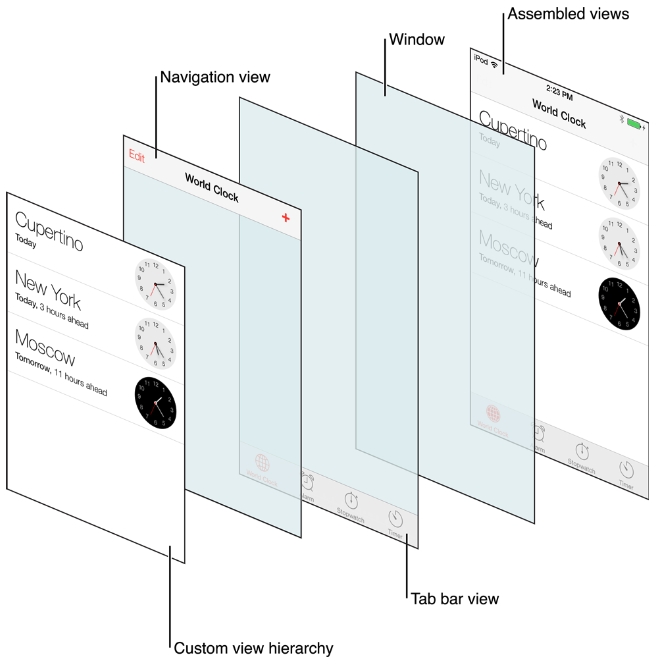

  - Views are often nested, as in the the previous view hierarchy diagram. A view that’s contained in another view is called a child view. A view that contains one or more views is called a parent view. In this example, each cell in the list is a child view of a table view, and each cell is a parent to three views: a label that displays a city name, another label that displays how the time zones are related, and an image view that displays an image of a clock.

- To display a view onscreen, you need to give it a frame — which consists of a size and a position — and add it to the view hierarchy. The area within the view is its bounds. When adding a view in Interface Builder, its background color is white by default. When creating a view in code, the background is transparent by default. You can set a new background color in either scenario.

  - Here are some of the attributes you can change when working with views:

    - 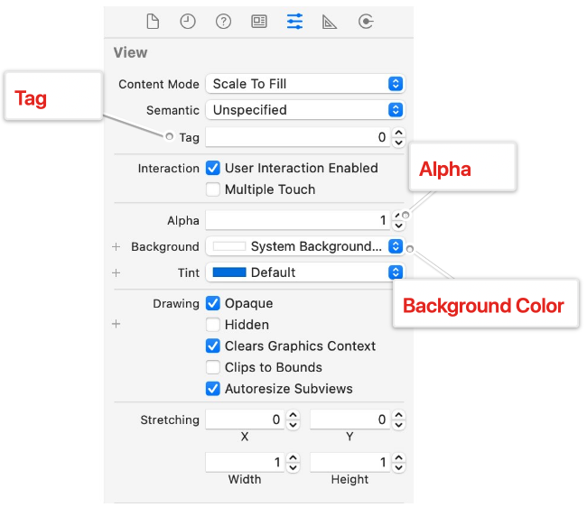

      - Tag: Integer that you can use to identify view objects
      - Alpha: Transparency of the view
      - Background Color: Background color that will be displayed

- Next, take a look at some of the most common views defined in UIKit.
- This section covers some common views you’ll work with using UIView. As you learn about the different views, think about apps you use and which views might be used to create their interfaces.
- **Label (UILabel)**

  - Labels use static text to relay information to the user.
  - Configuration

    - 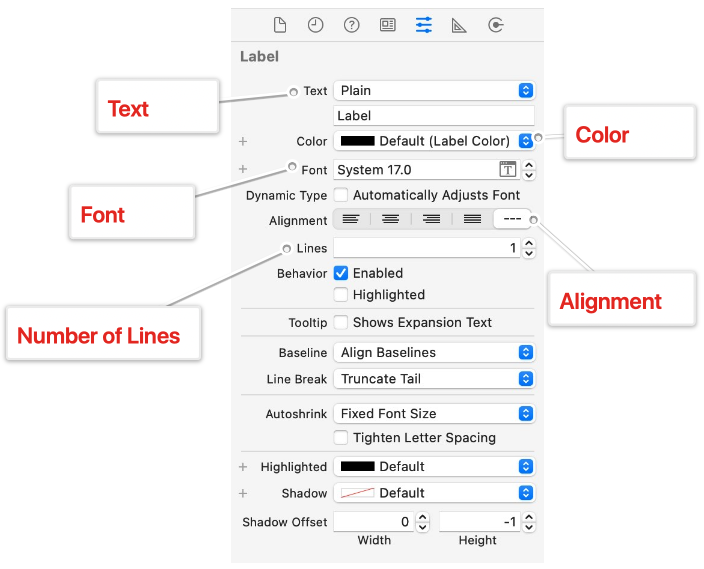

      - Text: Text displayed on the label
      - Color: Color of the text
      - Font: Font of the text
      - Alignment: Technique to use for aligning the text
      - Number of Lines: Maximum number of lines to use for rendering text

  - [UILabel Developer Documentation](https://developer.apple.com/documentation/uikit/uilabel)

- **Image View (UIImageView)**

  - An image view displays an image or an animated sequence of images. Some people confuse the image view with the image itself. Think of it this way: Just like a label displays text, an image view displays an image.
  - Configuration

    - 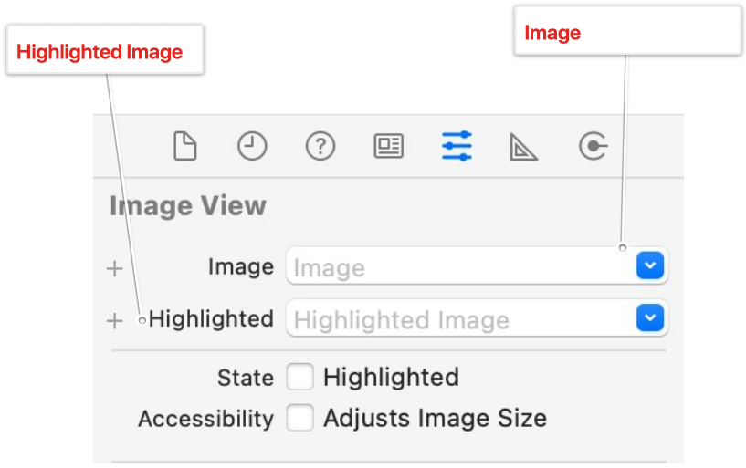

      - Image: Image displayed by the image view
      - Highlighted Image: Optional image to display when the image view is being tapped by the user

  - [UIImageView Developer Documentation](https://developer.apple.com/documentation/uikit/uiimageview)

- **TextView (UITextView)**

  - A text view allows the user to input text in your app. Text views accept and display multiple lines of text, with support for scrolling and editing. You’ll typically use a text view to display a large amount of text, such as the body of an email message.
  - Configuration

    - 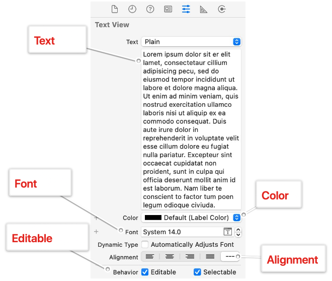

      - Text: Starting text displayed by the text view
      - Color: Color of the text
      - Font: Font of the text
      - Alignment: Technique to use for aligning the text
      - Editable: Whether the user can edit the text

  - [UITextView Developer Documentation](https://developer.apple.com/documentation/uikit/uitextview)

- **Scroll View (UIScrollView)**

  - A scroll view allows the user to see content that runs beyond the boundaries of the view. You’ll typically use a scroll view when the information you want to display is larger than the device’s screen.
  - When the user interacts with a scroll view, a vertical or horizontal scroll indicator briefly appears to indicate there’s more content to view.
  - Configuration

    - 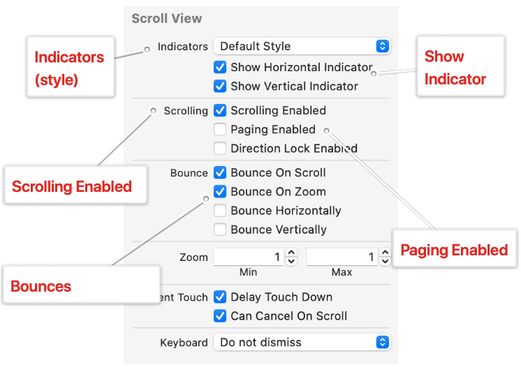

      - Indicators(style): Style of the scroll indicator - Default style, black, or white
      - Show Indicator: Whether to display a horizontal or vertical scroll indicator
      - Scrolling Enabled: Whether the user can scroll the content in the view
      - Paging Enabled: Whether the scrolling is fluid or jumps to the next page
      - Bounces: Whether the content bounces (horizontally and/or vertically) upon reaching the limits of the scrollable or zoomable area

  - [UIScrollView Developer Documentation](https://developer.apple.com/documentation/uikit/uiscrollview)

- **Table View (UITableView)**

  - A table view presents data in a single scrollable column of rows and sections, allowing users to navigate easily through groups of information. Table views are an excellent format for displaying and editing hierarchical lists of information.
  - For example, the Mail app uses a table view to display email messages in the user’s inbox, and the Messages app uses a table view to display message threads organized by contacts.
  - Configuration

    - Table views are interesting because you can customize the look and feel of the table view itself, as well as the look and feel of the rows (or cells) that it displays.

    - 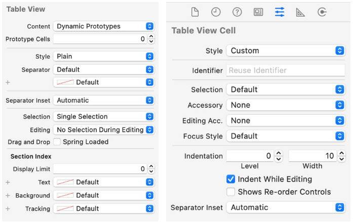

  - [UITableView Developer Documentation](https://developer.apple.com/documentation/uikit/uitableview)

- **Toolbars (UIToolbar)**

  - A toolbar usually appears at the bottom of a screen and displays one or more buttons, called bar button items. Users can select a button, or tool, to perform an action within a given view.
  - Configuration

    - You can configure the toolbar itself, or the bar items it displays. Each bar item consists of a title and an image, and can be enabled or disabled programmatically.

    - 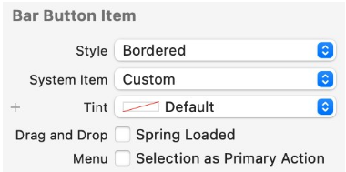

  - [UIToolBar Developer Documentation](https://developer.apple.com/documentation/uikit/uitoolbar)

- **Navigation Bars (UINavigationBar)**

  - You’ll use the navigation bar to present your app’s primary content in an organized way, one that you hope will be intuitive to the user. Navigation bars are typically displayed at the top of the screen, with bar buttons for navigating through a hierarchy of screens. They’ll most likely include a title and a back button.
  - Configuration

    - 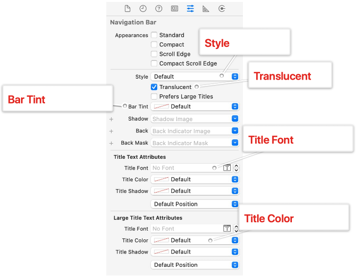

      - Style: Default (gray) or Black
      - Translucent: Whether the navigation bar should be slightly translucent
      - Bar Tint: The tine color to apply to the navigation bar background
      - Title Font: The font of the title displayed by the navigation bar
      - Title Color: The color of the title displayed by the navigation bar

  - [UINavigationBar Developer Documentation](https://developer.apple.com/documentation/uikit/uinavigationbar)

- **Tab Bars (UITabBar)**
  - A tab bar provides easy access to different views in an app. It displays multiple tab bar items, each made up of an icon image and text. You’ll use tab bars in your app to organize information by a specific feature or task. The most common way to use a tab bar is with a tab bar controller, which holds a property of each view controller that represents each scene you want presented in the tab bar. When the user taps an item, a new view related to the new task is displayed.
  - Tab bars are frequently used in apps that present multiple workflows or courses of action. For example, the App Store app has separate tabs to browse featured apps, search for a specific app, or check for available updates.
  - Configuration
    - Because you’ll most often use the tab bar in conjunction with a tab bar controller, you’ll add scenes to be displayed to the controller. The view controller for each scene has a UITabBarItem property that defines the text and optional image that will be displayed by the tab bar. To add a scene to a tab bar controller, and the tab bar view, you link it to the tab bar controller's viewControllers property in a storyboard.
  - [UITabBar Developer Documentation](https://developer.apple.com/documentation/uikit/uitabbar)

#### Controls

- In the previous section, you learned about common views that display information to the user. What about responding to user input? You'll use tools in UIKit, known as controls, to tell the app what to do.
- Think of a control as a communication tool between the user and the app. When the user interacts with a control, the control triggers a control event. Different controls trigger different control events.
- After setting up a control in Interface Builder, you set up an @IBAction that responds to a specific control event and allows you to execute a block of code. Most often you will use the Primary Action Triggered (UIControl.Event.primaryActionTriggered) control event. This control event is triggered when a button is tapped or when the value of a control changes.
- Controls are simple, straightforward, and familiar to users because they appear throughout most iOS apps. As you learn about some of the different subclasses of UIControl, on the following pages, think about your favorite apps and how you use controls to interact with to them.
- **Buttons (UIButton)**
  - Users of iOS devices can initiate a control event with the tap of a button. When you set up a button, you give it a title or an image that conveys what the button will do when tapped. The appearance of the button changes with different states of being tapped: tapping down and lifting up.
  - The primary control event is triggered when the user releases a button after tapping it. Buttons can also execute code at different stages of a tap, such as when the user first touches the button, holds down the button, or cancels the tap by dragging their finger outside of the frame of the button before lifting their finger.
  - [UIButton Developer Documentation](https://developer.apple.com/documentation/uikit/uibutton)
- **Segmented Controls (UISegmentedControl)**
  - A segmented control is a horizontal set of multiple segments. Each segment functions as a discrete button, allowing the user to choose from a limited, compact set of options. This example, from Maps, allows the user to change the display mode, with three choices: Map, Transit, or Satellite.
  - Segmented controls execute code when the control’s value changes. The value represents which segment of the control is selected.
  - [UISegmentedControl Developer Documentation](https://developer.apple.com/documentation/uikit/uisegmentedcontrol)
- **Text Fields (UITextField)**

  - Text fields allow the user to input a single line of text into an app. You’ll use them to gather a small amount of text and to perform some action based on that text.
  - Configuration

    - 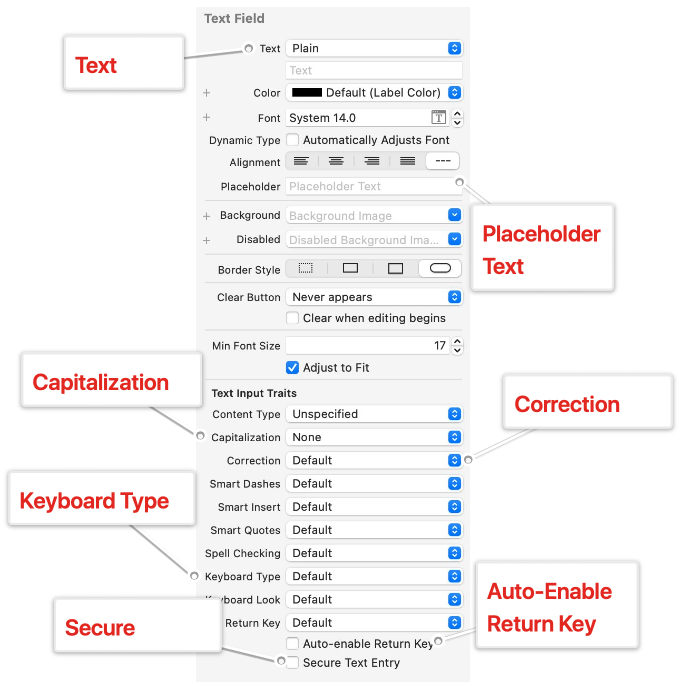

      - Text: Text that's displayed by the text field
      - Placeholder Text: Text that's displayed when the text field is empty
      - Capitalization: Setting that controls how the keyboard deals with capitalization
      - Correction: Setting that enables or disables autocorrect
      - Keyboard Type: Setting that controls which keyboard is displayed, for example: email, web, or default
      - Auto-Enable Return Key: Return key disabled until text is entered
      - Secure: Specify that the text field shouldn't display its contents; commonly used for passwords

  - Text fields execute code when the user presses the ‘Return’ or ‘Done’ key on the keyboard, or when the user edits the text.
  - [UITextField Developer Documentation](https://developer.apple.com/documentation/uikit/uitextfield)

- **Sliders (UISlider)**

  - Sliders allow users to make smooth and gradual adjustments to a value—useful for controls that modify things like speaker volume, screen brightness, or color values. The user controls a slider by moving from a starting value along a continuous range between minimum and maximum values.
  - Configuration

    - 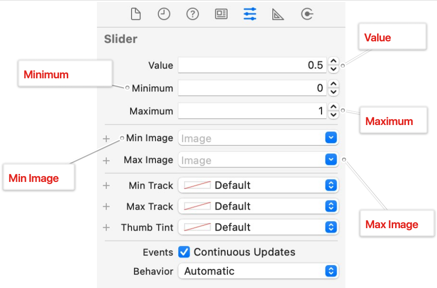

      - Value: Starting number value the slider will represent
      - Minimum: Lowest number value the slider may represent
      - Maximum: Highest number value the slider may represent
      - Min Image: Optional image on the minimum end of the slider
      - Max Image: Optional image on the maximum end of the slider

  - Sliders execute code as the user changes the value of the slider.
  - [UISlider Developer Documentation](https://developer.apple.com/documentation/uikit/uislider)

- **Switches (UISwitch)**

  - A switch lets the user turn an option on or off. You’ve probably noticed — and used — switches throughout the Settings app.
  - Configuration

    - 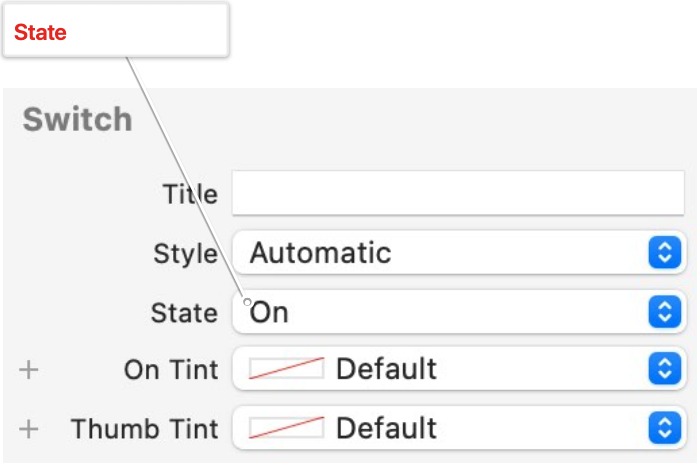

      - State: A Boolean value that determines the on/off state of the switch

  - Switches execute code as the user toggles the control.
  - [UISwitch Developer Documentation](https://developer.apple.com/documentation/uikit/uiswitch)

- **Date Pickers (UIDatePicker)**

  - Date pickers provide a straightforward interface for managing date and time selection, allowing users to specify a particular date quickly and efficiently.
  - Configuration

    - 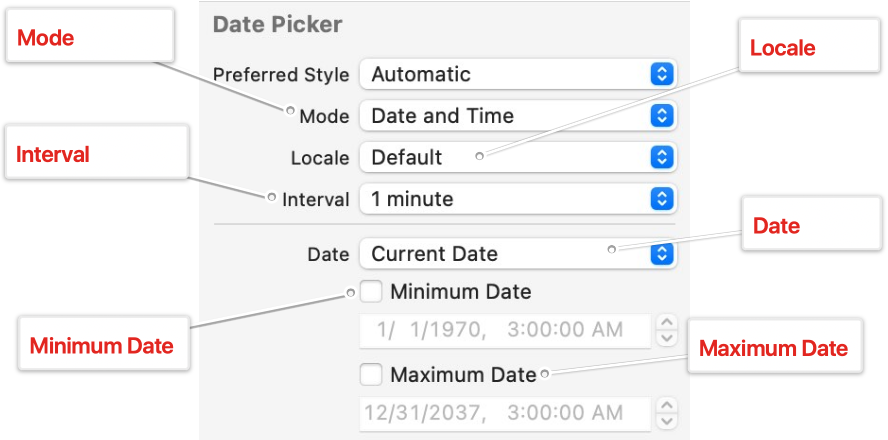

      - Mode: Setting that controls whether the picker should choose a date, or a date and time
      - Locale: Information for how the date should be displayed, varies by language or culture, defaults to the device's current locale
      - Interval: Controls granularity of the picker segments, for example, whether there should be an option for each minute, or every five minutes, fifteen minutes, etc.
      - Date: The starting date when the picker is first displayed
      - Minimum Date: The earliest the date picker allows the user to choose
      - Maximum Date: The latest the date picker allows the user to choose

  - Date pickers execute code whenever the value of the selected date or time is changed.
  - [UIDatePicker Developer Documentation](https://developer.apple.com/documentation/uikit/uidatepicker)

#### View Controllers

- UIKit defines a special class that controls a view, sets up child views, controls what they display, and responds to user interaction. This class is called the UIViewController.
- Most commonly, each screen in an app is represented by a scene in a storyboard, and each scene in a storyboard is associated with a subclass of UIViewController. The associated UIViewController subclass is defined in a .swift file that holds all of the logic that controls the scene. Each UIViewController class has a view property that represents the parent view of the scene.
- Think back to the Light project you built in the first unit. The project has a single storyboard with a single scene. That scene was linked to a UIViewController subclass called ViewController. The light was toggled by adjusting the view property of ViewController. That view property is the same instance of UIView as the parent view of the scene in the storyboard.
- When you added a button to the screen, the button became a child view of the scene’s main view. When you wired up actions and outlets, you linked them to the ViewController file, which defined the view controller for that scene.
- You’ll learn how to make complex view controllers in later lessons. But for now, it’s enough to understand that each different type of screen you see in an app is managed by a different type of view controller.

#### Where to Learn More

- You’ve just learned about the most common views and controls in UIKit. But where would you go to find out more about these and other UIKit tools? As you learned earlier, Apple has large teams dedicated to writing documentation to help developers like you learn more about the system tools for building apps.
- Most of the information for this section is from a set of guidelines called the [Human Interface Guidelines](https://developer.apple.com/design/human-interface-guidelines/designing-for-ios), which was written and maintained by one of those teams. When you want to learn more about UIKit, you can go to developer.apple.com and search for more information about the topics in this lesson.

### 2.9 Displaying Data

- In this lesson, you’ll plan out and build a simple app called Hello, an app that you could use to introduce yourself. As you work, you’ll apply what you’ve learned about some of the common views in UIKit.

#### Planning the App

- Most apps start with a simple idea, which can usually be summed up in one short sentence. Think of apps that you use every day. They may have started with the following straightforward ideas:
  - “Send and receive messages.”
  - “Share photos with my friends and family.”
  - “Post short messages, and see the short messages that others have written.”
- As an app developer, you’ll learn how to take a one-sentence overview of an app or a feature and plan out how to make it a reality.
- In this project, your task is to build an app for introducing yourself. This guide will give you a framework for what to include, but the app will introduce you. Bring in your own ideas, and make it yours.
- Think about how you would introduce yourself to someone you haven’t met before. What information would you want to make sure someone knew about you? Start by writing down your name, then take a few minutes to write down what you might share about yourself. Use the following prompts to help you come up with enough information for your app.
  - Who are you? What is your life all about?
  - What does a day in your life look like?
  - If you had all the time and money you needed, what would you do with your life?
  - What are some of your favorite things or activities?
- Include any other information you think other people would want to know.
- Sometimes the information you want to display in an app is consistent and never changes. In programming, this information is called static data. As you plan your app, you’re brainstorming static data about yourself. In future apps, you’ll work with data that changes, which is called dynamic data.
- Example
  - About Me
    - My name is Cynthia Yao. I’m a dedicated student, I play lacrosse,
    - I love animals, and I’m looking for an internship in Marine Biology.
    - Location: Half Moon Bay, California
    - Website: www.example.com
  - Day in the Life
    - Eat breakfast
    - Go to school
    - Go to lacrosse practice
    - Eat dinner
    - Hang out with friends
    - Watch TV
  - When I Grow Up
    - I want to sail around the world, spend time in new countries, learn new languages, and meet awesome people everywhere I go.
  - Favorites
    - Food: Ice cream
    - Sport: Lacrosse
    - Book: A Tale of Two Cities
- As you come up with information that’s unique to you, you can probably imagine many ways to display it and share it with others. For this project, try to think about how you might display this information on a single screen.
- Since you’re still in the planning phase, you might find it helpful to open Pages or Keynote and create a rough outline of the data you want your app to display.
- You’ll probably discover that all the information you want to include won’t fit on a single iOS device screen — which means you’ll need to enable scrolling. In this lesson, you’ll create part one of the project, adding your name, a profile image, and a few sentences about yourself. In a future lesson, you’ll complete part two, using more advanced layout features in Interface Builder to add images and labels in a scroll view.

#### Create the Project and Enter Your Information

- Create a new Xcode project using the iOS App template. When creating the project, make sure the interface option is set to Storyboard. Name the project "Hello" and save it to your project folder.
- Open the Main storyboard. You’ll use the initial scene to add your information. Because your app will always display the same data, you can build your static data directly into your screens using labels or images in Interface Builder. In future lessons, you’ll learn to write code for displaying dynamic data.
- As you choose fonts, colors, and other display settings, do your best to keep a clean-looking presentation that fits on an iOS device. Avoid unreadable fonts, conflicting color schemes, and confusing text layouts.
- As you place views, take advantage of the layout guides to center your content and be careful to observe margins and allow sufficient spacing between objects. You’ll also want to avoid putting content in the status bar at the top of the screen.
- **Add Labels for Displaying Text**
  - For each of the text items you want to include, drag a Label object from the Library to the scene. At a minimum, add labels for your name and one or two sentences about yourself. You can add the rest when you finish this project in a future lesson.
  - Selecting one label at a time in the storyboard, use the Attributes inspector to set the label’s text and choose an appropriate font. If you want a label to display as a header, make the font bigger or bolder than the default text. Do you want to use a custom font? Open the Font pop-up menu and choose Custom to select from all the fonts installed on your Mac.
  - Experiment with different attributes in the inspector to see how each of them modifies the appearance of your labels. For example, you can change the alignment of the text or the number of lines you want the label to display. By default, labels display only one line of text, which may cut off any remaining text at the end of the line.
  - When working with static information, you can keep increasing the number of lines until you see that the label can display all your text. But there’s a better way that allows the text to flow to as many lines as it needs to display the entire text you provide.
  - Look at the documentation for UILabel and find the numberOfLines symbol. In the Description section, you’ll see the following text:
    - This property controls the maximum number of lines to use in order to fit the label’s text into its bounding rectangle. The default value for this property is 1. To remove any maximum limit, and use as many lines as needed, set the value of this property to 0.
  - The numberOfLines property is useful when you want a label to display text that flows beyond a single line. Feel free to explore the documentation for UILabel to discover other strategies for fitting text into a label.
  - Finish up adding text to all the labels you want to include in your Hello app.
- **Add an Image**

  - Your introduction wouldn’t be complete without a photograph of yourself. If you don’t already have an image you like, you can use the Photo Booth app to take a selfie. Make sure you have the image file handy on the desktop or in the Finder. If you have more images, you’ll have a chance to add them to the app in a future lesson.
  - Now go ahead and add the image file to your scene so that the app will display it.
  - Here's how to add an image to your Xcode project:
    1. Open the Navigator area. Make sure the Navigator area on the left is open and that the Project navigator shows a list of your files. If you’re working on a small screen, you may want to close the Inspector area on the right.
    2. Select Assets. Xcode has automatically added this Asset Catalog to your project. This is the best place to keep the images you’ll use in your app.
    3. Drag in the image file. Add the image to your storyboard and give it a name in the Document Outline. The image is now part of your app.
  - Now that you’ve added an image of yourself, you can set up an image view in Interface Builder. Go back to the Main storyboard. From the Library, drag an Image View object to the scene.
  - Using the Attributes inspector, choose the name of your image from the Image pop-up menu. This will assign that image to the image view you just created.
  - In the previous lesson, you learned that an image view is like a frame around the image it will display. The size of the image view determines the total potential display size of the image. By setting the content mode of the image view, you can control if the image will display within the frame, potentially leaving empty white space, if it will stretch to fit within the frame, potentially distorting the image, or if it will stretch to fill the entire frame, potentially cropping some of the image.
  - In the table below, you can see the most common contentMode options for a square UIImageView displaying a non-square image.

    - 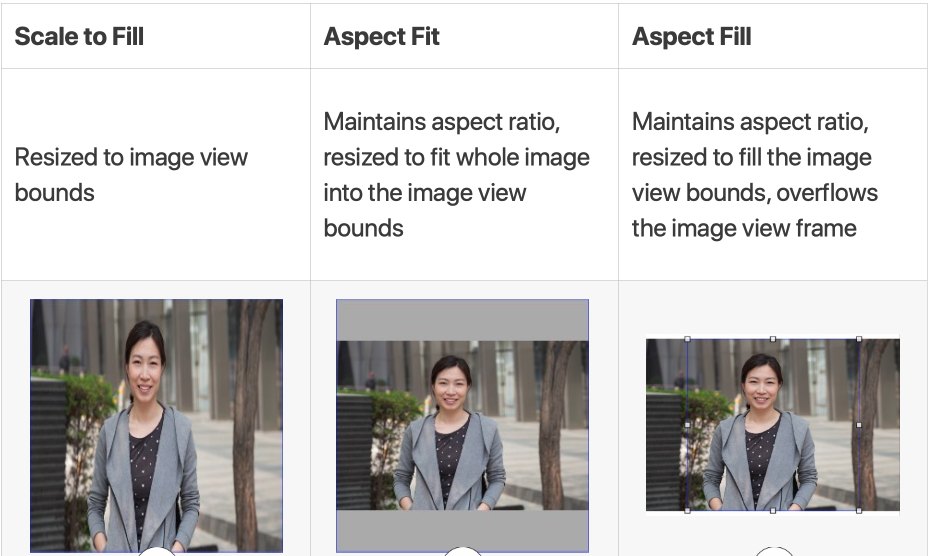

  - Choose the correct content mode for the image you added to your project.

#### Address Layout Issues

- **Unexpected Clipping**
  - It’s possible you’ve encountered occasional warnings or bugs with your layout. Don’t worry about these right now. In a later lesson, you’ll learn how to resolve them and how to use more advanced layout options, including Auto Layout, in Interface Builder.
  - However, if you've run into unexpected clipping (a common issue), you can resolve it now. Just as an image view frames the image it's displaying, a label frames the text it displays. If a label's content is larger than the label itself, it results in clipped text.
    - To fix clipped text, you have two choices: decrease the font size or increase the label size.
  - Images can also have clipping issues. For example, if you have an image view with a different aspect ratio than the image it displays and you choose the Aspect Fill content mode, some of the image will overflow the bounds of the image view.
    - Interface Builder allows you to modify this behavior, or choose whether or not content outside the bounds of the view will be visible.
    - To fix overflowed issue, check Clips to Bounds on Drawing section of Attribute inspector.
- **Placement Errors with Different Screen Sizes**
  - When you learn about Auto Layout, you’ll learn how to make your interface scale across various device sizes. But for now, make sure you set up your interface for the same device size that you’re using in Simulator. This will ensure that you see a consistent view across your projects.
- **Showing More Content**
  - You've now built a simple app with a few labels and one image in a single view. In the "Auto Layout and Stack Views" lesson, you'll learn how to use advanced layout tools to position views, and how to use a scroll view to add more content.

### Lesson 2.10 Controls In Action

- When you first learned about Interface Builder, you added a button to the screen and printed when the button was tapped. In this lesson, you’ll review that exercise with your new knowledge of views and controls, and you’ll repeat it with switches and sliders.
- **Buttons**
  - As you know from your own direct experience with apps, buttons are the most common type of input control. Add a button to your main scene and have it print a statement to the console when it’s tapped.
    1. Create a new project called “CommonInputControls” using the iOS "App" ​template.
    2. Open the Main storyboard. Then find a Button object in the Object library.
    3. Drag the button to the scene, placing it about a third of the way from the top of the screen. Open an assistant editor to see the corresponding ViewController file.
    4. Using the Control-drag shortcut, add an @IBAction from the button to the view controller code. Remember to add the action within the curly braces that define the ViewController class. On fresh view controller files, like this one, most developers add new actions below the viewDidLoad() block of code.
       - Use a descriptive name for your action, such as `buttonTapped`. Later on, when you look at the code in the ViewController file, you’ll be glad that the name of the action gives you a clue as to what will trigger it.
       - The most natural time for a button to execute code is when the user taps it and releases the touch from within the bounds of the button. That’s why “Touch Up Inside” is the default control event when you create an @IBAction from a button. You can also use the "Primary Action Triggered" control event, which will be triggered at the same time as "Touch Up Inside." If you want code to execute in response to a different control event, you can choose from the options in the pop-up menu.
       - Remember that when you create an @IBAction the function is passed to the sender as a parameter. The sender refers to the specific control that triggered the action. In this case, the sender is the tapped button.
         - `@IBAction func buttonTapped(_ sender: Any) { }`
       - When you know that the sender will always be the same type of object (like the button in this example), you can change Any to the specific control type (UIButton in this example). To make this change, you’ll access properties on sender within the @IBAction.
    5. Use the print() function to print a line of text to the console when the user taps the button.
       - `print(”Button was tapped!”)`
       - You can put any code or logic inside the control’s action using this same workflow.
    6. Run the app in Simulator, and try clicking the button you just created. You should see the printed text in the console area.
       - Right now, the text on the button doesn’t relate to the action it will trigger. Use Interface Builder to update the button’s text to something more descriptive of the code it will execute.
       - You can also set other button attributes, including its font, alignment, and shadow. To get a feel for the things you can adjust, take a moment to play around with the various options in the Attributes inspector.
- **Switches**

  - Switches are used to toggle a single option. You can use an @IBAction to execute code when a switch is toggled one way or another. Or you can check if the switch is currently toggled to the on or off position by accessing the `isOn` value from the sender parameter or from an @IBOutlet.
  - Add a switch to your CommonInputControls project, and print whether the switch is on or off when the user toggles the control.

    1. Find a Switch object in the Object library, and drag it to your scene.
    2. Using the assistant editor, add an @IBAction from the switch to the ViewController file. As with button actions, use a descriptive name, such as `switchToggled`, and set the sender type to `UISwitch`. Add code that will print to the console whether the switch was turned on or off.

       - ```swift
          @IBAction func switchToggled(_ sender: UISwitch) {
              if sender.isOn {
                  print(”The switch is on!”)
              } else {
                  print(”The switch is off.”)
              }
          }
         ```

    3. Run the app in Simulator, and toggle the switch. You should see the printed text in the console area.

- **Sliders**

  - Sliders allow the user to have smooth control over a value, such as adjusting volume or setting a numeric value with a large number of potential contiguous values. For example, in Display & Brightness settings, you use a slider to adjust the brightness of your device’s display.
  - Add a slider to your CommonInputControls project, and print the slider’s value as it changes.

    1. Find a Slider object in the Object library, and drag it to your scene.
    2. Using the assistant editor, add an @IBAction from the slider to ViewController. Use a descriptive name, such as sliderValueChanged, and set the sender type to UISlider. Add some code that will print the value of the slider to the console.

       - ```swift
          @IBAction func sliderValueChanged(_ sender: UISlider) {
              print(sender.value)
          }
         ```

    3. Run the app in Simulator, and move the slider. You should see the printed value in the console.

- **Text Fields**

  - Text fields allow the user to enter a small amount of text, such as entering a username or password. For example, you use a text field when entering a subject on a new email draft.
  - Add a label and a text field to your "CommonInputControls" project, and set the label's text to the current text in the text field when the user taps the Enter or Done key on the keyboard.

    1. Find a Text Field object in the Object library, and drag it to your scene.
    2. Using the assistant editor, add an @IBAction using the `Primary Action Triggered` event from the text field to ViewController. Use a descriptive name, such as `keyboardReturnKeyTapped`, and set the sender type to `UITextField`. Use the action to print the current text of the field.

       - ```swift
          @IBAction func keyboardReturnKeyTapped(_ sender: UITextField) {
              if let text = sender.text {
                  print(text)
              }
          }
         ```

    3. Remember that text fields can also trigger code when the user edits the contents of the field. Using the assistant editor, add an @IBAction using the `Editing Changed` control event from the text field to ViewController. Use a descriptive name, such as `textChanged`, and set the sender type to `UITextField`. Use the action to print the current text of the field.

       - ```swift
          @IBAction func textChanged(_ sender: UITextField) { 
              if let text = sender.text {
                  print(text)
              }
          }
         ```

  - Text fields are very flexible and should be configured to best fit the situation they are used in. For example, you can set the keyboard to display different keys based on whether the user is entering an email address or a URL. You can also turn autocorrect on or off, or set the text field to a secure input field to hide the characters as the user types them. Take some time to explore the options and use them appropriately when building your app.

- **Actions and Outlets**

  - You can create outlets that allow actions to access properties on your views and controls — even if the view or control isn’t the sender.
  - For example, you may have an outlet for a label that gets updated by a button’s action.
  - In the steps below, you’ll change the `buttonTapped` function triggered by the tapped button to access the current isOn state of the switch and the current value of the slider.

    1. Using the same Control-drag technique in the assistant editor, add @IBOutlet references for the switch and slider. Developers usually place @IBOutlet references above the viewDidLoad() function in a view controller file. Just as when naming an @IBAction, you should choose a descriptive name for your @IBOutlet. You might think to choose switch and slider for this @IBOutlet, but there’s a problem with switch. It turns out that “switch” is a reserved keyword in Swift, so the best practice is to use toggle to name an @IBOutlet for a switch: `@IBOutlet var toggle: UISwitch!`, `@IBOutlet var slider: UISlider!`
    2. Update the `buttonTapped` function in the @IBAction from the button to print the current isOn state and the value of slider.

       - ```swift
          @IBAction func buttonTapped(_ sender: UIButton) {
              print(”Button was tapped!”)
           
              if toggle.isOn {
                  print(”The switch is on!”)
              } else {
                  print(”The switch is off.”)
              }
           
              print(”The slider is set to \(slider.value)”)
          }
         ```

    3. Run the app in Simulator and click the button. You should see the printed text in the console.

- **Gesture Recognizers**

  - Each of the controls interact with gestures: buttons and switches ares configured to work with taps, sliders work with swipes, etc. A gesture is tied to a single view, but a view can have multiple gestures. For example, a switch responds to a tap, but the user can also swipe a switch left and right to turn it on and off. You can add your own gesture recognizers on top of any view you wish, from simple taps to complex pinches, long-presses, and rotations.
  - In this example, you’ll add a tap gesture recognizer on top of your view controller’s view. To begin, search the Object library for “gesture” to see the full list of available gesture recognizers.
  - Grab the `Tap Gesture Recognizer`, and drag it on top of the view that should respond to the tap event. In this case, drag it on top of the view controller’s view.
  - You will see the recognizer added to the Document Outline. Select the recognizer from the Document Outline and open the Attributes inspector. Different gestures will contain a different list of properties. You can adjust the number of taps that the recognizer requires, such as a single or double-tap, as well as the number of touches (or fingers) required to trigger any actions connected to the recognizer. In this example, you want to recognize a single tap using a single finger, so leave both values at 1.
  - Using the assistant editor, add an @IBAction from the recognizer to ViewController. Use a descriptive name, such as `respondToTapGesture`, and set the sender type to `UITapGestureRecognizer`. The following implementation of respondToTapGesture will determine where the user tapped when the recognizer’s action was called, and will print out the x/y value to the console.

    - ```swift
        @IBAction func respondToTapGesture(_ sender:
        UITapGestureRecognizer) {
            let location = sender.location(in: view)
            print(location)
        }
      ```

  - Build and run your application, then try tapping on the screen. The coordinates of your tap will be printed. Notice how the action does not trigger when you interact with the other controls on-screen, because the gesture is only tied to the view controller’s view.

- **Programmatic Actions**

  - How does Interface Builder connect controls to actions? It is helpful to understand how to connect controls to actions through code. At the very least, it will help you understand the work that Interface Builder is doing on your behalf.
  - To demonstrate connecting a control to a method programmatically, you will disconnect the existing button from the `buttonTapped(_:)` action and re-connect the two in code. Highlight the button in your storyboard, then open the Connections inspector. In the list of control events, you can see that the button executes the `buttonTapped(_:)` method when your finger presses down, then up, inside the control.
  - Tap the ‘x’ next to the method name, breaking the connection between the button and the action. Touch Up Inside will no longer be connected to any methods.
  - In order to connect the button to a method programmatically, you’ll need a reference to the button in code. Use Interface Builder to create an @IBOutlet for the button; `@IBOutlet var button: UIButton!`
  - The best place to connect the button to the action is right after the view has finished loading. Add the following code to the bottom of viewDidLoad(): `button.addTarget(self, action: #selector(buttonTapped(_:)), for: .touchUpInside)`
  - The `addTarget(_:action:for:)` method will connect the control to a particular action, and it requires three arguments.
    - The first argument is the the owner of the function you want to execute. The owner of the `buttonTapped(_:)` method is the ViewController, or self.
    - The second argument is a “selector”: the name used to select a method to execute for an object. Swift uses `#selector` as its syntax to locate a particular method.
    - The last argument is the event that should trigger the action. Just like you saw earlier in the Connections inspector, you should tie your actions to the Touch Up Inside event. (Other controls, such as switches and sliders, should utilize the Value Changed event.)
  - Build and run your application, and verify that when you tap the button the method still executes. Save your CommonInputControls project to your project folder.

### Lesson 2.11 Auto Layout and Stack Views

- As you begin developing apps for iOS, it’s important to think of the different devices that your apps will run on. You’ve learned that every user interface element has a size and a position on the screen. How might the size and position of those elements change in relation to the size and orientation of the device?
- Create a new Xcode project using the iOS App template. When creating the project, make sure the interface option is set to Storyboard. Name the project "AutoLayoutPractice." Open the Main storyboard and use the layout guides to add a Button from the Object library to the top-left corner of the screen.
- Interface Builder provides a quick way to check what your interface will look like on different screen sizes. Click the "Devices" button at the bottom of the canvas (the current selection is shown next to the button) to reveal a menu that lists multiple iOS devices. To the left of the "Devices" button are buttons for adjusting how the interface style, orientations, appearance and accessibility setting will be viewed.
- Go ahead and play around with the list. As you choose different screen sizes, styles, and orientations, the canvas redraws your user interface accordingly. If you've positioned a button in the top left of the canvas, it remains in that same position — no matter which device or orientation you've selected.

#### Why Auto Layout?

- Now return the canvas to the iPhone 13 / iPhone 13 Pro screen size in portrait orientation, then move the button to the center of the screen. Use the blue alignment guides to ensure that the button is exactly in the center of the view.
- Now switch the orientation to landscape mode. You’ll see that the button is no longer centered. In fact, it isn’t even on the screen!
- What’s going on? The button has stayed in the same X/Y position, based on the portrait orientation when you created the button. If you want the button to stay in the exact center, regardless of screen size or orientation, you’ll need to create a set of constraints, or rules, that can be used to determine the size and position of your button. This system of using constraints to make adaptive interfaces is called Auto Layout.

- **Create Alignment Constraints**

  - At the right of the bottom button bar is a set of tools for creating and managing constraints. To lock the button in the center of the screen, you’ll create two constraints that define the position of the button:
    - The horizontal center of the button is equal to the horizontal center of the view.
    - The vertical center of the button is equal to the vertical center of the view.
  - Start by returning to the portrait orientation and ensuring that the button is centered in the view. With the button selected, click the Align button, the second button in the bottom bar of constraint tools.
    - A popover displays a list of alignment constraints, which define the relationship between the selected object and the parent view. Select the bottom two options, “Horizontally in Container” and “Vertically in Container,” then click “Add 2 Constraints.” Once you’ve created these constraints, you should see crossing blue lines over the top of your button, indicating horizontal and vertical alignment with the parent view.
  - Use the “View as” button to select different devices and orientations. You’ll see that the alignment constraints you added are keeping the button centered in all views.

- **Create Size Constraints**

  - What about the width and height of the button? Since there aren’t currently any size constraints on the button, its size is dictated by the button text and font. But Interface Builder provides multiple ways to use constraints to set the width and height of interface elements.
  - Start by using the Attributes inspector to change the background color of the button to something other than clear. This will make the button’s size easier to see.
  - Now assume you want the height of the button to always be 60, no matter the screen size or orientation of the device. Click the Add New Constraints button , the button immediately to the right of the Align tool.
    - The popover displays a list of text fields and checkboxes to help you add constraints. Select the Height checkbox and adjust the value to 60. Click “Add 1 Constraint” to create the height constraint.
  - Note again that if you use the “View as” button to select different devices and orientations, you’ll see that the size constraints added are keeping the button size identical in all views.

- **Constraints Relative to the Screen**

  - You’ve fixed the height of the button, but what if you want the button’s width to vary based on the screen size? Assume you want the button’s left and right edges to always be 20 pixels from the left and right edges of the view, respectively.
    - Click the Add New Constraints button again, and notice the four fields at the top of the popover. These values define the distances from the top, leading, bottom, and trailing edges of the button to the nearest view. In this case, since there are no other views on the screen, they’re dictating the distances from the button edges to the view’s edges.
    - Leading refers to the left edge of the screen, while trailing refers to the right edge. These are labeled “leading” and “trailing” instead of “left” and “right” since not all languages read in the same direction. For certain users, you’ll want your app flipped. Leading and trailing constraints make this process easier.
    - Adjust the left and right-edge values to 20. The red indicators will illuminate to show which edges are being constrained. Click “Add 2 Constraints.”
  - Notice that the button has now expanded to be 20 pixels from each edge of the screen. Use the “View as” button to select different devices and orientations. You’ll see that the width of the button varies such that it always maintains the same distance from the edges of the screen. If for some reason the button didn’t update, update the button’s frame using the Update Frames tool at the left of Align button.

- **Safe Area Layout Guide**

  - Remove the button from the screen by selecting it and pressing the Delete key. Add a label from the Object library to the top-left corner of the screen. Using the Add New Constraints tool, create constraints with values of 0 on the top, left, and right of the label to the view.
  - Now select the label and open the Size inspector. You can view the three constraints that you just added.
  - Notice that the constraints are between the label (which you have selected) and the Superview. This means the edges of the label are constrained to the edges of the main view controller’s view. You can see in Interface Builder that this places the label under the status bar and obscures some of the label’s text. You may be tempted to simply change the value of the top constraint so that the distance from the top is equal to the height of the status bar. However, what if later that view controller is embedded in a navigation controller? The label would no longer be covered by the status bar, but it would then be covered by a navigation bar.
  - To fix this, you’ll need to create constraints relative to the Safe Area of your view controllers. The Safe Area is displayed in Interface Builder as a subview of the view controller’s primary view.
  - If you select the Safe Area, the entire view controller is selected except for portions of the screen that are taken up by system views like the status bar and home indicator. Interface Builder anticipates the existence of these common system views. However, other system bars can turn up at runtime, and the Safe Area will adjust for those as needed. This allows your content to adapt to system overlays such that it won't be hidden.
  - Delete your current constraints by selecting them one at a time in the Size inspector and pressing the Delete key.
  - Drag your label a bit lower on the screen so it is below the status bar, and create a constraint between the label’s top edge and the top edge of the Safe Area using the Add New Constraints tool. Also add constraints for the leading and trailing edges of the label. Since the Add New Constraints tool constrains your view to the nearest view, creating these constraints with the tool will constrain the top, leading, and trailing edges of the label relative to the Safe Area.

- **Resolve Constraint Issues**

  - Now delete the label that you added. Add a button to the center of the view controller and give it two alignment constraints - one to center it vertically on the screen, and one to center it horizontally on the screen. Now use the Add New Constraints tool to constrain its left edge 20 pixels from the left edge of the screen, and to constrain its right edge 30 pixels from the right edge of the screen.
  - The red lines on the canvas indicate that there's a problem. You've now created two conflicting constraints, each of which is trying to dictate the X position of the button. To see a list of constraint conflicts, click the red indicator in the top-right corner of the Document Outline.
  - One of the constraints says, "Set the horizontal center of the button equal to the horizontal center of the view"; and the other says, "The left edge of the button is 20 pixels away from the left edge of the view." Since these two constraints can't coexist, you'll need to remove one.
  - From the Conflicting Constraints list, click the red error indicator at the top right. Select the constraint that centers the button, and then click Delete Constraints.
  - From time to time, you may run into a constraint issue that’s tricky to resolve. Or maybe you’re adding interface elements to the scene and you need to reconfigure the view’s layout. In either situation, you can click the Resolve Auto Layout Issues button, next to the Add New Constraints tool, and use the options to try to automatically address constraint issues.
  - Update Constraint Constants will attempt to update the rules to match what is currently displayed in the storyboard scene.
  - Add Missing Constraints will attempt to add new constraints that match what is currently displayed in the storyboard scene.
  - Reset to Suggested Constraints will clear all constraints and attempt to accurately assign new constraints that match what is currently displayed in the storyboard scene.
  - Clear Constraints will remove any rules associated with the position and size of the selected view or all views.

- **Resolve Constraint Warnings**

  - Move the button you've been working with to a different position in the scene. You should see an Auto Layout warning.
  - To understand what's happening, click the yellow indicator in the top-right corner of the Document Outline. The warning informs you that the position of the button is no longer in sync with the position defined by the constraints.
  - To adjust the button’s position to fit the constraints, select the button on the canvas, then click the Update Frames button.

- **Constraints Between Siblings**

  - So far in this lesson, you’ve learned how to create constraints that define relationships between a view and its parent view. But there may also be times you want to create constraints between sibling views. In the following exercise, you’ll work with multiple labels that display text information about yourself.
  - Delete the button you've been working with, and add a label to the scene. Double-click the label and type in your name. Drag the label near the top of the view, using the guides to center it horizontally.
  - With the label selected, use the Add New Constraints tool to constrain it to be 0 pixels from the top of the Safe Area. To enable the constraint, you may need to select the red indicator line below the top field in the popover.
  - Use the Align tool to align the horizontal center of the label with the center of the parent view.
  - With one label set, you can add a second label and base its position on the position of its sibling. Drag another label from the Object library onto the view, just below the existing label. Enter some information about yourself, perhaps one of your favorite hobbies, into the new label’s text.
  - Now assume you want the new label to have the same horizontal center as the first label and to be positioned 20 pixels below it. With the new label selected, click the Add New Constraints button. In the popover, enter 20 into the top text field, and click “Add 1 Constraint.”
  - At this point, Interface Builder will display an error, indicating that the new label has a constraint describing its vertical position, but no information about its horizontal position. Interface Builder can help you resolve this error.
  - Select both labels in the scene by Command-clicking each of them, and click the Align button. In the popover, select the Horizontal Centers checkbox, set its value to 0, and click “Add 1 Constraint.” This tells Interface Builder that you want the selected views to have the same center position, with 0 pixels of offset.
  - If Interface Builder still displays a warning, click the Update Frames button to update the labels’ frames to match the constraints you just specified.
  - To practice what you just learned, add three new labels and repeat the above steps three more times to position them on the scene. When you’re done, each label should be 20 pixels below the previous one, and they all should be centered horizontally.

- **Stack Views**

  - Did you find that last exercise a bit repetitive? Managing the constraints of multiple objects can be tedious, especially when the position of each element is the same distance from the previous one. What if you decide later to have 30 pixels of separation between labels instead of 20? Or what if you want all of the labels to be positioned on the left side of the parent instead of in the center? You would have to spend a lot of time updating each and every constraint.
  - UIKit provides a smarter approach. Rather than create and update lots of individual constraints, you can use a stack view to automatically manage the constraints of its child views.
  - A single stack view manages either a row or a column of interface elements, and arranges those elements based on the properties set on the stack view. Start by selecting all the labels you just created, then click the Embed In Stack button to the right of the Resolve Auto Layout Issues tool and choose Stack View from the list that appears. This organizes the selected views into a single stack and removes any constraints on the individual labels.
  - At the moment, your new stack view doesn’t have any constraints that define its size or position. To change that, select the stack view, then click the Add New Constraints button. Set the top, leading, and trailing edges of the stack view to 0 pixels from the parent view’s edges. (You’ll need to select the red indicators associated with each text field to enable the constraints.) Give the stack view a constraint height of 300. Click “Add 4 Constraints,” and click the Update Frames button, if necessary.

- **Stack View Attributes**

  - 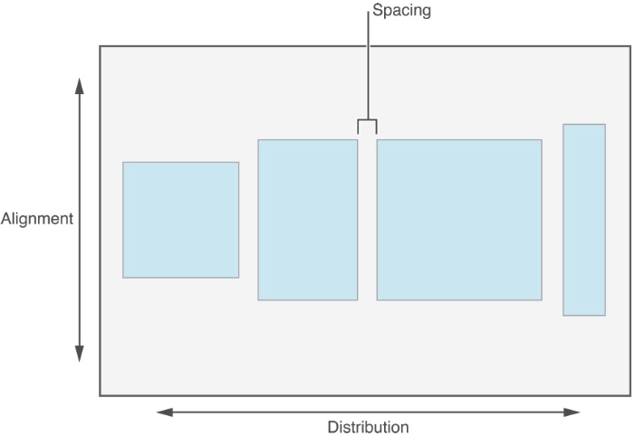

  - Now that you have all your labels in a stack, you can learn how to manage the stack view and define the positions of its subviews. But before you begin, set the background of each label to a unique color. This will make it clear how your adjustments are affecting the interface.
  - Select your stack view from the Document Outline, and open the Attributes inspector to reveal four main properties. Go ahead and explore these attributes, making adjustments along the way.
    1. Axis determines whether the elements within the view are stacked vertically or horizontally.
    2. Alignment describes how the elements within the stack are positioned. You can choose one of the following:
       - Fill — Each of the elements fills the size of the stack. For example, if the stack view has a width of 320 pixels, each element in a vertical stack will also have a width of 320 pixels.
       - Leading — The leading edge of each element is aligned to the leading edge of the stack view.
       - Center — The center of each element is aligned to the center of the stack view.
       - Trailing — The trailing edge of each element is aligned to the trailing edge of the stack view.
    3. Distribution defines how the elements are distributed within the stack view. You can choose one of the following:
       - Fill — The stack view resizes the arranged subviews so that they fill all the available space along the axis you specified. The stack view sizes **the first label as large as possible** to completely fill the stack.
       - Fill Equally — The stack view resizes the arranged subviews so that they fill all the available space along the axis. The views are resized so that they are **all the same size along the stack view’s axis**.
       - Fill Proportionally — The stack view resizes the arranged subviews so that they fill all the available space along the axis. If the size of the stack view changes, **the views are resized proportionally** to one another. For example, if two labels have heights of 50 and 100, respectively, and you increase the stack view’s height by 50 percent, the labels then have heights of 75 and 150.
       - Equal Spacing — The stack view doesn’t resize the subviews but positions them at **an equal distance from one another**.
       - Equal Centering — The stack view doesn’t resize the subviews, but ensures that the center of each subview is **an equal distance to the centers of the other subviews**.
    4. Spacing describes the amount of space between each element in the stack view. For example, you can change the spacing from 0 to 20 to add 20 points of spacing between labels.
  - Use the Size inspector to remove the height constraint on the stack view. If a stack view doesn’t have a specified height, it will resize based on its subviews.
  - Now that you’ve defined some attributes, try adding new labels to the stack. Or rearrange the existing labels and adjust the stack’s spacing and alignment. Imagine if you hadn’t used a stack view and you wanted to adjust the interface. How many constraints would you have needed to add, remove, or adjust?
  - Whenever possible, it’s a good practice to use stack views before trying to manage constraints individually. Stack views allow you to create nice-looking interfaces quickly — and also make it easy to modify or customize them in the future.

#### Size Classes

- With so many different combinations of screen sizes and orientations, it's important to build an interface that works well on all iOS devices. In the case of iPad devices, the split-screen feature adds an additional layer of complexity because an app may run in a smaller amount of space than you originally expected. To help simplify user interface development for many different situations, iOS includes size classes.
- Each iOS device has a default set of size classes that you can use as a guide when designing your interface. Each dimension, the width and the height, is either the Compact or Regular size class, and the two dimensions form a trait collection. The iPhone 13 Pro that you have been using has a trait collection that is Compact Width, Regular Height in portrait orientation but in Landscape orientation is Compact Width, Compact Height.
- Though an iPad has a Regular Width, Regular Height size class in both portrait and landscape, an app does not always run full-screen. Using the split-screen feature, an app can consume one third, one half, or two thirds of the screen real estate, and different-sized iPads will have unique trait collections when multi-tasking. It sounds like a lot to handle, but don’t think about the wide array of devices you need to support. Instead, focus on supporting the four different width/height trait collections, and your interface will be correct.
- The Layout button  will be enabled for devices that support split-screen operation. The layout options include full screen along with split views at one half, one third and two thirds of the screen to help layout an interface that will work well in all situations.

- **Vary Traits**

  - Constraints and properties can be set to different values depending on the trait collection. Suppose you want a stack view's Spacing property to be 0 most of the time. However, when run on a Regular Width, Regular Height device, it should be set to 20. With Interface Builder, you can easily add varying traits for a particular property or constraint. Using the stack view that you previously created with colored labels, select the stack and open the Attributes inspector. Set its Spacing to 0, and then click the '+' button, which opens a popover for introducing variations.

    - 

  - Since you want to add a new variation for the Regular Width, Regular Height trait collection, set the appropriate controls to these values, then select “Add Variation.” This will add a new Spacing property that is unique for this particular trait collection. Change this new Spacing to 20.

    - 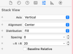

  - To verify that this trait variation is working properly, click the "Devices" button and change the device to an iPad (which is Regular Width, Regular Height). You should notice additional spacing between each label. When you return to an iPhone 13 Pro, the label spacing diminishes.

#### Installed

- Sometimes you’ll want to disable particular views or constraints depending on the trait collection. For example, maybe in order to save space, your app’s interface should not include the red label when the trait collection’s height is set to Compact. To begin implementing this design decision, select the red label and open the Attributes inspector. Near the bottom, you’ll find an “Installed” checkbox. This determines whether the particular view or constraint exists within the view hierarchy. Click the ‘+’ button next to the checkbox, and you’ll be presented with the same popover to introduce a variation. Set the Width to Any and the Height to Compact, then click “Add Variation.” This will add a new Installed property that spans any trait collection that includes a Compact Height.

  - 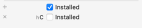

- Deselect the checkbox for this new property, and build and run your application using the iPhone 12 Pro or iPhone 13 Pro Simulator. When the device is in Portrait mode (Compact Width, Regular Height), the red label displays within the stack view. When you rotate the device to landscape, the trait collection updates to Regular Width, Compact Height and the red label disappears to save space.

#### Debug View Hierarchy

- The view hierarchy can become very complex, with numerous stack views and an assortment of buttons, labels, and images. If you have issues at runtime where one view is covering another, or constraints are not working as you’d expect, Xcode includes a tool that can help you solve the problem.
- Build and run the app you just built that includes the colored labels. After the view has loaded, press the Debug View Hierarchy button  at the top of the Debug area that extends from the bottom of Xcode. The view will appear in a 3D environment that you can swivel around to see how the view hierarchy was constructed.
- Here’s a breakdown of what you’re seeing in the editor area. As you move back to front, the proceeding view is layered on top of the previous.
  - The black view is your application’s UIWindow
  - The white view is your view controller’s view
  - The small clear rectangle is the UIStackView that contains the colored labels
  - The red, green, blue, orange, and purple labels are added subsequently
- Using the Debug navigator  on the left, you can see a tree view of your hierarchy, along with the values of each of the constraints. This is a much quicker way to get the value of each constraint instead of printing them to the console.
- The Debug View Hierarchy tool also includes an assortment of buttons at the top of the Debug area that you can use to enable/disable the content of each view, hide/show constraints, and more. If you find yourself struggling to resolve an issue with a view, you should consider using this tool.

#### Lab - Calculator

- Overview

  - The objective of this lab is to use Auto Layout to create a view that scales with the size and layout of any screen. You'll use view objects, constraints, and stack views to create a simple calculator that maintains its layout on all device sizes.

  - 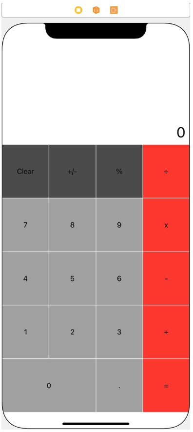

  - Create a new project called "Calculator" using the iOS App template.

- **Step 1 Create the Outer Containers**

  - In Interface Builder, set device to iPhone 14 Pro using the Device button.
  - Ignoring the complexity of the buttons for now, it’s easiest to break the calculator down into two distinct sections: the top third displays the digits that are entered, and the bottom two-thirds are used for input.
  - Drag a vertical stack view from the Object library onto the scene. Use the Add New Constraints tool to add four constraints that align the top, leading, bottom, and trailing edges of the stack view to the the outer view’s respective edges with 0 spacing. Click the Update Frames button, and the stack view should cover the entire screen.
  - Drag two UIView objects from the Object library into the stack view. Control-drag from the bottom view to the Safe Area Layout Guide, and select Equal Heights in the popup menu. This will set the inner view's height equal to the outer, which you will fix in the next step.

  - 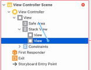

  - Select the bottom view and open the Size inspector. Locate the height constraint and double-click it. Change the Multiplier value from 1 to 0.66, which will set the inner view’s height equal to the outer view’s height, multiplied by 0.66. The height of the bottom view will always be two-thirds the size of the view controller’s view.
  - Add a UILabel from the Object library into the top container view. Set the text to "0" and the font size to 30.0, then open the Add New Constraints tool. Add bottom and trailing constraints, with 8 pixels of spacing between them.

- **Step 2 Add and Size Buttons**

  - The finished calculator has five rows of buttons, where each row has an equal height. You can use another vertical stack view to accomplish this. Drag a vertical stack view into the bottom container view, then use the Add New Constraints tool to constrain the top, leading, bottom, and trailing edges of the stack view to the the bottom container view’s respective edges with 0 spacing. Click the Update Frames button, and the stack view should cover the entire bottom container.
  - Select the newly-added vertical stack view, and open the Attributes inspector. Set the “Distribution” property to “Fill Equally” so that all subviews within the stack view will have the same height. Set the “Spacing” to 1, which will create the horizontal separation lines between each row.
  - You can use horizontal stack views for each row of buttons. Add a horizontal stack view into the vertical stack view, and set its “Distribution” property to “Fill Equally” so that all subviews within the stack view have the same width. Set the “Spacing” to 1, which will create the horizontal separation lines between each subview.
  - Add a UIButton into the horizontal stack view. Set the tint color to Black Color and the background color to Light Gray.
  - Copy the button to your clipboard (Command-C), then paste (Command-V) three additional buttons into the horizontal stack view. Change the background color of the last button to System Red.
  - Select the horizontal stack view in the Document Outline, and copy it to your clipboard (Command-C). Then paste (Command-V) four additional horizontal stack views into the vertical stack view.
  - The bottom horizontal stack view uses only three buttons instead of four. Since some buttons are sized differently than others, you need to update the “Distribution” of this stack view to “Fill Proportionally.” Then, delete one of the light gray buttons from the bottom so the stack view contains the proper number of controls.
  - **Control-drag from the bottom-rightmost red button to the red button above it, and then select "Equal Widths." Now locate this constraint and edit it, changing the multiplier to "1". This ensures that these two buttons are always the same size.** Repeat the process for the middle light gray button and the red button. The leftmost gray button will now fill the remaining space making its total width equal to the two gray buttons above it including the space between them.
  - Finally, update the top three buttons to use a dark gray color, and update the button titles to match those on a traditional calculator.

- Congratulations! You’ve used both constraints and stack views to create a simple calculator. Be sure to build and run your application on multiple iOS devices to verify that the constraints you’ve defined make sense on all screen sizes. Save your work to your project folder.

### Guided Project: Apple Pie

- So far in this unit, you’ve learned a lot about the fundamentals of Swift. Now it’s time to put your knowledge to work.
  Your project is to write a game called Apple Pie. In this simple word-guessing game, each player has a limited number of turns to guess the letters in a word. Each incorrect guess results in an apple falling off the tree. The player wins by guessing the word correctly before all the apples are gone.
  As a new programmer, you may find this larger project a bit intimidating. Remember, building a working app happens one step at a time. If you get stuck on a particular step, go back and review that lesson. You can do it!

  - 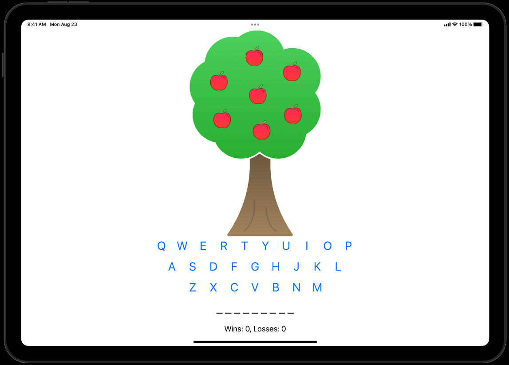

- In this particular version of Apple Pie, whenever a round is won or lost, a new game is immediately started. If there are no more words left to guess, all buttons are disabled, and the app needs to be restarted.

#### Part One - Build the Interface

- Create a new project using the iOS App template. Name the project "Apple Pie." This game is meant to be played on the iPad, and the interface that you'll be building doesn't accommodate a small iOS device.

  - To make the app iPad only, select the project file in the Project navigator, then under Deployment Info, uncheck the checkbox under Device for iPhone.

- **Layout in Storyboard**

  - Open the Main storyboard and use the "Devices" button to change the device to an iPad and change the orientation to Landscape mode using the "Orientation" button. Since you'll be using Auto Layout to build the interface, it will work in Portrait mode as well. Look back at the image of the finished app. Using the Interface Builder tools that you've learned so far, how might you construct this interface? There is an image at the top, followed by a grid of buttons, and then two rows of labels containing text. Perhaps the simplest way to build this interface is by using a vertical stack view.
    - Find the vertical stack view in the Object library, and drag it onto the iPad canvas.
  - As you've learned in earlier lessons, you can determine the position, width, and height of a stack view by adding constraints between the stack and its superview. Where does the stack start, and where does it end? The image view is near the top, and the last label goes along the bottom of the screen. The grid of buttons begins near the left edge and ends near the right edge. Therefore, the stack view can be constrained to cover the entire screen.
    - Select the stack view, then use the Add New Constraints tool to add four constraints. Set all four fields at the top of the popover to 0. The red indicators illuminate to show the edges that are being constrained. When you're done, click "Add 4 Constraints."
  - Now you're ready to add views and controls to the stack.
    - Search the Object library for an image view, and drag one into the stack view. Since it's the only item within the stack, it will take up the entire space of the stack.
    - Change the "Content Mode" of the image view to "Aspect Fit" in the Attributes inspector.
      - This will ensure the width and height of the image is not distorted by the proportions of the image view.
  - Add the apple tree images (Tree 0.pdf...Tree 7.pdf) from the student resources folder into your Assets folder. After they've been added, select all of them and choose "Single Scale" from the Scales menu in the Attributes inspector.
    - These assets are vector art, which means they can dynamically scale to any size without losing quality. When possible, use PDF files with vector art so that you don’t need to supply multiple scales for various devices.
  - Now, you can go back to the image view in the storyboard and update the image property to use one of the tree images.
    - Even though you’re updating the image view's image in code, this can help you visualize your interface from within the storyboard.
  - The button grid is more complex. You’re emulating the layout of a standard QWERTY keyboard, which has a unique number of keys in each row. You can imagine each row as its own horizontal stack view, and you can contain these rows in a vertical stack view.
    - Use the Object library to add a vertical stack view below the image view. You can reorder the items within the stack by dragging them around in the Document Outline.
  - Each of the horizontal stack views (or rows) that you add will be equal in size and centered.
    - Select the newly added vertical stack view, then open the Attributes inspector and change Alignment to Center and Distribution to Fill Equally. Also provide some spacing between rows by setting the Spacing to 5.
    - Now add a horizontal stack view within the vertical stack. You want the same spacing between columns as rows, so set the Spacing to 5. Set both the Alignment and Distribution to Fill.
  - Each row has a unique number of buttons with the first being 10, the second 9, and the third 7.
  - Use the Object library to add a button to the horizontal stack view. The letter keys on a keyboard are typically square. To achieve this appearance, select the button and use the Add New Constraints button to add an Aspect Ratio constraint. The constraint will be added but with an unwanted ratio.
    - Use the Size inspector for the button to edit the Aspect Ratio constraint, setting the multiplier to 1. This ensures that the button is square.
    - Use the Attributes Inspector to set the button's font to System and set the font size to 30 to make the button easier to read.
    - Change the button's text to the letter Q, then select and copy it to your clipboard (Command-C). Paste (Command-V) a new copy of the button into the stack view, and repeat this step until the stack view contains 10 buttons. Use the Attributes inspector to update the text of each button to a single capital letter using your own keyboard as a reference.
  - Now select the horizontal stack view, and copy it to your clipboard. Paste two new copies of the stack view. Update each button with the appropriate letters once again using your keyboard as reference — deleting any extra button to match. You can quickly edit a button's text by double-clicking it within Interface Builder.
  - Below the grid of buttons within the second vertical stack view, add two labels from the Object library.
    - Use the Attributes inspector to change the font size of the first label to 30.0 and the second to 20.0. The buttons and labels all have what is referred to as intrinsic size, which the text within them determines. Auto Layout uses their intrinsic size along with the stack view attributes to appropriately size the button grid while the tree image view can shrink and expand as necessary.
  - Before you move on, verify that you don't have any warnings or errors in Interface Builder. You can build and run your app to ensure that the layout looks correct on different iPad simulators or by using the View As feature in Interface Builder.

- **Create Outlets and Actions**

  - During gameplay, the text of the labels change whenever a letter is guessed correctly or whenever a new round begins. The image needs to change whenever an incorrect letter is guessed, and the letter buttons need to be disabled whenever they're pressed and re-enabled before each round. To update these views, create outlets so that you can reference the views in code.
    - Open the assistant editor so that the ViewController class definition appears to the right of the storyboard. Next, select the image view on the left, Control-drag to an area within the class definition, and release the mouse button. In the pop-up menu that appears, name the outlet `treeImageView`. When you press the Connect button, the code for the outlet is created: `@IBOutlet var treeImageView: UIImageView!`
    - Repeat this process for the two labels. Name the top label `correctWordLabel`, and the bottom label `scoreLabel`: `@IBOutlet var correctWordLabel: UILabel!`, `@IBOutlet var scoreLabel: UILabel!`
  - It's tedious to create a separate outlet for each UIButton. Instead, create one outlet that holds the collection of buttons.
    - Begin by selecting the first button with the letter Q as the title. Control-drag to the class definition to create an outlet, then release the mouse button. In the pop-up menu that appears, change the Connection type from Outlet to Outlet Collection. Then set the name of the outlet collection to `letterButtons`. When you press Connect, an outlet is created that references a collection of buttons.
    - Now click and drag from the circle next to the outlet collection to another button. A blue rectangle will appear, indicating a valid connection. Release the mouse button, then repeat this step for each button in the scene.
  - Each button also needs to be tied to an action. Again, it’s tedious to create a separate action for each button. Instead, create one action that all the buttons call when pressed. - Begin by selecting the first button with the letter Q as the title. Control-drag to the class definition, and release the mouse button. In the pop-up menu that appears, change the Connection type to Action. Set the name of the action to `letterButtonPressed`, and change the type of the argument to UIButton. When you press Connect, the method is created. Whenever a letter button is tapped, it should be disabled (a player can't select a letter more than once in the same round).

          - ```swift
              @IBAction func letterButtonPressed(_ sender: UIButton) {
                sender.isEnabled = false
              }
            ```

          - Why change the argument type from Any to UIButton in the popup? Since there are twenty-six buttons connected to the same action, you’ll need to use the sender to determine which button, specifically, triggered the method. **If sender has the Any type, you can’t access the title property** (and we'll need that later).
        - Control-drag the rest of the buttons to the existing action. You’ll know the connection is valid because a blue rectangle will appear as you hover the mouse near the method.

    - Build and run your application to verify that tapping each button disables it. It’ll become more apparent what else to do inside this method after you build other portions of the app.

#### Part Two - Beginning A Game

- **Define Words and Turns**
  - Your first task is to supply a list of words for players to guess. At the top of ViewController, define a variable called `listOfWords`. Fill this array with words: food names, hobbies, animals, household objects, or whatever else. To keep things simple, use only lowercase letters: `var listOfWords = [”buccaneer”, “swift”, “glorious”, “incandescent”, “bug”, “program”]`
  - Below listOfWords, define a constant called `incorrectMovesAllowed` which establishes how many incorrect guesses are allowed per round. The lower the number, the harder it will be for the player to win. There are seven different images of apple trees provided, so you’ll want this value to be between 1 and 7: `let incorrectMovesAllowed = 7`
- **Define Number of Wins and Losses**
  - After each round, the bottom label will display an updated count of the number of wins and losses. Create two variables to hold each of these values, and set the initial values ​to 0: `var totalWins = 0`, `var totalLosses = 0`
- **Begin First Round**

  - When the application launches, the viewDidLoad() method of ViewController is called. This is a great place to start a new round. Define a method called newRound.

    - ```swift
        override func viewDidLoad() {
            super.viewDidLoad()
            newRound()
        }

        func newRound() {
         
        }
      ```

  - What does it mean to start a new round? Each round begins with the selection of a new word, and resetting the number of moves the player can make to incorrectMovesAllowed. It would be helpful to hold the state of the game inside of a Game struct. Create a new file in your project by selecting File -> New -> File (Command-N) from the Xcode menubar. Select “Swift File” as your template, then select Next. Name the file “`Game`.”
  - Inside of Game, define a struct called Game. For now, you know that an instance of a Game has two properties: the word, and the number of turns you have left to properly guess the word.

    - ```swift
        import Foundation
         
        struct Game {
            var word: String
            var incorrectMovesRemaining: Int
        }
      ```

  - Back in the `newRound()` method, you can create a new instance of a Game. You should create a property that holds the current game’s value so that it can be updated throughout the view controller code. You can give the Game a new word in the initializer by removing the first value from the listOfWords collection, and set incorrectMovesRemaining to the number of moves you allow, stored in incorrectMovesAllowed.

    - ```swift
        var currentGame: Game!
         
        func newRound() {
          let newWord = listOfWords.removeFirst()
          currentGame = Game(word: newWord, incorrectMovesRemaining: incorrectMovesAllowed)
        }
      ```

    - Why does the currentGame variable have an exclamation mark at the end? For a brief moment between the app launch and the beginning of the first round, currentGame doesn’t have a value. This is a concept you’ll learn in the next unit. For now, know that **the exclamation mark means that it's OK for this property not to have a value for a short period**.

  - Now that you’ve started a new round, you need to update the interface to reflect the new game. Create a separate method called `updateUI()` that will handle the interface updates, then call it at the end of newRound.
  - Inside of this method, there are two pieces of the interface that you can update with the code you’ve written thus far: the score label, and the image view. The score label uses simple string interpolation to combine totalWins and totalLosses into a single string. Since each of the tree images are named “Tree X,” where X is the number of moves remaining, you can use string interpolation once more to construct the image name.

    - ```swift
        func newRound() {
            let newWord = listOfWords.removeFirst()
            currentGame = Game(word: newWord, incorrectMovesRemaining: incorrectMovesAllowed)
            updateUI()
        }
         
        func updateUI() {
            scoreLabel.text = “Wins: \(totalWins), Losses: \(totalLosses)”
            treeImageView.image = UIImage(named: “Tree \(currentGame.incorrectMovesRemaining)”)
        }
      ```

  - Build and run your application. The score label and the image view should update to reflect the beginning of a new round. Great job!

#### Part Three - Update Game State

- So far, you’ve built a working interface, and you’ve successfully started a new round. Now you need to add some code that progresses the game further towards a win or a loss.

- **Extract Button Title**

  - Currently, the letterButtonPressed(\_:) method disables whichever button the player used to guess, but it doesn’t update the game state. Whenever a button is clicked, you should read the button's title, and determine if that letter is in the word the player is trying to guess. Begin by reading the title from the button's configuration property. Not all buttons have configurations or titles, so you'll need to add exclamation marks to tell the Swift compiler that your button does have a configuration that has a title. (You’ll learn more about the exclamation mark in the next unit.) You should lowercase the letter because it's be much easier to compare everything in lowercase, and then convert it from a String to a Character.

    - ```swift
        @IBAction func letterButtonPressed(_ sender: UIButton) {
            sender.isEnabled = false
            let letterString = sender.configuration!.title!
            let letter = Character(letterString.lowercased())
        }
      ```

- **Guess Letter**

  - Now that you have the letter that the player guessed, what should you do with it? A Game manages how many more moves are remaining, but it doesn’t know which letters have been selected during the round. Add a collection of characters to Game that keeps track of the selected letters, named `guessedLetters`. Then add a method in Game that receives a Character, adds it to the collection, and updates incorrectMovesRemaining, if necessary. (By adding the guessedLetters property, you’ll need to update the initialization for currentGame.)

    - ```swift
        struct Game {
            ...
            var guessedLetters: [Character]
         
            mutating func playerGuessed(letter: Character) {
              guessedLetters.append(letter)
              if !word.contains(letter) {
                incorrectMovesRemaining -= 1
              }
            }
        }
         
        func newRound() {
            ...
            currentGame = Game(..., guessedLetters: [])
            updateUI()
        }
         
        @IBAction func letterButtonPressed(_ sender: UIButton) {
            ...
            currentGame.playerGuessed(letter: letter)
            updateUI()
        }
      ```

  - Build and run your application. As you press each button, the character gets added to the list of letters the player has guessed, and incorrectMovesRemaining decreases by 1 for each incorrect letter.

#### Part Four - Create Revealed Word

- Using word and guessedLetters, you can now compute a version of the word that hides the missing letters. For example, if the word for the round is “buccaneer” and the user has guessed the letters “c,” “e,” “b,” and “j,” the player should see “b*cc\_\_ee*” at the bottom of the screen.
- To begin, create a computed property called `formattedWord` within the definition of Game. Here’s one way to compute formattedWord:

  - Begin with an empty string variable.
  - Loop through each character of word.
  - If the character is in guessedLetters, convert it to a string, then append the letter onto the variable.
  - Otherwise, append \_ onto the variable.

    - ```swift
        var formattedWord: String {
            var guessedWord = “”
            for letter in word {
                if guessedLetters.contains(letter) {
                    guessedWord += “\(letter)”
                } else {
                    guessedWord += “_”
                }
            }
            return guessedWord
        }
      ```

- Now that formattedWord is a property that your UI can display, try using it for the text of currentWordLabel inside of updateUI().

  - ```swift
      func updateUI() {
          correctWordLabel.text = currentGame.formattedWord
          ...
      }
    ```

- Build and run your application. Letters will be added to the guessedLetters collection as they’re selected, and formattedWord will be re-calculated whenever it’s accessed in updateUI().
  You may notice a new issue: Because multiple underscores appear as a solid line in the interface, it can be difficult to tell how many letters are in the word. A solution could be to add spaces during your computation of formattedWord. But this issue is purely about improving the interface, not meddling with the computed data. A better solution is to add the spaces when you update the text of correctWordLabel.
- To properly set the text of correctWordLabel, you can use a Swift method named joined(separator:) that operates on an array of strings. This function concatenates the collection of strings into one string, separated by a given value. Here's an example:

  - ```swift
      let cast = [”Vivien”, “Marlon”, “Kim”, “Karl”]
      let list = cast.joined(separator: “, “)
      print(list) // “Vivien, Marlon, Kim, Karl”
    ```

- How can you imagine using the joined(separator:) method to set correctWordLabel? Start by converting the array of characters in formattedWord into an array of strings. Use a for loop to store each of the newly created strings into a [String] array. Then you can call the joined(separator:) method to join the new collection together, separated by blank spaces.

  - ```swift
      func updateUI() {
          var letters = [String]()
          for letter in currentGame.formattedWord {
              letters.append(String(letter))
          }
          let wordWithSpacing = letters.joined(separator: “ “)
          correctWordLabel.text = wordWithSpacing
          ...
      }
    ```

- Build and run your application to see a clear break between the letters and the underscores.

#### Part Five - Handle A Win Or Loss

- Apple Pie is starting to feel like a real game. The round is progressing along with each button pressed, but there are two obvious issues. The first is that incorrectMovesRemaining can go below 0, and the second is that the player can’t win a game, even if they guess all letters correctly.
- When incorrectMovesRemaining reaches 0, totalLosses should be incremented, and a new round should begin. It would be nice to have a single method that checks the game state to see if a win or loss has occurred, and if so, update totalWins and totalLosses. Create a method called `updateGameState` that will perform this work, and call it after each button press instead of calling updateUI().
- You can determine that a game has been won if the player has not yet lost, and if the current game’s word property is equal to the formattedWord (formattedWord won’t have any underscore if every letter has been successfully guessed). When that happens, increment totalWins. If a game has not been won or lost yet, then the player should be allowed to continue guessing, and the interface should be updated.

  - ```swift
      @IBAction func letterButtonPressed(_ sender: UIButton) {
          ...
          // updateUI()
          updateGameState()
      }

      func updateGameState() {
          if currentGame.incorrectMovesRemaining == 0 {
              totalLosses += 1
              newRound()
          } else if currentGame.word == currentGame.formattedWord {
              totalWins += 1
              newRound()
          } else {
              updateUI()
          }
      }
    ```

- Whenever totalWins or totalLosses changes, a new round can be started, so this is a great time to add `didSet` property observers to totalWins and totalLosses instead adding newRound() to the conditions.

  - ```swift
      var totalWins = 0 {
          didSet {
              newRound()
          }
      }
      var totalLosses = 0 {
          didSet {
              newRound()
          }
      }
    ```

- Now try running your application, verifying that both wins and losses are tallied up accordingly, and that a new round begins.

- **Re-enable Buttons and Fix Crash**

  - It looks like you’re approaching the finish line! You’re successfully able to complete a round of Apple Pie, but a new round doesn’t re-enable the letter buttons. Also, if you try to start a new round and there’s no more words to choose from, the game will crash.

    - The newRound logic needs to be a little smarter. If listOfWords isn’t empty, then you should perform the same work that you did previously, but also re-enable all of the buttons. If there are no more words to play with, disable all of the buttons so that the player cannot continue playing the game.

      - ```swift
          func newRound() {
              if !listOfWords.isEmpty  {
                  let newWord = listOfWords.removeFirst()
                  currentGame = Game(word: newWord, incorrectMovesRemaining: incorrectMovesAllowed, guessedLetters: [])
                  enableLetterButtons(true)
              } else {
                  print("Game End!!")
                  enableLetterButtons(false)
              }
              updateUI()
          }
          func enableLetterButtons(_ enable: Bool) {
              for button in letterButtons {
                  button.isEnabled = enable
              }
          }
        ```

#### Stretch Goals

- If you’d like to continue working on Apple Pie, go ahead and try adding some features to the game. Here are a few ideas to play with. You can build most of these features using your existing knowledge of Swift, but a few may require you to use the Xcode documentation. Good luck!
- Challenge yourself by adding these features to Apple Pie:
  - Learn about the map method, and use it in place of the loop that converts the array of characters to an array of strings in updateUI().
  - Add a scoring feature that awards points for each correct guess and additional points for each successful word completion.
  - Allow multiple players to play, switching turns after each incorrect guess.
  - Allow the player to guess the full word using the keyboard instead of guessing one letter at a time using the interface buttons.
  - Support letters with special characters. For example, the E button could check for “e” and “é” within a word.
  - The keyboard layout doesn’t work well when the app is in one-third Split View mode on iPad—the buttons get flattened. To resolve this issue, use trait variations to adjust the layout when in compact width.

### Lesson 2.12 Finish Your App Prototype

#### Guide

- **Wireframe**

  - Now that you have a skeleton for your prototype, it’s time to make it more formal. Continue to ask yourself what the key interactions and UI elements for the goals of your app are. These are the elements you want to build into your prototype.
  - Work through the Wireframe section of the App Design Workbook. You’ll build a wireframe from your app’s architecture map by converting screen outlines into a sketch of the interface. By the end of this stage, you’ll have a functioning Keynote prototype that simulates the behavior of your app.

- **Refine**

  - After developing a basic wireframe, it’s time to mimic the experience of an iOS app by considering how users will expect it to look and feel.
  - Use the Refine section of the App Design Workbook to apply important interface design guidelines to your functioning prototype. By the end of this stage, your prototype will feel at home on iOS and in the hands of your users.

- **Style**

  - From your icon to the fonts and colors you use, each design element is an opportunity to influence the user’s experience. Now it’s time to define the personality of your app to set it apart from its peers. Use your imagination to create a cohesive identity for your app.
  - Complete the Style section of the App Design Workbook. By the end of this stage, you’ll have a Keynote prototype that feels like a real app, which will enable your testers to provide good feedback.

#### Summary

- You've learned the basics of UIKit, the foundation of iOS development. You've learned how to display simple information with views, and respond to user input with a variety of controls. You also learned about the powerful tools in Xcode that enable you to build slick-looking interfaces that fit within the iOS environment.

## Unit 3 Navigation And Workflows

- In this unit, you'll learn about an important Swift feature for working with optional data. You'll also learn how to use multiple scenes, views, and controls to build simple workflows.
  By the end of this unit, you should feel comfortable using Interface Builder and storyboards to build the user interface for apps with multiple views. You'll also test, validate, and plan how you can iterate on your app idea.

- **What You'll Design**
  - The App Design Workbook will guide you through testing, validating, and iterating on your app prototype.
- **What You’ll Build**
  - Quiz is a simple app that guides the user through a personality quiz and displays the results.

### Lesson 3.1 Prepare to Test Your App

- You have been working hard to get the look and feel of your app just right. But that’s just one part of a much longer process. It often takes a lot of time to design an app that hits home for a user, and you may find that your first idea or design doesn’t pan out as expected. Good design is about learning from users, reflecting on feedback, and iterating on your ideas. Testing your prototype will help you understand whether your ideas and assumptions are correct.
- In this lesson, you’ll architect your tests and create a plan to execute them.
- Guide
  - **Architect Your Testing**
    - You’ve defined your app’s goals; how will you determine whether you’ve achieved them? You’ve implemented a prototype; how do you expect it to be used? You’ll define tests that answer those questions, and you’ll also take a step back to think about setting expectations — yours and your users'.
    - Work through the Architect section of the App Design Workbook. By the end of this stage, you’ll have a plan that you can use to write your test scripts.
  - **Script Your Tests**
    - Now that you’ve planned your testing, it’s time to focus on the details.
    - Use the Script section of the App Design Workbook to complete a set of test scripts. You’ll define the flow of your tests to keep the user engaged and oriented, dig into the kinds of questions each test can answer, and prepare for the unexpected.

### Lesson 3.2 Optionals

- One of the greatest strengths of Swift is its ability to read code and quickly understand data. When a function may or may not return data, Swift forces you to deal properly with both possible scenarios.
- Swift uses unique syntax, called optionals, to handle this sort of case. In this lesson, you’ll learn to use optionals to properly handle situations when data may or may not exist.

#### Nil

- Optionals are useful in situations when a value may or may not be present. An optional represents two possibilities: Either there is a value and you can use it, or there isn’t a value at all.
- Imagine you’re building an app for a bookstore that lists books for sale. You have a model object Book type that has properties for name and publicationYear.

  - ```swift
      struct Book {
        var name: String
        var publicationYear: Int
      }
       
      let firstDickens = Book(name: "A Christmas Carol",​ publicationYear: 1843)
      let secondDickens = Book(name: "David Copperfield",​ publicationYear: 1849)
      let thirdDickens = Book(name: "A Tale of Two Cities",​ publicationYear: 1859)
       
      let books = [firstDickens, secondDickens, thirdDickens]
    ```

- So far, so good. Now imagine you’re building a screen that shows a list of books that have been announced but haven’t yet been published.
- How might you initialize those books without a publish date? What do you assign to publicationYear?
  - `let unannouncedBook = Book(name: “Rebels and Lions”, publicationYear: 0)`
    - Zero isn’t accurate, because that would mean the book is over 2,000 years old.
  - `let unannouncedBook = Book(name: “Rebels and Lions”, publicationYear: 2019)`
    - The current year or even next year isn’t accurate either, because it may be released two years from now. There’s no known launch date.
- `nil` represents the absence of a value, or nothing. Because there is no publicationYear yet, publicationYear should be nil.
  - `let unannouncedBook = Book(name: “Rebels and Lions”, publicationYear: nil)`
  - That looks better, but the compiler throws an error. All instance properties must be set during initialization, and you can’t pass nil to the publicationYear parameter because it expects an Int value.
- Optionals solve this problem by providing a wrapper around a value that may exist. You can think of an optional as a box that, when opened, will contain either an instance of the expected type or nothing at all (nil).
- Every type has a matching optional type, which you declare by adding a `?` after the original type name.
- In this case, you need to update the type annotation on publicationYear property to Int?, an Int optional.

  - ```swift
      struct Book {
        var name: String
        var publicationYear: Int?
      }
       
      let firstDickens = Book(name: "A Christmas Carol",​ publicationYear: 1843)
      let secondDickens = Book(name: "David Copperfield",​ publicationYear: 1849)
      let thirdDickens = Book(name: "A Tale of Two Cities",​ publicationYear: 1859)
       
      let books = [firstDickens, secondDickens, thirdDickens]
       
      let unannouncedBook = Book(name: “Rebels and Lions”, publicationYear: nil)
    ```

#### Specifying the Type of an Optional

- Note that you can’t create an optional without specifying the type. Consider what would happen if you tried to let Swift infer the type.
- In this example, type inference will assume your variable is non-optional:
  - `var serverResponseCode = 404 // Int, not Int?`
- In this example, type inference doesn’t have any information to determine the data’s type if the data isn’t nil:
  - `var serverResponseCode = nil // Error, no type specified when not nil`
- For these reasons, in most cases you’ll need to use type annotation to specify the type when creating an optional variable or constant. Take a look at the following correct approaches to an Int? optional:
  - `var serverResponseCode: Int? = 404 // Set to 404, but could be nil later`
  - `var serverResponseCode: Int? = nil // Set to nil, but could hold an Int later`

#### Working with Optional Values

- How do you determine whether or not an optional contains a value? How do you access the value? You could begin by comparing the optional to nil using an if statement. If the value is not nil, you can unwrap the value using the **force-unwrap operator**, `!`.

  - ```swift
      if publicationYear != nil {
        let actualYear = publicationYear!
        print(actualYear)
      }
    ```

- If you skipped the comparison of the optional to nil and you force-unwrapped an optional that doesn’t contain a value, the code will generate an error and crash when you try to run it.
  - `let unwrappedYear = publicationYear! // runtime error`
- It seems like good practice to compare an optional to nil before attempting to use the contained value, but it also feels redundant. As you’ll recall, safety and clarity are primary design goals of Swift, so concise syntax is provided for safely using an optional’s value if it has one, and avoiding errors if it doesn’t.
- Optional binding unwraps the optional and, if it contains a value, assigns the value to a constant as a non-optional type, making it safe to work with. This approach eliminates the need to continue working with the ambiguity of whether or not you are working with a value or with nil. The syntax for optional binding looks like this:

  - ```swift
      if let constantName = someOptional {
        // constantName has been safely unwrapped for use within the
        braces
      }
    ```

- If `someOptional` has a value, the value is assigned to constantName and is available only within the braces. Take a look at how optional binding works on the previous Book example:

  - ```swift
      if let unwrappedPublicationYear = book.publicationYear {
        print(”The book was published in \(unwrappedPublicationYear)”)
      } else {
        print(”The book does not have an official publication date.”)
      }
    ```

#### Functions and Optionals

- Swift comes with many functions that return optional values.
- Consider the example where you have a String whose value is set to “123”. You can see here that string could be converted into an Int.

  - ```swift
      let string = “123”
      let possibleNumber = Int(string)
    ```

- But what if the string can’t be converted?

  - ```swift
      let string = “Cynthia”
      let possibleNumber = Int(string)
    ```

- Swift infers possibleNumber to be an Int? type because the initializer for Int that takes a String as a parameter may or may not be able to successfully convert the String into an Int. If string can be converted into an Int, possibleNumber will hold that value. **If it can’t, possibleNumber will be nil**.
- If you want to write a function that accepts an optional as an argument, simply update the type in the parameter list. Consider this print function that accepts a firstName, middleName, and lastName, but allows for middleName to be nil since not everyone uses a middle name.
  - `func printFullName(firstName: String, middleName: String?, lastName: String)`
- The same is true for a function that returns an optional: Just update the return type. For example, a website URL returns the text from that page. The returned text is optional because the URL may not work or may not return any text.
  - `func textFromURL(url: URL) -> String?`

#### Failable Initializers

- Any initializer that might return nil is called a failable initializer. Earlier in this lesson, you saw how the Int initializer attempted to create an Int from a String and returned nil if it was unable to convert the String.
- For greater control and safety, you may want to create your own failable initializers and define the logic for returning an instance, or nil. Consider the following definition for a Toddler:

  - ```swift
      struct Toddler {
        var name: String
        var monthsOld: Int
      }
    ```

- In this example, every Toddler must be given a name, as well as an age in months. However, you might not want to create an instance of a toddler if the child is younger than 12 months or older than 36 months. To provide this flexibility, you can use init? to define a failable initializer. The question mark (?) tells Swift that this initializer may return nil and that it should return an instance of type Toddler?.
- Within the body of the initializer, you can check whether the given age is less than 12 or greater than 36. If either one is true, the initializer returns nil instead of assigning a value to monthsOld:

  - ```swift
      struct Toddler {
        var name: String
        var monthsOld: Int
       
        init?(name: String, monthsOld: Int) {
          if monthsOld < 12 || monthsOld > 36 {
            return nil
          } else {
            self.name = name
            self.monthsOld = monthsOld
          }
        }
      }
    ```

- When you use the failable initializer to create Toddler instances, an optional will always be returned. To safely unwrap the value before proceeding to use it, you can use optional binding:

  - ```swift
      let toddler = Toddler(name: “Joanna”, monthsOld: 14)

      if let myToddler = toddler {
        print(”\(myToddler.name) is \(myToddler.monthsOld) months old”)
      } else {
        print(”The age you specified for the toddler is not between 1
        and 3 yrs of age”)
      }
    ```

#### Optional Chaining

- It’s also possible for an optional value to have optional properties, which you might think of as a box within a box. These are called nested optionals.
- In the following example, note that every Person has an age and may have a residence. A Residence may have an address, and not every Address has an apartmentNumber.

  - ```swift
      struct Person {
        var age: Int
        var residence: Residence?
      }
       
      struct Residence {
        var address: Address?
      }
       
      struct Address {
        var buildingNumber: String
        var streetName: String
        var apartmentNumber: String?
      }
    ```

- Unwrapping nested optionals can require a lot of code. In the following example, you’re checking an individual’s address to find out if he/she lives in an apartment. To do this for a given Person object, you must unwrap the residence optional, the address optional, and the apartmentNumber optional. Using if-let syntax, you’d have to do quite a bit of conditional unwrapping:

  - ```swift
      if let theResidence = person.residence {
        if let theAddress = theResidence.address {
          if let theApartmentNumber = theAddress.apartmentNumber {
            print(”He/she lives in apartment number \(theApartmentNumber).”)
          }
        }
      }
    ```

- But there's a better way to do this. Rather than assign a name to every optional, you can conditionally unwrap each property using a construct known as optional chaining. If the person has a residence, the address has an apartment number, and if that apartment number can be converted to an integer, then you can refer to the number using theApartmentNumber, as seen here:

  - ```swift
      if let theApartmentNumber = person.residence?.address?.apartmentNumber {
        print(”He/she lives in apartment number \(theApartmentNumber).”)
      }
    ```

- When chaining together optionals, a `?` appears before each optional in the chain.
- If a nil value breaks the chain at any point, the if let statement fails. As a result, no value is assigned to the constant, and the code inside of the braces never executes. If none of the values are nil, the code inside of the braces executes and the constant has a value.

#### Implicitly Unwrapped Optionals

- An object cannot be initialized until all of its non-optional properties are given a value. But in some cases, particularly with iOS development, some properties are nil for just a moment until the value can be specified after initialization. For example, you’ve used Interface Builder to create outlets so that you can access a particular piece of the interface in code.

  - ```swift
      class ViewController: UIViewController {
        @IBOutlet var label: UILabel!
      }
    ```

- If you were the developer of this class, you’d know that anytime a ViewController is created and presented to the user, there will always be a label on the screen, because you added it in the storyboard. But in iOS development, the storyboard elements aren’t connected to their corresponding outlets until after initialization takes place. Therefore, label must be allowed to be nil for a brief period.
- What about using a regular optional, UILabel?, for the type? The standard optional will require the if-let syntax to constantly unwrap the value, providing a safety mechanism for data that may not exist. But you know that label will have a value after the storyboard connects the outlets, so unwrapping an optional that isn’t really “optional” feels cumbersome.
- To get around this issue, Swift provides syntax for an implicitly unwrapped optional, using the exclamation mark `!` instead of the question mark ?. As the name suggests, this type of optional unwraps automatically, whenever it’s used in code. This allows you to use label as though it weren’t an optional, while allowing the ViewController to be initialized without it.
- **Implicitly unwrapped optionals should be used in one special case: when you need to initialize an object without supplying the value, but you know you'll be giving the object a value before any other code tries to access it**. It might seem convenient to overuse implicitly unwrapped optionals to save yourself from using if let syntax, but by doing so you'd remove an important safety feature from the language. Thus, many Swift developers consider too many !'s in code a red flag. If you try to access the value of an implicitly unwrapped optional and the value is nil, your program crashes.

### Lesson 3.3 Type Casting and Inspection

- Whenever you work with data, the type plays a crucial role. For example, if a function returns an Int, you know you can use its value in a mathematical expression. But what if the type information isn’t very specific and you need to inspect the data more closely to determine how to use it?
  In this lesson, you’ll learn why some data can only be expressed using a broader type and how you can test for specific kinds of data before using it.

#### Type Casting

- Suppose Brad’s job is to visit the homes of his clients and to take care of their pets. When he arrives at each location, he performs different tasks depending on the type of animal. If the pet’s a dog, he takes it for a walk. If it’s a cat, he changes the litter box. And if it’s a bird, he cleans the cage.
- In Swift, a function’s declaration determines the type of data to be returned. Since the function can’t return a Dog, a Cat, and a Bird, the best it can do is return the parent type of all three, Animal.

  - ```swift
      func getClientPet() -> Animal {
        // returns the pet
      }
       
      let pet = getClientPet() // pet is of type Animal
    ```

- Unfortunately, this type is too broad to be useful to Brad. Without knowing the specific animal type, he could accidentally try to walk the bird, clean the dog’s litter box, or clean the cat’s cage. Consider the following valid functions with Dog, Cat, and Bird parameters.

  - ```swift
      func walk(dog: Dog) {
        print(”Walking \(dog.name)”)
      }
      func cleanLitterBox(cat: Cat) {
        print(”Cleaning the \(cat.boxSize) litter box’”)
      }
      func cleanCage(bird: Bird) {
        print(”Removing the \(bird.featherColor) feathers at the bottom of the cage’”)
      }
    ```

- Brad needs to be able to access a version of pet that's one of the subclasses of Animal. You can use the `as?` operator to try and downcast the value to a more specific type and store it in a new constant. This operation is known as a `conditional cast`, because it casts the instance to the specified type if it's possible to do so. Use if-let syntax to check the conditions before converting the type:

  - ```swift
      let pets = allClientAnimals()
       
      for pet in pets {
        if let dog = pet as? Dog {
          walk(dog: dog)
        } else if let cat = pet as? Cat {
          cleanLitterBox(cat: cat)
        } else if let bird = pet as? Bird {
          cleanCage(bird: bird)
        }
      }
    ```

- Now Brad can be sure he’s walking dogs, cleaning kitty litter boxes, and cleaning birdcages.
- There’s also a forced form of the type cast operator: `as!`. This version will force the downcast to the specified type. But if you specify an incorrect type, it will crash your program, just as it does with force-unwrapping an optional.
  - Imagine Alan has one pet, a dog, and he goes to pick it up from the pet store. A fetchPet(for customer: String) function may return an Animal type.
    - `let alansDog = fetchPet(for: "Alan") // alansDog is inferred as the Animal type`
  - When you know that the returned object will be a more specific type, you can use the as! operator to cast the value immediately.
    - `let alansDog = fetchPet(for: “Alan”) as! Dog // alansDog is inferred as the Dog type`
- When you begin to build apps, you'll discover that when you work with UIKit, the APIs can return very generic objects such as UIViewController. But as the developer of your application, you know what the specific type should be. For example, if pressing a button on the view of FirstViewController always presents a SecondViewController, you can force the downcast of destination to SecondViewController within the prepare(for:sender:) function. This function is called whenever you present a new view controller using storyboard segues.

  - ```swift
      class SecondViewController: UIViewController {
        var names: [String]?
      }
       
      func prepare(for segue: UIStoryboardSegue, sender: Any?) {
        let secondVC = segue.destination as! SecondViewController
        secondVC.names = [”Peter”, “Jamie”, “Tricia”]
      }
    ```

- Use `as!` only when you are certain that the specific type is correct.

#### Any

- You’ve learned that arrays, by default, are set to handle a specific type, such as an Int, String, or Animal. Homogenous collections are simpler to work with because you know the type of every instance within them.
- But what if you want to work with nonspecific types? Swift provides two special types: `Any` and `AnyObject`. As the name implies,
  - `Any` can represent an instance of any type: strings, doubles, functions, or whatever.
  - `AnyObject` can represent an instance of any class in Swift but not a structure.
- Here’s an example of an array that can hold any type of instance, or [Any]:

  - `var items: [Any] = [5, “Bill”, 6.7, Dog()]`
  - Because the array above can include anything, there’s no way to guarantee the type of any item. For example, if you used items[0] to access the first item in the following array, it will return the value 5 with the nonspecific Any type. To go ahead and use the value of firstItem as an Int, you’d use the as? operator:

    - ```swift
        var items: [Any] = [5, “Bill”, 6.7, true]
        if let firstItem = items[0] as? Int {
          print(firstItem + 4) // 9
        }
      ```

  - Although Any can be used just like any other type, it’s always better to be specific about the types you expect to work with. Before using Any or AnyObject in your code, make sure you need the behavior and capabilities these special types provide.

### Lesson 3.4 Guard

- Most bugs reside in complex code. The simpler your code is to read, the easier it is to spot potential bugs.
- In this lesson, you’ll learn to use guard to better manage control flow. You’ll learn to handle invalid and special-case values up front, rather than weaving them throughout your programming logic.
- As you start to work on more complex apps, you'll need to write functions that depend on a series of true conditions before executing. But the more conditions in your code, the harder it is to read — and debug — especially when the if statement is your only form of control flow.
- You've learned that each if statement evaluates a Boolean expression. If the result is true, the code defined in the statement is executed; otherwise, it's skipped. But what if you have multiple if statements nested within one another? Your code begins to form what programmers call the “pyramid of doom”:

  - ```swift
      func singHappyBirthday() {
        if birthdayIsToday {
            if !invitedGuests.isEmpty {
                if cakeCandlesLit {
                    print(”Happy Birthday to you!”)
                } else {
                    print(”The cake’s candles haven’t been lit.”)
                }
            } else {
                print(”It’s just a family party.”)
          }
        } else {
            print(”No one has a birthday today.”)
        }
      }
    ```

- What's so problematic about this example? With each if statement, the code is moving farther and farther from the beginning of each line, making the code hard to read. And each else statement moves farther and farther from its corresponding if statement, so it's difficult to tell how they match up. You can rework this logic to reduce the pyramid effect while still using if statements:

  - ````swift
      func singHappyBirthday() {
          if !birthdayIsToday {
              print("No one has a birthday today.")
              return
          }
       
          if invitedGuests.isEmpty {
              print("It's just a family party.")
              return
          }
       
          if cakeCandlesLit == false {
              print("The cake's candles haven't been lit.")
              return
          }
       
          print("Happy Birthday to you!")
      }
    ``` 
    ````

- But you can go a step further using the guard statement to clearly communicate to the person reading this code that specific conditions must be met before proceeding.

  - ```swift
      func singHappyBirthday() {
        guard birthdayIsToday else {
          print(”No one has a birthday today.”)
          return
        }
       
        guard !invitedGuests.isEmpty else {
          print(”It’s just a family party.”)
          return
        }
       
        guard cakeCandlesLit else {
          print(”The cake’s candles haven’t been lit.”)
          return
        }
       
        print(”Happy Birthday to you!”)
      }
    ```

- **A `guard`'s `else` block is executed only if the expression evaluates to false**. This is the opposite of the if statement that executes the block if the expression evaluates to true.

  - ```swift
      guard condition else {
        // false: execute some code
      }
       
      // true: execute some code
    ```

- With this design, you can write a function that returns early if it can’t complete its task. **A guard statement requires you to exit the scope of the function using the return keyword in the else case**. By eliminating all the unwanted conditions using guard statements and calling return, you can move conditional checks to the top of the function and put the code you expect to run at the bottom. The expected code is no longer surrounded by unexpected conditions. This also clearly communicates to the reader the author's intent and reasoning for the conditional check—as opposed to using if statements, which don’t require a return.
- Here are two versions of a divide function, one using an if statement and one using a guard statement. Since you can’t divide by zero, each version of the function prints the result if the divisor is not zero.

  - ```swift
      func divide(_ number: Double, by divisor: Double) {
        if divisor != 0.0 {
          let result = number / divisor
          print(result)
        }
      }
       
      func divide(_ number: Double, by divisor: Double) {
        guard divisor != 0.0 else {
          return
        }
        let result = number / divisor
        print(result)
      }
    ```

- The code using guard does an early return if the divisor passed in is 0. By the time it reaches the line that does the actual division, it has already removed any erroneous parameters.
  The if example above could also be written similarly to the one using guard syntax by reversing the condition in the check. However, it's considered better practice and more readable to use guard in these cases.

  - ```swift
      func divide(_ number: Double, by divisor: Double) {
        if divisor == 0.0 { return }
        let result = number / divisor
        print(result)
      }
    ```

- **Guard with Optionals**

  - In an earlier lesson, you learned about optionals and that a function should perform work if an optional contains a value. When you unwrap an optional using if-let syntax to bind it to a constant, the constant is valid within the braces.

    - ```swift
        if let eggs = goose.eggs {
          print(”The goose laid \(eggs.count) eggs.”)
        }
        // `eggs` is not accessible here
      ```

  - Instead, you can **use `guard let` to bind the value within an optional to a constant that's accessible outside the braces**.

    - ```swift
        guard let eggs = goose.eggs else { return }
        // `eggs` is accessible hereafter
        print(”The goose laid \(eggs.count) eggs.”)
      ```

  - Note the placement of the else statement after the condition. This placement signifies that guard is checking for a true or non-optional condition. When the value you're attempting to unwrap is nil, the code within the else block is executed — otherwise execution continues to the line after the closing brace and the unwrapped value is available to use.
  - Both `if let` and `guard let` let you unwrap multiple optionals in one statement. However, doing so with a `guard let` makes all unwrapped values available throughout the rest of the function, rather than only within the control flow braces.

    - ```swift
        func processBook(title: String?, price: Double?, pages: Int?) {
          if let theTitle = title,
            let thePrice = price,
            let thePages = pages {
            print(”\(theTitle) costs $\(thePrice) and has \(thePages) pages.”)
          }
        }
         
        func processBook(title: String?, price: Double?, pages: Int?) {
          guard let theTitle = title,
            let thePrice = price,
            let thePages = pages else {
              return
            }
            print(”\(theTitle) costs $\(thePrice) and has \(thePages) pages.”)
        }
      ```

  - Using `guard` statements to move conditional code is one way to improve the readability of your programs. Throughout this course, you've looked over plenty of code that others have written. You've probably discovered that it's much easier to understand what's going on if you can quickly locate the core functionality — rather than search for it in a sea of validation code.

### Lesson 3.5 Constant and Variable Scope

- As you write larger, more complex programs, you’ll need to pay attention to where you declare your constants and variables. What’s the optimal placement in your code? If you declare every variable at the top, you may find your code is more difficult to read and much more difficult to debug.
- In this lesson, you'll learn to write well-structured code that's easy to read. You'll do this by properly scoping your constants and variables.
- Each constant and variable lives within some sort of scope, a place where it’s visible and accessible. There are two different levels of scope: global and local. Any variable declared in global scope is called a global variable, and a variable declared in local scope is a local variable.
- Global scope refers to code that’s available from anywhere in your program. For example, when you begin declaring variables inside an Xcode playground, you’re declaring them in global scope. After you define a variable on one line, it’s available to each line after it. Whenever you finish typing into a playground, the code is executed line by line, beginning from this global scope.
- Whenever you add a pair of curly braces ({ }) — whether for a structure, class, function, if statement, for loop, or more — the area within the braces defines a new local scope. Any constant or variable that’s declared within the braces is defined in that local scope and isn’t accessible by any other scope.
- Consider the following block of code:

  - ```swift
      var age = 55
       
      func printMyAge() {
        print(”My age: \(age)”)
      }
       
      print(age)
      printMyAge()
      Console Output:
      55
      My age: 55
    ```

- Notice that the variable age is defined at the top of the code and not inside a control flow structure or function. This means it’s in global scope and can be accessed throughout the program. The function printMyAge is able to reference age, even though it wasn’t passed in as a parameter. Similarly, the function printMyAge isn’t defined within a structure or class, so it’s in global scope and is therefore accessible by the last line in the code.
- Now look at another block of code:

  - ```swift
      func printBottleCount() {
        let bottleCount = 99
        print(bottleCount)
      }
       
      printBottleCount()
      print(bottleCount) // error
    ```

- The variable bottleCount is defined within a function, printBottleCount, which has its own local scope between the braces. So bottleCount is in local scope and is only accessible by the contents of the function, inside the braces. The last line in the code will throw an error, because it’s unable to find a variable named bottleCount.
- Consider one more example:

  - ```swift
      func printTenNames() {
        var name = “Grey”
        for index in 1...10 {
          print(”\(index): \(name)”)
        }
        print(index) // error
        print(name)
      }
       
      printTenNames()
    ```

- In the code above, name is a local variable and is available to anything defined within the same scope. It's also available within an even smaller local scope: the for loop on the next line. The variable index, while defined inside the function, was defined inside the loop, which can be thought of as a more narrowly defined subsection of the function's scope. index is therefore only accessible inside the loop. Because print(index) occurs just outside the loop, it produces an error.

- **Variable Shadowing**

  - This next example defines a variable called points in two different locations: within the function’s local scope and within the for loop’s local scope. This is called variable shadowing. It’s valid Swift code, but it might not be obvious what will happen when the code is executed.

    - ```swift
        func printComplexScope() {
            let points = 100
            print(points)
         
            for index in 1...3 {
                let points = 200
                print(”Loop \(index): \(points+index)”)
            }
         
            print(points)
        }
         
        printComplexScope()
        Console Output:
        100
        Loop 1: 201
        Loop 2: 202
        Loop 3: 203
        100
      ```

  - First, points is declared and set to 100. This value is printed on the next line.
  - Within the for loop, another points is declared, this one with a value of 200. The second points completely shadows the function - scoped variable, which means that it renders the first points inaccessible. Any reference to points will access the one closest to the same scope. So when the print statement within the loop is called, it will print a value of 200 five times.
  - After the loop is finished, the print statement will print the only points variable that it can access: the one with a value of 100.
  - To avoid unnecessary confusion in this particular example, you might advocate changing the name of the inner points variable. And you would probably be correct.
  - However, there are a few cases when variable shadowing can be useful. Imagine having an optional name string and you want to use if let syntax to do some work with its value. Rather than coming up with a new variable name, like unwrappedName, you can reuse name within the scope of the if let braces:

    - ```swift
        var name: String? = “Brady”
         
        if let name = name {
          // name is a local `String` that shadows the global `String?` of the same name

          print(”My name is \(name)”)
        }
      ```

  - You can also use variable shadowing to simplify naming unwrapped optionals from a guard statement.

    - ```swift
        func exclaim(name: String?) {
          if let name = name {
            // Inside the braces, `name` is the unwrapped `String` Value

            print(”Exclaim function was passed: \(name)”)
          }
        }
         
        func exclaim(name: String?) {
          guard let name = name else { return }
          // name: `String?` is no longer accessible, only name: `String`

          print(”Exclaim function was passed: \(name)”)
        }
      ```

  - Shadowing the optional with the unwrapped value is common in Swift code. Be sure that you can read and understand this common pattern.

- **Shadowing and Initializers**

  - You can take advantage of your knowledge of variable shadowing to create clean, easy-to-read initializers. Suppose you want to create an instance of a Person by passing in a name and age as its two parameters. You’ll also assume that every Person instance has both name and age properties:

    - ```swift
        struct Person {
          var name: String
          var age: Int
        }

        let tim = Person(name: “Tim”, age: 35)
        print(tim.name)
        print(tim.age)
        Console Output:
        Tim
        35
      ```

  - As you’re writing the initializer, you’ll want to keep it as simple and logical as possible: assigning the name parameter to the name property and assigning the age parameter to the age property.

    - ```swift
        init(name: String, age: Int) {
          self.name = name
          self.age = age
        }
      ```

  - Since name and age are the names of parameters within the function scope, they shadow the name and age properties defined within the Person scope. You can place the keyword self in front of the property name to reference the property specifically — and to avoid any confusion that variable shadowing may cause to the compiler and the reader. This syntax makes it very clear that the name and age properties are set to the name and age parameters passed into the initializer.

- **Lab - Scope.playground**

  - The function below takes an array of User objects and returns the User object that has taken the most steps. The body of the function first declares a variable that is an optional User, then loops through all of the users in the array. Inside each iteration of the loop, it will check if topCompetitor has a value or not by unwrapping it. If topCompetitor doesn't have a value, then the current user in the iteration is assumed to have the highest score and is assigned to topCompetitor. If topCompetitor has a value, there is code to check whether the current user in the iteration has taken more steps than the user that is assigned to topCompetitor.
  - At that point, the goal is to assign the user with the higher score to topCompetitor. However, the code generates a compiler error because, due to improper variable shadowing, topCompetitor has a narrower scope than it should if it is going to be reassigned. Fix the compiler error below and call getWinner(competitors:), passing in the array competitors. Print the name property of the returned User object. You'll know that you fixed the function properly if the user returned is activeSitter.
  - Write a memberwise initializer inside the User struct above that uses variable shadowing for naming the parameters of the initializer.
  - Now write a failable initializer inside the User struct above that takes parameters name and stepsToday as an optional String and Int, respectively. The initializer should return nil if either of the parameters are nil. Use variable shadowing when unwrapping the two parameters.

    - ```swift
        struct User {
            var name: String
            var stepsToday: Int

            init(name: String, stepsToday: Int) {
                self.name = name
                self.stepsToday = stepsToday

            }
            init?(name: String?, stepsToday: Int?) {
                guard let name = name else { return nil }
                guard let stepsToday = stepsToday else { return nil }
                self.name = name
                self.stepsToday = stepsToday

            }
        }

        let stepMaster = User(name: "StepMaster", stepsToday: 8394)
        let activeSitter = User(name: "ActiveSitter", stepsToday: 9132)
        let monsterWalker = User(name: "MonsterWalker", stepsToday: 7193)

        let competitors = [stepMaster, activeSitter, monsterWalker]

        func getWinner(competitors: [User]) -> User? {
            var topCompetitor: User?

            for competitor in competitors {
                // compiler error because, due to improper variable shadowing
                // 'topCompetitor' is a 'let' constant
                // if let topCompetitor = topCompetitor {
                    // if competitor.stepsToday > topCompetitor.stepsToday {
                        // topCompetitor = competitor

                if topCompetitor != nil {
                    if competitor.stepsToday > topCompetitor!.stepsToday {
                        topCompetitor = competitor
                    }
                } else {
                    topCompetitor = competitor
                }
            }
            return topCompetitor
        }

        getWinner(competitors: competitors)
      ```

### Lesson 3.6 Enumerations

- Imagine you’re writing a program that allows passengers to select a seat from three options: window, middle, and aisle. In Swift, you’d do this with an enumeration.
- An enumeration, or `enum`, is a special Swift type that allows you to represent a named set of options. In this lesson, you’ll learn when enumerations are commonly used, how to define an enumeration, and how to work with enumerations using switch statements.
- Enumerations define a common type for a group of related values.
- Consider the directions on a compass app: north, east, south, and west. The app can help orient the user toward any of those four directions. The needle on a compass always points to the north, but the heading of the compass moves as the user moves. The heading helps the user determine which direction they’re facing.
- You define a new enumeration using the keyword `enum`. The code below defines an enum for tracking the direction on a compass:

  - ```swift
      enum CompassPoint {
        case north
        case east
        case south
        case west
      }
    ```

- The enum defines the type, and the case options define the available values allowed with the type. It’s best practice to capitalize the name of the enumeration and to lowercase the case options.
- You can also define the available cases, separated by commas, on a single line:
  - `enum CompassPoint {   case north, east, south, west }`
- Once you’ve defined the enumeration, you can start using it like any other type in Swift. Just specify the enumeration type along with the value:

  - ```swift
      var compassHeading = CompassPoint.west
      // The compiler assigns `compassHeading` as a `CompassPoint` by type inference.

      var compassHeading: CompassPoint = .west
      // The compiler assigns `compassHeading` as a `CompassPoint` because of the type annotation. The value can then be assigned with dot notation.
    ```

- Now that the type of compassHeading is set, you can change the value to another compass point using the shorter dot notation:

  - `compassHeading = .north`

- **Control Flow**

  - In the control flow lesson, you learned how to use if statements and switch statements to respond to Bool values. You can use the same control flow logic when working with different cases of an enumeration.
  - Consider the code below that prints a different sentence based on which CompassPoint is set to the compassHeading constant:

    - ```swift
        let compassHeading: CompassPoint = .west
         
        switch compassHeading {
          case .north:
            print(”I am heading north”)
          case .east:
            print(”I am heading east”)
          case .south:
            print(”I am heading south”)
          case .west:
            print(”I am heading west”)
        }
         
        if compassHeading == .west {
          print(”I am heading west”)
        }
      ```

- **Type Safety Benefits**

  - Enumerations are especially important in Swift because they allow you to represent information, such as strings or numbers, in a type-safe way.
  - Imagine a set of data that represents movies of specific genres. Before learning about enumerations, you may have defined a simple movie structure like this:

    - ```swift
        struct Movie {
          var name: String
          var releaseYear: Int?
          var genre: String
        }
      ```

  - Given that definition, you would use a String when setting the genre:
    - `let movie = Movie(name: “Wolfwalkers”, releaseYear: 2020, genre: “Aminated”)`
  - Do you notice a problem in this initializer?
  - Many Swift developers would say that genre is “stringly typed” instead of “strongly typed.” What they’re referencing is the fact that genre is prone to all the errors that String values face — and one them is incorrect spelling. Imagine you wrote code to fetch all the movies in the “Animated” genre. Wolfwalkers would be missing.
  - As a better practice, you could assign genre a value from an enumeration called Genre.

    - ```swift
        enum Genre {
          case animated, action, romance, documentary, biography, thriller
        }
         
        struct Movie {
          var name: String
          var releaseYear: Int?
          var genre: Genre
        }
         
        let movie = Movie(name: “Wolfwalkers”, releaseYear: 2020, genre: .animated)
      ```

  - This code is much less error-prone. The compiler enforces safety by requiring you to choose a case from the Genre enumeration when you initialize a new movie.
  - Enumerations are an extremely powerful tool in Swift. You’ll use them any time you want to add type safety where you might otherwise use strings or numbers. You’ll continue to learn more advanced features of enumerations as you work with more complex data.

- **Lab - Enumerations.playground**

  - Create a SwimmingWorkout struct below with properties for distance, time, and stroke. distance and time should be of type Double and will represent distance in meters and time in seconds, and stroke should be of type String.
  - Allowing stroke to be of type String isn't very type-safe. Inside the SwimmingWorkout struct, create an enum called Stroke that has cases for freestyle, butterfly, backstroke, and breaststroke. Change the type of stroke from String to Stroke.
  - Now imagine you want to log swimming workouts separately based on the swimming stroke. You might use arrays as static variables on SwimmingWorkout for this. Add four static variables, freestyleWorkouts, butterflyWorkouts, backstrokeWorkouts, and breaststrokeWorkouts, to SwimmingWorkout above. Each should be of type `[SwimmingWorkout]` and should default to empty arrays.
  - Now add an instance method to SwimmingWorkout called save that takes no parameters and has no return value. This method will add its instance to the static array on SwimmingWorkout that corresponds to its swimming stroke. Inside save write a switch statement that switches on the instance's stroke property, and appends self to the proper array.

    - ```swift
        struct SwimmingWorkout {
            var distance: Double
            var time: Double
            var stroke: Stroke

            enum Stroke {
                case  freestyle, butterfly, backstroke, breaststroke
            }

            static var freestyleWorkouts = [SwimmingWorkout]()
            static var butterflyWorkouts = [SwimmingWorkout]()
            static var backstrokeWorkouts = [SwimmingWorkout]()
            static var breaststrokeWorkouts = [SwimmingWorkout]()

            func save() {
                switch stroke {
                case .backstroke:
                    SwimmingWorkout.backstrokeWorkouts.append(self)
                case .freestyle:
                    SwimmingWorkout.freestyleWorkouts.append(self)
                case .butterfly:
                    SwimmingWorkout.butterflyWorkouts.append(self)
                case .breaststroke:
                    SwimmingWorkout.breaststrokeWorkouts.append(self)
                }
            }
        }
      ```

  - Create two instances of SwimmingWorkout objects.

    - ```swift
        var swimmer1 = SwimmingWorkout(distance: 2.5, time: 64.40, stroke: .backstroke)
        var swimmer2 = SwimmingWorkout(distance: 5.0, time: 120.02, stroke: .backstroke)
      ```

  - Call save on the two instances of SwimmingWorkout that you created above, and then print the array(s) to which they should have been added to see if your save() method works properly.

    - ```swift
        swimmer1.save()
        swimmer2.save()
        print("backstroke workouts: \(SwimmingWorkout.backstrokeWorkouts)")
      ```

### Lesson 3.7 Segues and Navigation Controllers

- You’ve already learned that view controllers manage different scenes within an app. But as your apps grow in complexity, you’ll find you need different scenes using different view controllers to display information. You’ll also need to transition between different scenes to allow the user to navigate the app.
- In this lesson, you’ll learn how to use segues to transition from one view controller to another, how to define relationships between view controllers, and how navigation controllers can help you manage scenes that display related or hierarchical content.
- Take a look at the most commonly used apps on your phone. Do any of them have one screen that always looks the same? Probably not. Most apps have many scenes for displaying different types of information. Each of these scenes is backed by a separate view controller instance or class.
- Your job as a developer is to allow users to move easily from one scene to another. You can use Interface Builder to add segues, or transitions, between different scenes. You can also create special relationships between scenes with related content by including them in a navigation controller.
  After you learn about the different types of segues, you’ll learn how to create segues between different scenes in a navigation controller. Once you’ve mastered working with segues and navigation controllers, you’ll be able to build more complex interfaces and navigation hierarchies — which, in turn, will equip you to build more powerful apps.

#### Segues

- A segue defines a transition from one view controller to another. It often begins when the user taps a button or table row, and it ends when a new view controller is presented. Similar to creating outlets and actions, you define segues in Interface Builder by connecting the start and end points, clicking and dragging from one scene to another. You can also trigger segues programmatically.
- In addition to the transition, a segue also defines the presentation method of the view controller. One common method is a modal presentation, which places a new view controller on top of the previous one. On smaller screens, a modal presentation will always appear at full screen. To adapt the UI for larger devices, you can customize a modal presentation to appear as a popover, a form sheet, or a full-screen presentation.
- When learning about navigation controllers later in this lesson, you'll also learn about the push transition, which animates a new view controller from right to left onto the screen.
- When a new view controller is presented modally, you can use an unwind segue to allow the user to dismiss the new view controller and return to the previous one.

- **Create Triggered Segues**

  - To practice transitioning between view controllers, you'll create a simple app that cycles through the different colors of a traffic light. Start by creating a new Xcode project using the iOS App template. Name the project "TrafficSegues." When creating the project, make sure the interface option is set to Storyboard. Select the Main storyboard in the Project navigator to open your project in Interface Builder.
  - Add a UIButton to the center of the view, using the alignment guides to help position it. Click the Align button and select “Horizontally in Container” and “Vertically in Container” to create two constraints that center the button for all screen sizes.
  - Locate View Controller in the Object library, and drag this object onto the canvas, positioning it to the right of the first view controller. Using the Attributes inspector, give the left view controller a red background and the right view controller a yellow background.
  - Imagine you want to transition to the yellow view controller when the user taps your UIButton in the red view controller. Holding down the Control key, select the button and drag the pointer to the second view controller. This action should highlight the yellow view controller, indicating it's a valid end point for the segue.
  - When you release the mouse or trackpad button, you'll see a popover that allows you to specify the presentation method of the segue. There are multiple segues to choose from, but focus your attention on "Present Modally" and "Show."
    - **"Present Modally"** will display the yellow view controller over the red, using a bottom-to-top sliding animation. You'll see this animation in the Mail app when you begin writing a new email, or in Contacts when you choose to create a new contact.
    - The **Show** segue also presents modally until a navigation controller is added to the storyboard scene. You’ll add one of these later in the lesson. For now, select Show.
    - An arrow appears from the red view controller to the yellow view controller indicating the segue.
  - Build and run your app. When you click your UIButton, you should see the yellow view animate, from the bottom up, over the top of the red view.
  - Now add a third view controller, positioning it to the right of the yellow view. Set its background color to green. As in the previous steps, add a UIButton to the yellow view, create centering constraints, then Control-drag from the button to the green view controller and define a Show segue.
  - When you build and run your app, tapping the button on the the red view controller will modally present the yellow view controller, and tapping the button on the yellow view controller will modally present the green view controller.
  - Note that the red view controller is of type ViewController. You didn't assign a class to the yellow and green view controllers, so they'll be generic UIViewController instances. This distinction will be important when you implement the unwind segue.

- **Unwind Segue**

  - You've just created a short sequence of segues. Although the user can swipe down to dismiss these views, it's best practice to always include a button to dismiss modal views as well. To do this, you need to create an unwind segue. Whereas a segue transitions to another scene, an unwind segue transitions from the current scene to return to a previously displayed scene.
  - To begin, select ViewController in the Project navigator and add the following method just below the viewDidLoad() function:

    - ```swift
        @IBAction func unwindToRed(unwindSegue: UIStoryboardSegue) {
         
        }
      ```

  - You can name the method anything you like, but it must take UIStoryboardSegue as its only parameter.
  - Unwind segues can be tricky to understand at first glance. By adding a function that takes a UIStoryboardSegue as a parameter to any scene’s view controller definition, you’re telling Interface Builder that the scene is a valid destination for an unwind segue.
  - In this lesson, the method you just added doesn’t contain any code, but it can be used to pass information from the end point of the segue back to the source view controller.
  - Check out how that works.
    - Back in the Main storyboard, add a button to the center of the green view. Update the button's text to read "Dismiss."
    - Control-drag the Dismiss button to the Exit object at the top of the view controller scene. When you release the mouse or trackpad button, a popover appears, listing all available destinations for unwinding. In this case, there's only one option: `unwindToRedWithUnwindSegue`, which matches the method signature you placed in the definition of `ViewController`. Go ahead and select it.
    - Build and run your app. When you click the Dismiss button, it should unwind all the way back to the red view controller.

#### Navigation Controllers

- Modal segues are the preferred method of transitioning from one context to another within your app.
  - For example, in the iOS Mail app, tapping the Compose button transitions from reading messages to writing messages. The Cancel button is always available if the user chooses to return to a previous context.
- However, some situations require a segue from one view controller to a related view controller.
  - For example, when the user taps a cell in Settings, a new view controller animates from right to left to cover the screen, visually adding to the stack of displayed view controllers. Adding a new view controller to the top of a stack is called pushing onto the stack.
- Tapping the Back button in the top-left corner or swiping back dismisses the top view and returns to the next highest view controller, animating from left to right. Dismissing a view controller from the top of the stack is known as popping off of the stack.
- Navigation controllers manage the stack of view controllers and provide the animations when navigating between related views.

  - 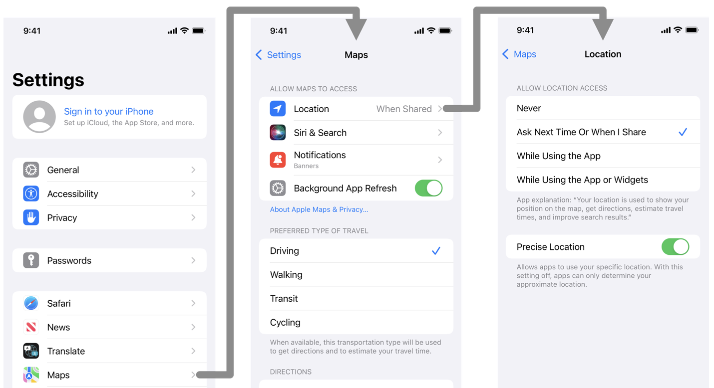

  - This push-and-pop structure is like washing a stack of dirty plates. After you wash and dry each plate, you place it in the cabinet. The first plate you wash will be at the bottom of the stack, and the last plate will be on the top. Later, when you grab a clean plate from the cabinet, you’ll be grabbing the last plate you washed.
  - Now imagine that each plate is a view controller being pushed onto the screen. As you continue to push new view controllers, the first one — known as the root — moves farther down in the stack. Multiple taps of the Back button will eventually return to the root view controller, at which point the Back button goes away. Every navigation controller has a root view controller.

- Another way to think about a navigation controller is that it mirrors a hierarchical data structure.
  - In the case of Mail, the list of accounts (the root) gives you the ability to tap to reveal the account's folders. Tapping on each folder reveals its messages.
  - Settings is similar. There's a list of setting categories (the root) one of which may be selected to reveal the settings or subcategories within, each time traveling deeper into the hierarchy.
  - For the example above, from the root, General is selected and then Accessibility within that. Pushing a view controller onto the stack delves deeper into the hierarchy and popping a view controller from the stack travels back up the hierarchy to the root.
- Back in your TrafficSegues project, you can use a navigation controller to manage the red, yellow, and green screens. Red will push to yellow, and yellow will push to green.
  - To add a navigation controller into your scene, select the red view controller.
  - Next, click the `Embed In` button in the bottom toolbar and select `Navigation Controller`.
    - Alternatively, go to the Xcode menu bar and choose Editor > Embed In > Navigation Controller.
  - Either of these methods will place a navigation controller at the beginning of the scene and set the red view controller as its root.
- Build and run your app to see what’s changed. You may notice a few important differences:
  - The Show segues between the red, yellow, and green view controllers have adapted to Show (Push), rather than Present Modally. (This is a key feature of the Show segue: It adapts the presentation method depending on whether it’s used within a navigation controller or independently.)
  - The Dismiss button still unwinds back to the red view controller, but it does so by popping off view controllers rather than dismissing them.
  - At the top of each view is a transparent navigation bar, which provides space for the Back button as well as for a title and additional buttons.
  - The Document Outline now includes a Navigation Controller Scene, which includes a Navigation Bar.

#### Navigation Bar

- One of the most obvious features of a navigation controller is the navigation bar, which appears at the top of the screen. A navigation bar may display a title and/or button items.
- Select the navigation bar in the Document Outline, and check out the Attributes inspector to see what properties you can customize, such as the bar’s tint color, title color, and title font. (You might also choose to modify these properties in code.) View the documentation for `UINavigationBar` for a complete list of customizable properties.

- **Navigation Item**

  - Every UIViewController has a navigationItem that you can use to customize its navigation bar. When you added the navigation controller in the earlier step, Interface Builder automatically added a navigation item to the root (red) view controller.
  - In the Document Outline, select the navigation item for the red view controller, and open the Attributes inspector. Enter “Red” in the Title attribute.
    - It changes "View Controller Scene" in the Document Outlet to "Red Scene" and "Navigation Item" to "Red."
  - Build and run the app. When you push to the yellow screen, you’ll notice that the Back button now displays “Red.”
    - How did that happen? The Back button used the title of the preceding view controller as its text.
    - However, if the preceding view controller doesn’t have a title, the Back button simply displays “Back.”
    - If you want the Back button to use other text, like “Go To Red,” you can enter it in the Back Button field in the Attributes inspector of the red view controller’s navigation item.
  - Under certain circumstances, Interface Builder will add a navigation item to view controllers. In the event it hasn’t, you can add one yourself by finding a Navigation Item in the Object library, and dragging it on top of your view controller.
    - Set the titles of the yellow and green view controllers by selecting their Navigation Item and using the Attributes inspector to create "Yellow" and "Green" titles.
  - In addition to titles and Back buttons, navigation items can include a special type of button, known as a bar button, which can appear on either navigation bars or toolbars.
    - Find the `Bar Button Item` in the Object library, and place one in the top-right corner of the green view controller’s navigation bar.
    - Click the bar button you just added, and open the Attributes inspector. In the `System Item` popup menu, you’ll see commonly used button choices, such as Add, Save, and Cancel. Choose one or two to see the button text change.
    - Play with the Style and Tint attributes as well. The Bar Item properties allow you to customize your button further. For example, you can use the Image field to replace a text title with an image or icon.
    - For now, go ahead and update the Title property of the bar item to “Pop.” (Notice that this update changes the `System Item` option to `Custom`.)
    - Next, you can wire this new bar button to the unwind segue. Refer to the same steps you used to connect the Dismiss button. Once you’re done, you can delete the Dismiss button.
  - Your storyboard now has all its segues. Build and run your app to see the titles and the button you just added. Notice that clicking the Pop button returns you to the red view controller.

    - 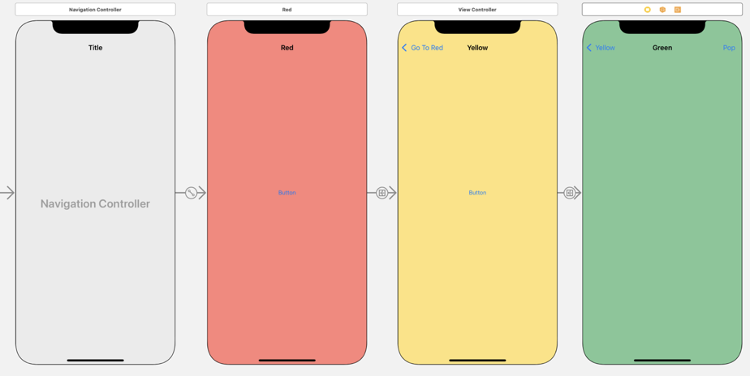

- **Large Titles**

  - You may have noticed in system apps like Settings that the navigation bar title on the primary screen appears much larger than in subsequent scenes. This large title can be added to your own apps by selecting the navigation bar in Interface Builder, then checking the “Prefers Large Titles” box in the Attributes inspector.
  - Note that all of your titles, not just the title of the first view controller, have now adopted a large title.
  - You can adjust which view controllers use the large title option by selecting the navigation item in question and selecting one of the options from the Large Title dropdown in the Attributes inspector.
    - The `Always` option will ensure that the title of that navigation item will always be large.
    - The `Never` option will ensure that the title of that navigation item will never be large.
    - The `Automatic` option will adopt the behavior of the previous view controller in the navigation stack.
    - Unless you have a specific reason to do otherwise, a good first practice is to have your root view controller adopt a large title, and subsequent view controllers adopt smaller titles.
